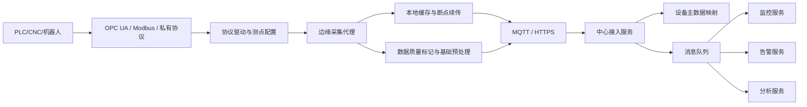

# 场景一：设备接入与协议适配

项目固定背景统一参考 [项目固定背景.md](/Users/duanpeitong/Desktop/work/study/26_jgs_lw/项目固定背景.md)。

## 1. 场景定位

### 1.1 从业务角度看

设备接入与协议适配是整个智能设备运维平台的起点，但它不是简单的“把设备连上网”。在本项目中，它真正解决的是如何把分散在生产现场、协议各异、稳定性不一的设备，纳入一个可治理、可扩展、可持续演进的平台边界。

后续实时监控、异常告警、故障预警、工单闭环和分析优化，都依赖设备数据能够被持续、准确、统一地进入平台。如果接入层不稳定，上层应用即使功能完整，也会因为数据缺失、口径不一或延迟过高而失去业务价值。

### 1.2 从考题角度看

这个场景适合以下题目：

- 系统集成架构设计
- 平台架构设计
- 物联网平台设计
- 边缘计算架构设计
- 可扩展性设计
- 异构系统集成设计
- 数据采集架构设计

如果题目涉及“异构集成”“设备接入”“工业互联网”“边缘架构”“平台扩展性”，这个场景都可以作为正文主线。写作时不要只写协议名称，而要重点写清为什么要分层接入、为什么不让中心平台直接面对设备、如何通过统一数据模型屏蔽现场差异。

### 1.3 从项目角度看

在本项目中，集团 3 个生产基地分布着 900 余台关键设备，设备来源厂商多、型号多、协议不统一。项目于 2024 年 7 月启动后，最先遇到的不是上层管理问题，而是底层设备到底能不能接入平台、如何接入平台的问题。

因此，这个场景在整个项目中属于首要场景，也是后续所有能力建设的起点。我在架构设计中并没有把它当成一次性的集成开发任务，而是把它作为平台底座能力来设计：既要满足当前 3 个基地的落地，又要支撑后续新增设备、新增产线和新基地扩展。

## 2. 场景拆解

### 2.1 业务目标与成功标准

这个场景的目标，不只是“接上几台设备”，而是建立一套可复制、可扩展、可治理的设备接入能力。

成功标准主要包括：

- 设备能够按统一设备档案和测点模型纳管，而不是各基地各自定义
- 协议差异被封装在边缘接入层，不影响上层监控、告警和分析服务
- 网络波动或中心入口短时不可用时，关键数据尽量不丢，并能恢复后补传
- 后续新增设备时主要扩展协议驱动和采集配置，而不是反复改造中心平台
- 数据进入平台后具备设备标识、测点编码、时间戳、质量标记等基础治理字段

### 2.2 场景边界

这个场景重点解决四类问题：

- 设备协议差异如何被统一适配
- 设备测点和原始数据如何转换为平台统一数据模型
- 工业现场网络波动时如何保证接入链路韧性
- 新设备、新基地扩展时如何降低重复集成成本

它不直接解决告警规则、工单流程、预测模型和驾驶舱展示问题。接入层的责任边界，是向中心平台稳定提供标准化后的遥测数据、状态事件和基础质量标记；至于这些数据如何触发告警、如何生成工单、如何形成分析指标，则由后续监控、告警、工单和分析场景继续承接。

明确这个边界很重要。否则设备接入层很容易被做成“什么都处理”的大网关，既承担协议适配，又承担复杂规则判断和业务流程，最终导致边缘侧复杂度失控，也削弱中心平台的统一治理能力。

### 2.3 核心矛盾与约束条件

这个场景的核心矛盾主要有六个：

1. 设备异构严重，协议和数据格式差异大
2. 老旧设备接入能力弱，无法直接连接中心平台
3. 工业现场网络环境复杂，链路不稳定
4. 中心平台不适合直接管理大量底层连接
5. 高频测点数据持续产生，如果全部原样上送，会增加网络和中心处理压力
6. 项目分期建设，接入方案必须支持边上线、边扩展、边优化

这些约束决定了平台不能简单采用“所有设备直接接中心”的方式。

### 2.4 备选方案与舍弃理由

在方案设计时，我重点评估过几种看似直接的做法。

| 备选方案 | 表面优势 | 舍弃原因 |
| --- | --- | --- |
| 设备直接连接中心平台 | 链路短，中心统一管理 | 中心要直接面对大量协议和连接，现场网络波动会直接冲击平台入口 |
| 中心平台集中做协议适配 | 协议逻辑集中，便于统一开发 | 协议变化、厂商差异和现场调试都集中到中心侧，服务边界容易失控 |
| 为每类设备单独定制接入程序 | 初期落地快 | 每新增一类设备都要重复开发，后续维护成本高，难以复制到新基地 |
| 在边缘侧完成大量业务规则判断 | 可减少中心压力 | 边缘节点职责过重，规则统一治理困难，也不利于总部统一监控和复盘 |

因此，我最终选择“边缘节点 + 协议插件 + 统一数据模型 + 中心接入服务”的分层方案。这个方案的核心不是把所有能力前移到边缘，而是把现场变化最大、最不稳定的协议和采集问题封装在边缘侧，把统一治理、业务规则和分析能力保留在中心平台。

### 2.5 架构决策与边界划分

针对上述问题，我在架构上采用了三层接入边界。

第一层是设备与协议层。它面对 PLC、CNC、机器人等现场设备，以及 `OPC UA`、`Modbus TCP/RTU` 和厂商私有协议。该层的特点是差异大、变化多、现场依赖强，因此不应直接暴露给中心业务服务。

第二层是边缘采集层。集团 3 个基地部署 24 台边缘节点，边缘节点上的采集代理负责协议驱动加载、测点采集、本地缓存、时间戳补齐、质量标记和基础预处理。这里封装的是现场复杂度。

第三层是中心接入层。中心平台只面对统一格式的数据，由接入服务完成设备身份校验、字段校验、主数据映射、数据标准化和写入消息队列。这里沉淀的是平台稳定接口和治理边界。

这个边界划分的核心价值，是让上层监控、告警、工单和分析服务不直接感知底层设备协议。新增设备时，主要在边缘侧增加协议驱动和采集配置；中心平台只要统一数据模型保持稳定，就不需要频繁被现场差异牵动。

### 2.6 关键机制设计

#### 2.6.1 协议插件化与测点模型

设备接入最容易失控的地方，是把协议解析代码、测点含义和业务处理逻辑混在一起。为避免这种问题，我要求边缘采集代理按协议驱动和测点配置分离设计。

- 协议驱动负责连接设备、读取寄存器或订阅测点
- 测点配置负责定义设备测点与平台指标编码的映射
- 数据转换负责把原始值转换为平台标准结构

标准数据结构至少包含：

- `baseId`
- `deviceId`
- `metricCode`
- `timestamp`
- `value`
- `quality`
- `source`

这样做以后，协议变化主要影响驱动层，设备测点变化主要影响配置层，上层平台只依赖稳定的标准数据结构。

#### 2.6.2 本地缓存与断点续传

边缘节点不能只是透传通道。工业现场到中心平台的网络可能出现抖动，中心入口也可能因为发布或维护短时不可用。如果没有缓存和补传能力，监控和分析链路会出现数据断层。

因此，边缘侧需要对关键遥测数据、状态变化事件和异常事件进行本地缓存。链路恢复后，边缘节点按时间顺序和批次补传，同时中心接入服务通过 `edgeId + deviceId + metricCode + timestamp` 等字段做幂等处理，避免补传导致重复写入或重复触发。

这里的取舍是：平台不追求所有高频原始数据在任何异常场景下都完整保留，而是优先保障关键状态、关键测点和异常事件的连续性。这样既控制边缘存储压力，也更符合设备运维业务的真实价值。

#### 2.6.3 数据质量标记与预处理

设备采集数据并不天然可靠。现场可能出现传感器异常、设备时钟偏差、瞬时无效值、重复状态上报等问题。如果这些问题全部传到中心平台，再由上层业务各自处理，会造成口径不一致。

因此，边缘采集层和中心接入层需要共同完成基础数据质量处理：

- 边缘侧补齐采集时间和设备标识
- 对明显无效值、重复状态进行过滤或标记
- 对关键数据增加质量标记，例如正常、缺失、补传、异常值
- 中心接入服务根据设备主数据校验设备身份和测点合法性

这样做的目的不是在接入层完成复杂业务判断，而是让进入平台的数据具备最基本的可信度和可解释性。

### 2.7 质量属性与架构权衡

这个场景主要支撑四类质量属性。

- `可扩展性`
  新增设备时优先扩展协议驱动和测点配置，避免改动中心业务服务。

- `可靠性`
  通过边缘缓存、断点续传和中心幂等接收，降低网络波动对数据连续性的影响。

- `可维护性`
  通过协议驱动、测点配置和中心接入服务分离，降低长期维护复杂度。

- `实时性`
  对实时监控所需的状态和关键测点优先上报，对非关键高频数据可以预处理或降采样。

同时，这个方案也有成本。边缘节点需要承担更多部署和运维工作，协议驱动和测点配置需要标准化管理；边缘与中心之间采用补传机制后，部分数据在异常场景下可能具有最终一致特征，而不是始终严格实时。因此，我在设计中把实时监控、异常事件和分析数据进行优先级划分，避免用同一套实时性要求约束所有数据。

### 2.8 技术落点与协同关系

这个场景最终落到以下几类关键技术能力上：

- 协议适配：`OPC UA`、`Modbus TCP/RTU`、厂商私有协议
- 边缘采集：边缘采集代理、协议驱动、测点配置
- 本地缓存：`SQLite`、本地时序缓存
- 上传通道：`MQTT`、`HTTPS`
- 中心接入：统一接入服务、设备身份校验、主数据映射、消息队列
- 数据治理：统一设备模型、测点编码、时间戳、质量标记

典型链路可写成：

`PLC/CNC/机器人 -> 协议驱动 -> 边缘采集代理 -> 本地缓存/预处理 -> MQTT/HTTPS -> 中心接入服务 -> 消息队列 -> 监控/告警/分析`

### 2.9 项目推进与验证方式

本场景在实施上不可能一次性覆盖全部设备，因此采用分阶段推进方式：

- 第一期：优先接入关键生产设备和高故障率设备，验证端边云接入主链路
- 第二期：扩展到各基地主要设备类型，沉淀协议驱动和测点模板
- 第三期：完成剩余设备纳管，并优化缓存补传、数据质量和稳定性

每一阶段的验证重点不同。第一期重点验证设备能否稳定接入和上报；第二期重点验证接入模板是否可复制；第三期重点验证大规模纳管后的稳定性、可维护性和数据质量。

### 2.10 论文转写角度

如果题目是 `物联网平台设计`，重点写端边云分层和设备统一接入。

如果题目是 `系统集成架构设计`，重点写异构协议适配、统一数据模型和中心接入服务。

如果题目是 `可扩展性设计`，重点写协议插件化、测点配置化和新增设备成本控制。

如果题目是 `高可用或可靠性设计`，重点写边缘缓存、断点续传、中心幂等接收和数据连续性保障。

如果题目是 `数据架构设计`，重点写设备主数据、测点模型、时间戳、质量标记和接入数据标准化。

### 2.11 项目链路图示

## 3. 论文主体内容（约 1300 字）

在本项目建设初期，我最先面对的并不是上层监控看板和工单流程，而是一个更底层也更关键的问题：分布在 3 个生产基地的 900 余台关键设备，如何稳定、统一、可扩展地接入平台。设备类型覆盖数控机床、焊接机器人、PLC 等，既有支持 `OPC UA` 的新型设备，也有只能通过 `Modbus TCP/RTU` 通信的老旧设备，还有少量需要厂商私有协议适配的专用设备。如果这个问题处理不好，后续实时监控、异常告警、预测性维护和工单闭环都会失去可信的数据基础。因此，我没有把设备接入看成普通接口开发，而是把它作为平台架构的基础能力来设计。

在方案论证阶段，我首先排除了“设备直接接入中心平台”的做法。这个方案表面上链路最短，但会使中心平台直接面对大量底层协议、连接状态和现场网络波动。一旦某个基地网络抖动，或者某类设备协议发生变化，问题会直接传导到中心接入服务，甚至影响监控和告警主链路。我也没有选择把所有协议适配都放在中心平台集中处理，因为这样会使中心服务既承担协议解析，又承担数据治理和业务分发，边界过重，后续新增设备时改动范围不可控。基于这些判断，我最终采用“边缘节点 + 协议插件 + 统一数据模型 + 中心接入服务”的分层接入架构。

具体设计上，我把接入链路划分为设备与协议层、边缘采集层和中心接入层三部分。设备与协议层面对 PLC、CNC、机器人等现场设备，负责暴露原始测点和状态；边缘采集层部署在 3 个基地的 24 台边缘节点上，由边缘采集代理加载不同协议驱动，完成设备连接、测点读取、协议解析和数据格式转换；中心接入层只面对边缘节点上传的标准化数据，负责设备身份校验、主数据映射、字段校验和写入消息队列。通过这种划分，变化频繁、现场依赖强的复杂性被封装在边缘侧，而中心平台保留稳定的数据入口和治理边界。

在关键机制上，我重点设计了协议插件化、测点模型和数据质量标记。协议驱动只负责连接设备和读取原始数据，测点配置负责把设备侧测点映射为平台统一的 `metricCode`，标准化后的数据结构包含 `baseId`、`deviceId`、`timestamp`、`value`、`quality`、`source` 等字段。这样一来，新增设备时不需要重写中心业务逻辑，只需要增加或调整边缘侧协议驱动和测点配置。对于上层监控、告警和分析服务来说，不论底层来自 `OPC UA`、`Modbus` 还是私有协议，进入平台后的数据口径都是一致的。

为了提升接入链路的可靠性，我没有把边缘节点设计成简单透传网关，而是要求其具备本地缓存、断点续传和基础预处理能力。当基地到中心平台的链路短时异常，或者中心入口因发布维护暂时不可用时，边缘节点先缓存关键遥测数据、状态变化和异常事件，链路恢复后再按批次补传。中心接入服务则通过设备标识、测点编码和时间戳等字段做幂等处理，避免补传导致重复写入。对于高频但业务价值较低的数据，边缘侧可进行过滤或基础聚合；对于关键状态和异常事件，则优先保障连续性。这个取舍使平台在可靠性、实时性和资源成本之间取得了平衡。

在项目推进上，我采用分阶段验证的方式控制风险。第一期优先接入关键生产设备和高故障率设备，验证端边云接入链路是否成立；第二期扩展到各基地主要设备类型，沉淀协议驱动和测点模板；第三期完成剩余设备纳管，并持续优化缓存补传、数据质量和稳定性。这样做避免了一开始就大范围铺开带来的实施风险，也使团队能够在真实现场环境中逐步校准协议适配和采集规则。

从项目效果看，设备接入与协议适配场景为整个平台提供了统一、稳定的数据基础。平台最终实现了对 900 余台设备的统一纳管，使集团具备了跨基地设备运行信息的统一视角；同时，接入层与业务层的解耦，使后续新增设备、新增产线或新基地时，主要工作集中在边缘侧协议扩展和测点配置上，而不是反复改造中心平台。回顾整个过程，我认为该场景的核心价值不只是“接上设备”，而是通过清晰的边界划分和可复制的接入机制，把复杂工业现场纳入了可治理的平台架构之中，为后续智能运维能力建设奠定了基础。
