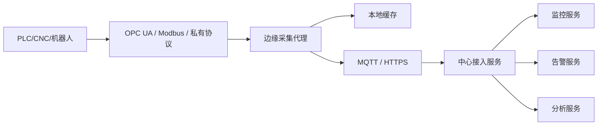

# 场景一：设备接入与协议适配

项目固定背景统一参考 [项目固定背景.md](/Users/duanpeitong/Desktop/work/study/26_jgs_lw/项目固定背景.md)。

## 1. 场景定位

### 1.1 从业务角度看

设备接入与协议适配是整个智能设备运维平台的起点。因为后续无论是实时监控、异常告警、故障预警还是工单闭环，都建立在设备数据能够被稳定、统一接入的前提上。

如果设备接不进来，平台后续所有能力都无从谈起。

### 1.2 从考题角度看

这个场景适合以下题目：

- 系统集成架构设计
- 平台架构设计
- 物联网平台设计
- 边缘计算架构设计
- 可扩展性设计

如果题目涉及“异构集成”“设备接入”“工业互联网”“边缘架构”，这个场景都可以作为正文主线。

### 1.3 从项目角度看

在本项目中，集团 3 个生产基地分布着 900 余台关键设备，设备来源厂商多、型号多、协议不统一。项目于 2024 年 7 月启动后，最先遇到的不是上层管理问题，而是底层设备到底能不能接入平台、如何接入平台的问题。

因此，这个场景在整个项目中属于首要场景，也是后续所有能力建设的起点。

## 2. 场景拆解

### 2.1 业务目标与成功标准

这个场景的目标，不只是“接上几台设备”，而是建立一套可复制、可扩展、可持续演进的设备接入能力。

成功标准主要包括：

- 设备能够统一纳管
- 协议差异不再影响上层业务
- 网络波动时数据尽量不断
- 后续新增设备和新基地时接入成本可控

### 2.2 核心矛盾与约束条件

这个场景的核心矛盾主要有四个：

1. 设备异构严重，协议和数据格式差异大
2. 老旧设备接入能力弱，无法直接连接中心平台
3. 工业现场网络环境复杂，链路不稳定
4. 中心平台不适合直接管理大量底层连接

这些约束决定了平台不能简单采用“所有设备直接接中心”的方式。

### 2.3 架构决策与方案选择

针对上述问题，我在架构上采用了“边缘节点 + 协议适配 + 统一接入服务”的分层方案。

这个方案的核心思路是：

- 在 3 个基地部署 24 台边缘节点，靠近产线侧完成近源采集
- 边缘侧负责协议转换、本地缓存和基础预处理
- 中心平台只面对统一格式的数据接入服务
- 上层监控、告警、分析模块不直接感知设备协议差异

这样设计的本质，是把复杂、变化频繁的现场差异封装在接入层和边缘层，而把平台核心能力稳定在中心层。

### 2.4 技术落点与协同关系

这个场景最终落到以下几类关键技术能力上：

- 协议适配：`OPC UA`、`Modbus TCP/RTU`、厂商私有协议
- 边缘采集：边缘采集代理、边缘节点
- 本地缓存：`SQLite`、本地时序缓存
- 上传通道：`MQTT`、`HTTPS`
- 中心接入：统一接入服务、消息队列

这些技术之间的协同关系可以写成：

`PLC/CNC/机器人 -> 协议驱动 -> 边缘采集代理 -> 本地缓存 -> MQTT/HTTPS -> 中心接入服务`

然后再由中心接入服务把数据转入：

- 监控服务
- 告警服务
- 分析服务

### 2.5 项目推进与落地方式

本场景在实施上不可能一次性覆盖全部设备，因此采用了分阶段推进方式：

- 第一期：优先接入关键生产设备和高故障率设备
- 第二期：扩展到各基地主要设备类型
- 第三期：完成剩余设备纳管并优化稳定性

这种推进方式的好处是：

- 先验证接入架构是否成立
- 控制项目早期风险
- 为后续大规模推广积累经验模板

### 2.6 项目链路图示

## 3. 论文主体内容（约 1300 字）

在本项目建设初期，我最先面对的并不是上层监控看板和工单流程，而是一个更底层也更关键的问题：设备到底如何统一接入平台。因为平台服务对象分布在 3 个生产基地，涉及 900 余台数控机床、焊接机器人、PLC 等关键设备，不同设备来源厂商不同、通信协议不同、网络环境也不同。如果这个问题解决不好，那么后续的实时监控、异常告警、预测性维护和工单闭环都将失去数据基础。因此，我把设备接入与协议适配作为项目建设的首要场景来处理。

在问题分析阶段，我很快意识到，项目并不适合采用“所有设备直接接入中心平台”的简单模式。首先，设备协议异构严重，既有支持 `OPC UA` 的数控设备，也有通过 `Modbus RTU` 通信的老旧设备，还有部分必须通过厂商私有协议接入的专用设备；其次，部分设备本身接入能力弱，难以直接适配中心平台的接口规范；再次，工业现场网络并不总是稳定，如果中心平台直接与大量底层设备建立连接，一旦网络抖动，问题会迅速放大到整个平台。基于这一判断，我认为必须通过分层方式，把现场复杂度隔离在接入层和边缘层。

因此，在总体架构设计中，我采用了“边缘节点 + 协议适配 + 中心接入服务”的分层接入方案。具体做法是在 3 个基地部署 24 台边缘节点，由边缘节点上的采集代理负责与 PLC、CNC、机器人等设备建立连接，完成协议解析、测点读取和数据格式转换。对于数控机床，可通过 `OPC UA` 获取状态和测点数据；对于老旧设备，则通过 `Modbus TCP/RTU` 读取关键参数；对于个别专用设备，则通过厂商私有协议做适配。边缘采集代理在本地把这些数据转换为平台统一格式，再通过 `MQTT` 或 `HTTPS` 上传到中心平台接入服务。这样一来，中心平台无需直接感知底层协议差异，而只需要围绕统一数据格式建设监控、告警和分析能力。

为了保证现场接入链路的稳定性，我没有把边缘节点设计成单纯的透传通道，而是要求其具备本地缓存和断点续传能力。当基地与中心平台之间网络波动，或者中心入口短时不可用时，边缘节点先把关键设备数据缓存在本地，再在链路恢复后补传。这样做的目的，是尽量保证数据连续性，避免因现场网络问题导致监控和分析出现明显断层。对于设备运维平台而言，这一点非常重要，因为平台的异常识别和趋势分析高度依赖连续数据。

在项目实施过程中，我还特别注意控制接入建设的节奏。由于设备数量多、类型复杂，不可能一次性完成全部纳管。因此，我采取了分阶段推进方式：第一期优先接入关键生产设备和高故障率设备，验证整体架构和链路稳定性；第二期扩展到各基地主流设备类型；第三期再完成剩余设备纳管并持续优化接入稳定性。这样既控制了早期实施风险，也使项目团队能够在每一阶段沉淀接入模板和经验，逐步形成可复制的接入能力。

从项目效果看，设备接入与协议适配场景的成功落地，为后续所有上层能力提供了统一数据基础。一方面，平台最终实现了 900 余台设备的统一纳管，使集团第一次具备了跨基地设备运行信息的统一视角；另一方面，接入层与业务层的解耦，使后续新增设备、新增基地时无需反复改造中心平台，而主要在边缘层补充协议适配和采集规则即可。回顾整个过程，我认为设备接入场景最核心的价值，不仅在于“接上设备”，更在于它建立了一套可扩展、可复制、可持续演进的接入架构，使整个项目真正具备了平台化建设的基础。
