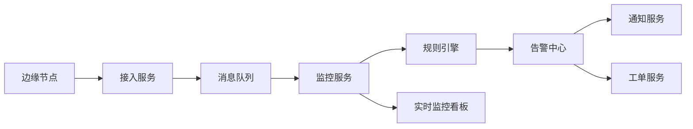

# 场景二：实时监控与告警

项目固定背景统一参考 [项目固定背景.md](/Users/duanpeitong/Desktop/work/study/26_jgs_lw/项目固定背景.md)。

## 1. 场景定位

### 1.1 从业务角度看

设备完成统一接入之后，平台首先要解决的就是“设备运行状态能否被及时看见、异常能否被及时发现”的问题。实时监控与告警场景直接决定了平台是否真正具备日常运维价值。

### 1.2 从考题角度看

这个场景适合以下题目：

- 事件驱动架构设计
- 高并发系统设计
- 监控与告警平台设计
- 系统性能设计
- 实时处理架构设计

如果题目涉及“实时处理”“监控平台”“事件驱动”“性能优化”，这个场景都可以成为论文主线。

### 1.3 从项目角度看

在本项目中，设备统一接入之后，集团希望对 3 个基地 900 余台设备的状态、关键指标和异常事件进行集中监控。如果平台只能采集数据而不能及时转化为监控和告警能力，那么它就仍然只是一个数据汇聚系统，而不是运维平台。

因此，实时监控与告警场景在项目中承担的是“从接入走向可运维”的关键转折。

## 2. 场景拆解

### 2.1 业务目标与成功标准

该场景的业务目标主要有三点：

- 实时掌握设备运行状态
- 快速识别异常并通知相关人员
- 为后续工单闭环和故障预警提供事件基础

成功标准包括：

- 监控看板能覆盖集团与基地双层视角
- 异常事件能及时触发告警
- 高峰期数据上报不拖垮平台主链路

### 2.2 核心矛盾与约束条件

这个场景的核心矛盾在于：

1. 设备上报频率高，持续形成实时流量
2. 不同设备的告警阈值和策略不同
3. 如果所有处理都同步完成，监控链路很容易堵塞
4. 总部和基地对监控视角要求不同

这意味着平台不能简单做一个数据看板，而必须同时解决实时处理和多层级视图的问题。

### 2.3 架构决策与方案选择

针对这些问题，我采用了“采集上报 + 消息缓冲 + 告警中心 + 多级通知”的分层架构。

具体思路是：

- 边缘节点负责持续采集设备状态并统一上报
- 中心平台先通过消息队列进行削峰和解耦
- 告警中心统一执行规则判断、分级和收敛
- 通知服务按告警级别触发不同通知渠道

这样设计的本质，是把“数据上报”和“业务处理”分开，把“告警识别”和“后续联动”分开。

### 2.4 技术落点与协同关系

这个场景最终主要落在以下几类能力上：

- 消息队列：承接高频状态上报
- 规则引擎：执行阈值规则、组合规则和时间窗口规则
- 告警中心：统一管理告警事件
- 通知服务：短信、站内信、企业微信等
- 实时监控看板：集团视图和基地视图

典型链路可写为：

`边缘节点 -> 接入服务 -> 消息队列 -> 监控服务 -> 规则引擎 -> 告警中心 -> 通知服务`

### 2.5 项目推进与落地方式

在实施上，这个场景也分阶段推进：

- 第一期：先建设设备状态看板和单指标告警
- 第二期：补充组合规则、告警分级和收敛机制
- 第三期：增强跨基地监控视角和告警专题分析

这样做的原因是，监控和告警策略需要在实际运行中不断校准，不适合一开始就做得过深过重。

### 2.6 项目链路图示

## 3. 论文主体内容（约 1300 字）

在本项目建设过程中，实时监控与告警场景是平台从“能采集数据”走向“能支撑运维工作”的关键一步。设备统一接入之后，如果数据只是被存储下来而不能及时转化为监控视图和异常提醒，那么平台的业务价值就很有限。因此，在总体架构设计中，我把实时监控与告警能力作为接入层之后最优先建设的核心场景之一，目标是让集团和基地能够实时掌握设备状态，并在异常发生时及时触发运维响应。

在问题分析阶段，我首先识别到该场景面临的是一个典型的高频实时处理问题。因为平台覆盖 3 个生产基地和 900 余台设备，边缘节点会持续上报设备状态、测点值和异常事件，这些数据天然具有持续流入、峰值不均和处理链路长的特点。如果平台采用简单的同步处理模式，即边缘数据一到达中心平台就立即同步执行监控刷新、告警判定、通知推送和工单联动，那么任意一个环节的性能波动都可能拖慢整条链路，最终导致监控延迟甚至告警失真。因此，我一开始就没有把实时监控理解为单纯前端看板，而是把它看成一条需要分层治理的实时事件链路。

针对这一问题，我采用了“采集上报、消息缓冲、规则判定、告警分发”四层架构。边缘节点负责持续采集设备运行状态并统一上报；中心接入层先把数据写入消息队列，利用消息缓冲能力削峰填谷，把高频接入流量与后端业务处理解耦；监控服务消费状态数据，负责设备状态聚合和监控看板刷新；规则引擎则负责基于阈值、组合条件和时间窗口对异常进行判断，输出告警事件；最后由告警中心统一管理告警级别、通知渠道和联动动作。这种设计的最大价值，是把“数据来了就同步做完所有处理”的紧耦合模式，改造成“数据先进入总线、后续模块按职责处理”的分层模式。

在告警设计上，我没有把它做成简单的阈值越线提醒。因为工业运维场景下，单点指标抖动并不一定意味着故障，如果没有足够的规则管理能力，平台很容易产生大量误报，最终削弱运维人员对系统的信任。因此，我要求告警中心统一支持阈值规则、组合规则、时间窗口规则以及告警分级与收敛机制。例如，单个设备温度短时升高可能只是普通提醒，但如果持续升高并伴随振动异常，则应升级为重点告警；同一设备短时间内重复触发同类异常，则应合并收敛而非重复轰炸通知。这样设计以后，平台的告警不再是“有异常就全部报”，而是更接近真实运维现场需要处理的重点事件。

在可视化层面，我还要求监控体系同时满足总部和基地两类视角。总部更关注跨基地整体态势、告警分布和重点设备状态；基地则更关注本地车间、产线和班组层面的具体异常。因此，平台的实时监控并不是单一看板，而是分层设计的监控视图体系。这样做既能满足集团统一监管，也能保证基地用户看到与自身职责直接相关的信息。

从项目效果看，实时监控与告警场景成功建立了平台统一的状态感知和异常识别能力。它一方面缩短了异常发现时间，降低了过去对人工巡检和经验判断的依赖；另一方面，也为后续工单闭环、故障预警和运营分析提供了统一事件入口。回顾整个项目，我认为这一场景最关键的价值，不只是“把监控看板做出来”，而是通过分层处理和事件化设计，把设备状态流真正转化成了可感知、可识别、可联动的运维事件流。这使平台具备了从数据采集走向业务响应的能力，是整个智能设备运维平台架构中非常关键的一步。
