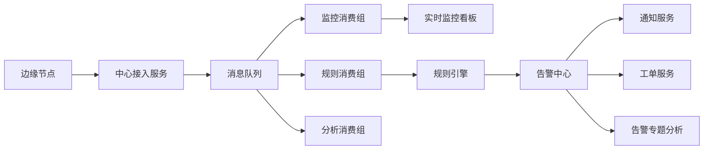

# 场景二：实时监控与告警

项目固定背景统一参考 [项目固定背景.md](/Users/duanpeitong/Desktop/work/study/26_jgs_lw/项目固定背景.md)。

## 1. 场景定位

### 1.1 从业务角度看

设备完成统一接入之后，平台首先要解决的是“设备运行状态能否被及时看见、异常能否被及时识别、处置动作能否被及时触发”。实时监控与告警不是简单的页面刷新和阈值提醒，而是把设备数据流转化为运维事件流的关键场景。

如果监控延迟过高、告警误报过多，或者告警产生后不能稳定分发，平台就会停留在数据展示层，无法真正支撑日常设备运维。

### 1.2 从考题角度看

这个场景适合以下题目：

- 事件驱动架构设计
- 高并发系统设计
- 监控与告警平台设计
- 系统性能设计
- 实时处理架构设计
- 消息队列与异步削峰
- 规则引擎设计

如果题目涉及“实时处理”“监控平台”“事件驱动”“性能优化”“异步解耦”，这个场景都可以成为正文主线。写作时重点不是说平台做了看板，而是说明如何把高频设备数据稳定转化为可识别、可分级、可联动的告警事件。

### 1.3 从项目角度看

在本项目中，平台覆盖 3 个生产基地、900 余台设备和 24 台边缘节点。设备状态、测点数据和异常事件持续进入中心平台，集团和基地都希望及时掌握设备运行状况。

因此，实时监控与告警场景承担的是“从接入走向可运维”的关键转折：接入层提供数据基础，监控告警层把数据变成运维人员能够理解和处理的事件。

## 2. 场景拆解

### 2.1 业务目标与成功标准

该场景的业务目标主要包括：

- 实时掌握设备运行状态和关键测点变化
- 快速识别异常并按等级通知相关人员
- 为工单闭环、故障复盘和预测性维护提供统一事件入口
- 支撑总部和基地两类监控视角

成功标准包括：

- 监控看板能够覆盖集团、基地、车间和设备等层级
- 告警能够按设备、规则、等级和状态统一管理
- 高峰期设备上报不会拖垮接入和告警主链路
- 告警结果能够联动通知、工单和分析服务
- 告警重复、抖动和风暴能够被收敛

### 2.2 场景边界

这个场景重点解决三类问题：

- 高频设备数据如何进入实时处理链路
- 异常如何从原始测点变成统一告警事件
- 告警如何分发给通知、工单和分析等后续模块

它不直接解决设备协议适配，也不负责工单执行过程。接入层负责提供标准数据，工单服务负责后续处置闭环，实时监控与告警层位于二者之间，负责把“状态变化”识别为“需要处理的事件”。

明确这个边界很重要。否则监控服务容易被做成既负责数据接入、又负责规则判断、还负责通知和工单联动的“大模块”，最终导致链路复杂、难以扩展，也难以控制实时性。

### 2.3 核心矛盾与约束条件

这个场景的核心矛盾主要有六个：

1. 设备上报频率高，持续形成实时流量
2. 早班开机、网络恢复补传、公共条件异常等场景会产生峰值压力
3. 不同设备、产线和基地的告警阈值和策略并不完全相同
4. 如果所有处理都同步完成，接入链路会被慢服务拖住
5. 单点指标抖动容易产生误报，告警过多会削弱一线信任
6. 总部和基地需要不同层级的监控视图

这意味着平台不能简单做一个实时数据看板，而必须把数据接入、消息缓冲、规则判定、告警收敛和事件分发作为一条完整链路来设计。

### 2.4 备选方案与舍弃理由

在方案设计时，我重点排除了几种简单做法。

| 备选方案 | 表面优势 | 舍弃原因 |
| --- | --- | --- |
| 接入服务同步刷新看板和判断告警 | 实现直接，链路短 | 任一下游模块变慢都会反向阻塞接入链路 |
| 监控服务直接内置所有告警规则 | 初期开发快 | 规则与展示耦合，后续规则扩展和分级治理困难 |
| 告警只做单指标阈值判断 | 简单可解释 | 容易产生误报，无法表达持续异常、组合异常和抖动收敛 |
| 所有告警直接通知所有人 | 看似响应充分 | 容易形成通知轰炸，最终降低运维人员关注度 |

因此，我最终采用“接入标准化 + 消息缓冲 + 监控聚合 + 规则判定 + 告警中心 + 事件分发”的分层方案。

### 2.5 架构决策与边界划分

该场景的架构边界可以分为五层。

第一层是数据接入层。边缘节点上报的数据进入中心接入服务，完成设备身份校验、字段补齐和标准化处理。

第二层是消息缓冲层。标准化数据先写入消息队列，通过 Topic 和消费组解耦监控、规则和分析链路。

第三层是监控聚合层。监控服务消费设备状态数据，维护设备当前状态、关键指标和实时看板。

第四层是规则判定层。规则引擎负责阈值规则、组合规则、时间窗口规则和趋势规则，输出统一告警事件。

第五层是告警中心与分发层。告警中心负责告警分级、收敛、确认、关闭和状态管理，并将告警事件分发给通知服务、工单服务和分析服务。

这种边界划分的核心价值，是让实时监控、规则判定和后续联动各自独立扩展，避免所有能力挤在一条同步链路中。

### 2.6 关键机制设计

#### 2.6.1 消息缓冲与链路优先级

设备状态和测点数据进入平台后，不直接同步调用所有下游服务，而是先写入消息队列。监控消费组、规则消费组和分析消费组各自消费同一批标准化数据。

其中，监控和规则属于高优先级链路，需要关注消费延迟；分析属于低优先级链路，可以允许一定延迟。这样即使分析服务在报表统计时短时变慢，也不会拖慢设备状态刷新和告警判断。

#### 2.6.2 规则分层与告警收敛

告警规则不能只依赖单点阈值。项目中将规则分为四类：

- 阈值规则：判断单指标是否超过上下限
- 组合规则：判断多个指标是否同时异常
- 时间窗口规则：判断异常是否持续存在
- 趋势规则：判断指标是否持续恶化

同时，告警中心对同一设备、同一规则、同一时间窗口内的重复告警进行收敛，避免反复通知。告警状态统一维护为产生、确认、处理中、恢复、关闭等阶段，为后续工单闭环提供清晰事件状态。

#### 2.6.3 分层视图与事件联动

总部视图重点关注跨基地设备态势、严重告警分布和趋势变化；基地视图重点关注本地车间、产线和设备明细。平台在展示上分层，但底层告警事件和指标口径保持统一。

当告警达到一定等级后，告警中心不直接完成所有处置，而是通过事件方式联动通知服务和工单服务。这样告警既能被展示，也能驱动后续动作。

### 2.7 质量属性与架构权衡

该场景主要支撑四类质量属性。

- `实时性`
  监控和规则链路优先消费，保证关键状态和异常识别及时。

- `可扩展性`
  监控、规则、分析通过消费组解耦，新增分析场景不影响主链路。

- `可靠性`
  告警事件统一管理，关键联动动作支持重试、幂等和状态追踪。

- `可维护性`
  规则、告警、通知和工单边界清晰，便于后续扩展和调整。

这里的取舍是：平台不追求每条原始遥测数据都在前端毫秒级展示，而是优先保证关键状态、异常事件和高价值指标的时效性。对于分析类数据，可以通过异步消费和汇总计算降低对实时链路的影响。

### 2.8 技术落点与协同关系

该场景最终主要落在以下能力上：

- 消息队列：承接高频设备状态和测点数据
- 监控服务：维护设备当前状态和实时视图
- 规则引擎：执行阈值、组合、窗口和趋势规则
- 告警中心：告警分级、收敛、状态管理和事件分发
- 通知服务：短信、站内信、企业微信等多渠道通知
- 工单服务：承接严重告警并形成处理闭环

典型链路可写为：

`边缘节点 -> 接入服务 -> 消息队列 -> 监控服务/规则引擎 -> 告警中心 -> 通知服务/工单服务/分析服务`

### 2.9 项目推进与验证方式

该场景按三期推进：

- 第一期：建设设备状态看板和单指标告警，验证数据到事件的主链路
- 第二期：补充组合规则、告警分级、收敛机制和通知联动
- 第三期：增强跨基地监控视角、告警专题分析和规则持续优化

验证重点也随阶段变化：一期关注监控延迟和告警可用性，二期关注误报率、重复告警和通知有效性，三期关注跨基地管理视角和规则优化闭环。

### 2.10 论文转写角度

如果题目是 `事件驱动架构设计`，重点写告警事件如何驱动通知、工单和分析。

如果题目是 `高并发或性能优化`，重点写消息缓冲、消费组隔离和链路优先级。

如果题目是 `监控与告警平台设计`，重点写规则分层、告警分级、状态流转和告警收敛。

如果题目是 `实时处理架构设计`，重点写接入数据如何经过消息队列进入监控和规则链路。

### 2.11 项目链路图示

## 3. 论文主体内容（约 1300 字）

在本项目建设过程中，实时监控与告警是平台从“能采集数据”走向“能支撑运维工作”的关键场景。平台覆盖 3 个生产基地、900 余台关键设备和 24 台边缘节点，设备状态、测点数据和异常事件持续进入中心平台。如果这些数据只是被存储或展示，而不能及时转化为可识别、可分级、可联动的告警事件，那么平台的业务价值就会非常有限。因此，我在总体架构设计中把实时监控与告警作为接入层之后最优先建设的核心能力之一。

在方案分析阶段，我没有采用“接入服务同步完成所有处理”的简单模式。这个模式看似链路短，但接入服务需要同时等待监控刷新、规则判断、通知推送和工单联动，任一环节出现抖动都会拖慢整条链路。尤其在早班设备集中开机、网络恢复后边缘节点补传、公共条件异常引发集中告警等场景下，同步链路很容易积压，最终导致监控延迟和告警失真。因此，我把实时监控理解为一条需要分层治理的事件链路，而不是一个前端看板功能。

基于这一判断，我采用了“接入标准化、消息缓冲、监控聚合、规则判定、告警分发”的分层架构。边缘节点持续采集设备状态并统一上报，中心接入服务完成基础校验和标准化后，将数据写入消息队列。监控服务以消费组方式维护设备当前状态和实时看板，规则引擎消费同一批标准化数据进行异常判断，分析服务则异步计算趋势和统计指标。通过这种方式，监控、规则和分析链路彼此解耦，分析任务即使短时落后，也不会阻塞实时监控和告警判断。

在告警设计上，我没有把平台做成简单的阈值越线提醒。工业现场中，单点指标短时抖动并不一定代表真实故障，如果系统频繁误报，一线人员很快会降低对平台的信任。因此，我要求规则引擎支持阈值规则、组合规则、时间窗口规则和趋势规则。例如，单个温度超限可以作为普通提醒，但如果温度持续升高并伴随振动异常，则应升级为高等级告警。同一设备、同一规则在短时间内重复触发时，告警中心要进行收敛，而不是重复通知。告警状态也统一维护为产生、确认、处理中、恢复和关闭，为后续工单闭环提供清晰事件基础。

在视图和联动方面，我要求平台同时满足总部和基地两类角色。总部关注跨基地整体态势、严重告警分布和运行趋势；基地关注本地车间、产线和设备明细。因此，监控看板采用分层展示，但底层指标口径和告警事件保持统一。当严重告警产生后，告警中心通过事件方式联动通知服务和工单服务，使告警不仅被看见，还能进入处置流程。这样，平台形成了从设备状态到告警事件、再到通知和工单的完整链路。

从项目效果看，实时监控与告警场景成功建立了平台统一的状态感知和异常识别能力，缩短了异常发现时间，也为工单闭环、故障预警和运营分析提供了统一事件入口。回顾整个过程，我认为该场景的关键价值，不在于“做出监控页面”，而在于通过消息解耦、规则分层和告警事件化，把持续流入的设备数据转化为可感知、可判断、可联动的运维事件流，使平台真正具备了从数据采集走向业务响应的能力。
