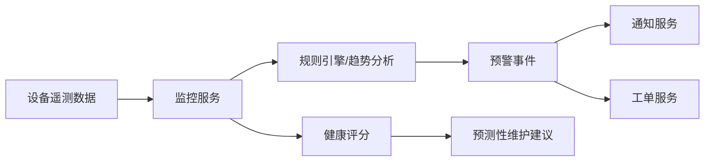

# 场景三：故障预警与预测性维护

项目固定背景统一参考 [项目固定背景.md](/Users/duanpeitong/Desktop/work/study/26_jgs_lw/项目固定背景.md)。

## 1. 场景定位

### 1.1 从业务角度看

故障预警与预测性维护场景解决的是“设备异常能否提前识别、运维模式能否从被动维修转向主动预防”的问题。它体现的是平台从“看见问题”走向“提前处理问题”的能力升级。

### 1.2 从考题角度看

这个场景适合以下题目：

- 智能运维架构设计
- 数据架构设计
- 预测分析系统设计
- 平台能力演进设计
- 数据驱动决策设计

如果题目涉及“智能运维”“预测分析”“平台演进”“数据驱动”，这个场景都可以作为主叙事展开。

### 1.3 从项目角度看

在本项目中，集团过去更多依赖“故障后抢修”的方式处理设备问题，停机之后才发现异常，既影响产线连续性，也导致运维成本偏高。平台建设后，管理层希望逐步建立从异常发现、风险预判到主动维护的能力。

因此，这个场景在项目中承担的是“从监控告警走向预测性维护”的能力升级角色。

## 2. 场景拆解

### 2.1 业务目标与成功标准

该场景的核心目标包括：

- 提前识别关键设备异常趋势
- 减少被动维修和非计划停机
- 让预警结果进入运维闭环而不是停留在展示层

成功标准主要体现为：

- 关键设备具备可解释的预警能力
- 预警结果能联动工单和通知
- 运维策略能随着数据积累持续优化

### 2.2 核心矛盾与约束条件

这个场景的主要矛盾在于：

1. 虽然采集到了很多数据，但历史样本和规则经验并不完全充分
2. 如果直接上复杂模型，落地风险较高
3. 误报和漏报都会影响一线人员对平台的信任
4. 预警结果如果不能进入闭环，业务价值有限

这决定了项目不能一开始就完全依赖复杂算法模型，而应采用渐进式路线。

### 2.3 架构决策与方案选择

基于上述判断，我采用了“规则预警为主、模型分析为辅”的渐进式演进方案。

方案核心包括：

- 前期以阈值规则、趋势规则和组合规则为主
- 中期逐步引入设备健康评分
- 后期再扩展趋势分析和预测性维护策略
- 预警结果必须联动工单和通知形成闭环

这样设计的本质，是先让平台具备可解释、可落地的预警能力，再逐步向更复杂的智能分析演进。

### 2.4 技术落点与协同关系

该场景最终主要落到以下能力上：

- 时序数据分析
- 规则引擎
- 健康评分模型
- 告警中心
- 工单联动机制

典型链路可写为：

`设备遥测数据 -> 监控服务 -> 规则引擎/趋势分析 -> 预警事件 -> 通知服务/工单服务`

后续可拔高为：

`历史数据 -> 健康评分模型 -> 风险评估结果 -> 预测性维护建议`

### 2.5 项目推进与落地方式

该场景实施上采用了明显的渐进式推进：

- 第一期：对高价值设备建立基础预警规则
- 第二期：引入趋势规则和健康评分
- 第三期：形成预测性维护看板和运维策略优化机制

这样做的好处是：

- 快速形成可用能力
- 控制算法建设风险
- 随着数据积累逐步增强预警准确性

### 2.6 项目链路图示

## 3. 论文主体内容（约 1300 字）

在本项目建设过程中，我很早就认识到，智能设备运维平台如果只做到“实时监控”和“异常告警”，虽然已经优于传统人工巡检模式，但仍然没有真正改变设备运维“事后处理”的本质。集团建设该平台的更深层目标，是希望逐步把运维模式从“故障后维修”转向“事前预防”。因此，在完成基础监控能力建设之后，我把故障预警与预测性维护场景作为平台能力升级的关键方向。

在问题分析阶段，我没有直接把目标定义为“上一个复杂算法模型”。因为我判断本项目虽然已经具备设备接入、监控和告警的数据基础，但在建设早期，历史样本积累、标签质量和现场经验沉淀仍然有限，如果贸然把预警能力完全建立在复杂模型之上，风险会非常高。一方面，模型效果可能短期内难以稳定；另一方面，如果一线人员频繁遇到误报和漏报，会迅速降低对平台的信任。因此，我在架构上采取了更稳健的路线：先建立可解释、可配置、可快速落地的规则预警体系，再逐步引入趋势分析和健康评分能力，最后再向更强的预测性维护能力扩展。

基于这一思路，我首先把预警场景建立在现有监控链路之上。设备遥测数据经由监控服务汇聚后，不仅用于实时看板展示，还进一步进入规则引擎和趋势分析链路。前期重点围绕温度、电流、振动、运行时长等高价值指标，建立阈值规则、组合规则和时间趋势规则。例如，单个温度超阈值可视为一般异常，而温度持续升高并伴随振动异常时，则判定为更高等级的预警事件。这种做法能够以较低建设成本快速形成可落地的预警能力，也便于后续和现场经验进行对照校准。

在此基础上，我逐步引入健康评分和趋势分析机制。对于关键设备，不再只看某一时刻是否超阈值，而是综合运行时间、测点变化趋势和异常历史，形成设备健康度判断。这使平台能够从“看当前有没有故障”进一步走向“判断未来是否存在风险”。当然，我并没有把这部分设计成孤立的分析模块，而是要求其输出结果必须进入运维主链路：一旦达到预警条件，就要生成预警事件，并联动通知服务和工单服务，让风险识别直接转化为运维动作。否则，即便分析结果再准确，也难以真正提升业务价值。

在项目推进方式上，我坚持渐进式建设，而不是一次性把所有智能分析能力堆上去。第一期先围绕高价值设备建立基础预警规则，解决最直接的异常识别问题；第二期再逐步引入趋势分析和健康评分，让平台具备更强的风险识别能力；第三期再面向管理层和运维团队建设预测性维护看板和策略优化能力。这种路径的优势在于，平台每个阶段都能产出实际业务价值，同时为下一阶段积累足够的数据和经验基础。

从项目效果看，故障预警与预测性维护场景显著提升了平台对关键设备异常的提前发现能力，也推动集团设备运维模式逐步从事后抢修走向事前预防。更重要的是，这一场景让平台不再只是一个“看到数据、看到告警”的系统，而是成为能够辅助运维决策和推动主动维护的智能平台。回顾整个建设过程，我认为这一场景最核心的经验，不是“采用了多先进的算法”，而是通过渐进式架构设计，在控制落地风险的同时，把规则、趋势分析、健康评分和工单闭环串联成了一条真正可运行的智能运维能力链路。这也是本项目从传统运维系统迈向智能运维平台的重要标志。
