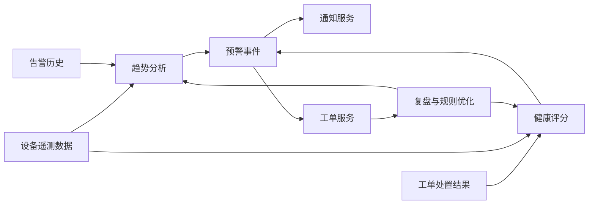

# 场景三：故障预警与预测性维护

项目固定背景统一参考 [项目固定背景.md](/Users/duanpeitong/Desktop/work/study/26_jgs_lw/项目固定背景.md)。

## 1. 场景定位

### 1.1 从业务角度看

故障预警与预测性维护解决的是“设备异常能否提前识别、运维模式能否从事后抢修转向主动预防”的问题。它体现的是平台从状态感知走向风险判断的能力升级。

在本项目中，故障预警不能简单理解为增加一个算法模型，而是要把设备遥测、告警历史、工单结果和现场经验组织成一条可解释、可验证、可闭环的智能运维链路。

### 1.2 从考题角度看

这个场景适合以下题目：

- 智能运维架构设计
- 数据架构设计
- 预测分析系统设计
- 平台能力演进设计
- 数据驱动决策设计
- 规则引擎与告警设计
- 软件架构演进设计

如果题目涉及“智能运维”“预测分析”“健康评分”“平台演进”“数据驱动”，这个场景都可以作为主叙事展开。写作时重点要说明为什么不能一开始完全依赖复杂模型，以及如何通过渐进式设计降低落地风险。

### 1.3 从项目角度看

项目建设前，集团设备运维更多依赖“故障后抢修”，停机后才发现异常，既影响产线连续性，也导致运维成本偏高。平台一期、二期完成接入、监控、告警和工单闭环后，集团希望进一步利用历史数据和处置经验，逐步建立风险预判能力。

因此，该场景承担的是“从监控告警走向预测性维护”的能力升级角色。

## 2. 场景拆解

### 2.1 业务目标与成功标准

该场景的核心目标包括：

- 提前识别关键设备异常趋势
- 减少被动维修和非计划停机
- 将预警结果联动通知和工单，而不是停留在展示层
- 随着数据积累持续优化规则、健康评分和维护策略

成功标准主要体现为：

- 关键设备具备可解释的预警规则和健康度评估
- 预警结果可追踪、可确认、可关闭
- 预警能够联动工单或维护计划
- 误报和漏报能够通过复盘持续优化

### 2.2 场景边界

这个场景重点解决异常趋势识别、健康评分、风险分级和预警闭环问题。

它不直接替代实时告警，也不直接承担复杂设备维修知识库的全部内容。实时告警关注“当前是否异常”，故障预警关注“未来是否可能出现风险”；工单服务负责处置流程，预警场景负责把风险识别结果转化为可执行的预警事件。

### 2.3 核心矛盾与约束条件

这个场景的主要矛盾包括：

1. 设备数据已经持续采集，但早期历史样本和故障标签并不充分
2. 复杂模型短期内可能效果不稳定，且解释性不足
3. 误报会消耗运维精力，漏报会影响业务信任
4. 不同设备类型的故障机理差异大，不能用一套规则覆盖全部设备
5. 预警结果如果不能进入工单和维护计划，业务价值有限
6. 预测性维护需要长期数据积累和持续校准，不适合一次性建成

这些约束决定了项目不能一开始就完全依赖复杂算法模型，而应采用渐进式路线。

### 2.4 备选方案与舍弃理由

| 备选方案 | 表面优势 | 舍弃原因 |
| --- | --- | --- |
| 直接建设复杂预测模型 | 技术先进，容易拔高 | 早期样本不足、标签质量有限，模型效果和解释性存在风险 |
| 只使用固定阈值规则 | 实现简单，解释性强 | 难以识别趋势性、组合性和劣化性风险 |
| 预警只展示在看板上 | 对业务侵入小 | 无法转化为运维动作，容易变成“只看不做” |
| 各基地自行维护预警规则 | 贴近现场 | 规则口径不统一，无法沉淀集团级经验 |

因此，我采用“规则预警为主、趋势分析和健康评分逐步增强、预警事件联动工单”的渐进式方案。

### 2.5 架构决策与边界划分

该场景按四个层次设计。

第一层是数据基础层。设备遥测、告警历史、工单处置结果和设备主数据共同构成预警分析基础。

第二层是规则与趋势层。前期通过阈值规则、组合规则、时间窗口规则和趋势规则识别可解释风险。

第三层是健康评分层。对关键设备综合运行时长、异常频次、测点趋势和维修历史形成健康度评估。

第四层是预警闭环层。预警结果进入告警中心、通知服务和工单服务，形成确认、处置、复盘和优化闭环。

### 2.6 关键机制设计

#### 2.6.1 规则先行与模型渐进

项目早期不直接以复杂模型作为主方案，而是先把现场经验转化为可配置规则。例如温度持续上升、振动异常叠加电流波动、同类告警在短时间内复发等，都可以通过组合规则和窗口规则表达。

随着历史数据和工单处置结果积累，再逐步引入健康评分、趋势预测和设备画像能力。这样既保证前期能力可落地，也为后续智能化增强保留空间。

#### 2.6.2 预警分级与闭环反馈

预警事件不能和普通告警混在一起简单展示。平台需要根据设备重要性、异常趋势、历史复发情况和影响范围进行风险分级。

预警触发后，可以按等级采取不同动作：低等级预警进入看板和通知，高等级预警触发工单或维护计划。处置完成后，工单结果反向反馈给规则和评分模型，用于校准阈值、权重和规则条件。

#### 2.6.3 可解释性与信任建立

一线运维人员需要知道系统为什么产生预警。因此预警结果应展示触发规则、关键指标变化、历史趋势和相关告警记录，而不是只给出一个黑盒分数。

这种设计可以降低智能化能力落地阻力，也便于后续复盘和优化。

### 2.7 质量属性与架构权衡

该场景主要支撑以下质量属性。

- `可解释性`
  规则和健康评分需要能说明触发原因，便于一线接受。

- `可演进性`
  从规则到评分再到预测模型逐步增强，避免一次性押注。

- `可靠性`
  预警结果进入闭环，避免只展示不处理。

- `可维护性`
  规则、模型、设备类型和阈值配置分离，便于持续优化。

这里的取舍是：项目早期没有追求一步到位的复杂智能模型，而是优先选择可解释、可验证、可配置的规则预警。这样技术先进性不如纯模型方案强，但落地风险更低，更符合考试论文中“架构可实施”的要求。

### 2.8 技术落点与协同关系

该场景主要落到以下能力上：

- 时序数据分析
- 规则引擎
- 趋势分析
- 健康评分模型
- 告警中心
- 工单联动机制
- 预警复盘与规则优化

典型链路可写为：

`设备遥测数据/告警历史/工单结果 -> 趋势分析/规则引擎/健康评分 -> 预警事件 -> 通知服务/工单服务 -> 复盘优化`

### 2.9 项目推进与验证方式

该场景采用渐进式推进：

- 第一期：对高价值设备建立基础预警规则
- 第二期：引入趋势规则、预警分级和健康评分
- 第三期：形成预测性维护看板、复盘机制和策略优化能力

验证重点包括预警命中率、误报率、漏报反馈、预警到工单的转化率、关键设备非计划停机变化等。

### 2.10 论文转写角度

如果题目是 `智能运维架构设计`，重点写规则、趋势、评分和闭环联动。

如果题目是 `数据架构设计`，重点写遥测、告警、工单和主数据如何支撑预警。

如果题目是 `架构演进设计`，重点写从规则预警到健康评分再到预测性维护的渐进路线。

如果题目是 `规则引擎设计`，重点写阈值、组合、窗口、趋势和复盘优化机制。

### 2.11 项目链路图示

## 3. 论文主体内容（约 1300 字）

在本项目建设过程中，我很早就认识到，智能设备运维平台如果只做到实时监控和异常告警，虽然已经优于传统人工巡检模式，但仍然没有真正改变设备运维“事后处理”的本质。集团建设该平台的更深层目标，是逐步把运维模式从“故障后抢修”转向“事前预防”。因此，在完成基础监控和工单闭环能力后，我把故障预警与预测性维护作为平台能力升级的重要场景。

在方案分析阶段，我没有直接把目标定义为建设复杂预测模型。因为项目早期虽然已经具备设备接入和监控数据，但历史故障样本、标签质量和现场经验沉淀仍然有限。如果贸然把预警能力完全建立在复杂模型上，短期效果可能不稳定，解释性也不足。一线人员如果频繁遇到误报和漏报，会迅速降低对平台的信任。因此，我选择更稳健的路线：先建立可解释、可配置、可验证的规则预警体系，再逐步引入趋势分析和健康评分能力，最后向更复杂的预测性维护能力演进。

基于这一思路，我将预警能力建立在设备遥测、告警历史、工单结果和设备主数据之上。前期重点围绕温度、电流、振动、运行时长等高价值指标建立阈值规则、组合规则和时间窗口规则。例如，单个温度超阈值可以作为普通提醒，但如果温度持续升高并伴随振动异常，则判定为更高等级的预警事件。这样既保留了规则的解释性，也能表达比单点阈值更复杂的风险模式。

在此基础上，我逐步引入健康评分和趋势分析机制。对于关键设备，不再只看某一时刻是否超阈值，而是综合运行时间、异常频次、测点变化趋势和维修历史，形成设备健康度评估。预警结果也不是孤立展示，而是进入告警中心和工单服务：低等级预警进入看板和通知，高等级预警触发维护工单或检查计划。工单处理结果再反向反馈给规则和评分模型，用于校准阈值、权重和规则条件。

在实施方式上，我坚持渐进式建设。第一期先围绕高价值设备建立基础预警规则，解决最直接的异常趋势识别问题；第二期引入预警分级、趋势规则和健康评分，使平台具备更强的风险判断能力；第三期建设预测性维护看板和复盘优化机制，支撑管理层评估重点设备风险和维护策略效果。这样每个阶段都有实际业务价值，同时为下一阶段积累数据和经验。

从项目效果看，故障预警与预测性维护场景提升了平台对关键设备异常趋势的提前发现能力，也推动集团设备运维模式逐步从事后抢修走向事前预防。回顾整个过程，我认为该场景最核心的经验，不是采用了多复杂的算法，而是通过渐进式架构设计，在控制落地风险的同时，把规则、趋势分析、健康评分、工单闭环和复盘优化串联成一条真正可运行的智能运维能力链路。

