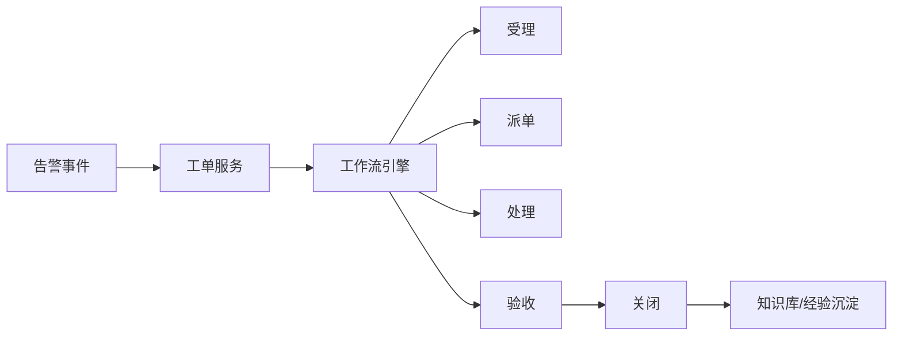

# 场景四：工单闭环与运维流程

项目固定背景统一参考 [项目固定背景.md](/Users/duanpeitong/Desktop/work/study/26_jgs_lw/项目固定背景.md)。

## 1. 场景定位

### 1.1 从业务角度看

工单闭环与运维流程场景解决的是“设备异常被发现之后，如何真正落实到处理动作”的问题。它体现的是平台从“发现问题”走向“闭环解决问题”的能力。

### 1.2 从考题角度看

这个场景适合以下题目：

- 业务流程架构设计
- 工作流系统设计
- 平台化改造设计
- 运维体系设计
- 业务闭环设计

如果题目涉及“流程重构”“工作流”“平台化治理”“闭环管理”，这个场景都很适合展开。

### 1.3 从项目角度看

在本项目实施前，各基地设备故障处理更多依赖电话通知、纸质记录和人工协调，缺少统一的工单系统，处理过程不可追踪，经验也难以沉淀。即使前面已经建立了监控和告警能力，如果异常最终不能转化为标准化处理流程，平台价值仍然有限。

因此，工单闭环场景在项目中承担的是“从发现异常走向运维落地”的关键作用。

## 2. 场景拆解

### 2.1 业务目标与成功标准

这个场景的业务目标主要有三点：

- 把告警和异常转化为可执行工单
- 建立统一、可追踪的运维流程
- 沉淀处理经验并支撑后续优化

成功标准包括：

- 告警可以自动或半自动触发工单
- 工单状态全过程可追踪
- 不同基地在统一框架下实现协同

### 2.2 核心矛盾与约束条件

该场景的主要矛盾在于：

1. 各基地处理流程差异大，难以统一
2. 告警发现后缺少标准化派工机制
3. 工单处理过程没有统一状态流转
4. 经验知识散落在个人和班组中，无法沉淀

这决定了平台不能只做一个“工单列表”，而必须做成一套流程治理能力。

### 2.3 架构决策与方案选择

针对这些问题，我采用了“告警驱动工单 + 工作流控制流转 + 知识库沉淀经验”的方案。

核心思路是：

- 告警达到条件后自动或人工确认生成工单
- 工单按受理、派单、处理、验收、关闭等状态流转
- 不同基地可在统一流程框架下配置局部参数
- 处理过程和典型经验沉淀到知识库中

这种方案的本质，是把原本依赖人工协作的分散式处理，升级为平台驱动的标准闭环。

### 2.4 技术落点与协同关系

该场景最终主要落在以下几类能力上：

- 工作流引擎
- 状态机
- 消息通知
- 审计日志
- 知识库

典型链路可写为：

`告警事件 -> 工单服务 -> 工作流引擎 -> 派单/处理/验收 -> 工单关闭 -> 知识沉淀`

### 2.5 项目推进与落地方式

该场景在项目中的推进方式是：

- 第一期：完成基础工单流转和人工派单
- 第二期：实现自动派单、通知联动和移动端处理
- 第三期：打通知识库、统计分析和运维考核

这种推进方式的好处是，可以先把流程跑通，再逐步增强智能化和管理化能力。

### 2.6 项目链路图示

## 3. 论文主体内容（约 1300 字）

在本项目建设中，我很快意识到，设备运维平台如果只做到“发现异常”，而不能推动后续处理和闭环，那么它对业务的实际价值会非常有限。项目实施前，各基地设备异常处理更多依赖电话沟通、纸质记录和人工协调，不同基地流程差异很大，处理过程不可追踪，问题解决后也难以形成统一经验沉淀。因此，在监控和告警能力基本建立之后，我将工单闭环与运维流程场景作为平台建设的关键业务场景之一，目标是把异常发现真正转化为标准化、可追踪、可分析的运维动作。

在问题分析阶段，我首先识别到一个典型矛盾：过去的异常处理虽然“有人在做”，但流程没有被平台化。告警发现之后，谁负责、何时处理、是否升级、处理是否完成、是否复发，这些关键问题都依赖人工协调和经验判断。这样的方式在小范围内或许还能运转，但在 3 个基地统一建设平台的背景下，必然会带来响应慢、责任模糊、统计困难和经验无法沉淀的问题。因此，我认为这个场景不能只做简单的工单录入，而必须把异常处理流程作为一项平台能力进行标准化重构。

基于这一认识，我在架构上采用了“告警驱动工单 + 工作流控制流转 + 知识库沉淀经验”的闭环方案。首先，当告警达到一定条件后，系统可以自动生成工单，或者由值班人员确认后转工单；其次，工单不是自由流转，而是严格按照受理、派单、处理、验收、关闭等标准状态推进，并通过工作流引擎进行控制；再次，不同基地在统一流程框架下可以配置本地处理参数，例如派单规则、验收角色和处理时限，以兼顾集团统一治理与现场灵活性；最后，典型故障处理方式和经验结果进入知识库，为后续复用提供基础。

在这个场景中，我特别强调工单不是独立模块，而是告警链路和运维流程之间的承接层。也就是说，平台不是先有一个工单系统，再想办法往里面填数据，而是让告警中心和工单服务天然衔接：一旦告警达到严重等级，系统就可以自动触发工单生成；工单进入处理流转后，相关节点又通过通知服务推送到对应人员；工单关闭后，其处理结果再反向沉淀到知识库和分析模块。这种设计使平台真正形成了“发现异常 -> 触发处理 -> 记录过程 -> 沉淀经验”的闭环链路。

在实施方式上，我没有一开始就把所有复杂功能全部压上去，而是采用分阶段推进。第一阶段先完成基础工单流转，让各基地都在统一框架下使用同一套状态模型；第二阶段再实现自动派单、消息通知和移动端处理，使流程更加高效；第三阶段再把知识库、统计分析和运维考核接入进来，使工单系统从单纯流程工具升级为运维治理平台。这样的推进路径有利于先解决“有没有流程”的问题，再逐步解决“流程好不好用”和“流程能不能持续优化”的问题。

从项目效果看，工单闭环与运维流程场景显著提升了异常处理效率和过程透明度，使设备运维从过去依赖人工协同的松散方式，转变为平台驱动的标准化流程体系。更重要的是，处理结果和经验能够被结构化沉淀，为后续告警规则优化、运维知识复用和绩效考核提供支撑。回顾整个项目，我认为这一场景最核心的价值，不只是“做了一个工单模块”，而是它把平台前端的告警识别能力和后端的运维执行能力连接起来，真正形成了可管理、可追踪、可持续优化的业务闭环。
