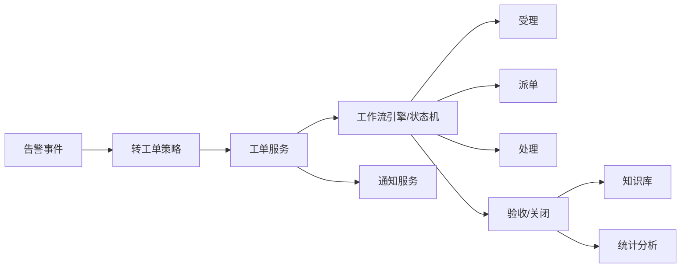

# 场景四：工单闭环与运维流程

项目固定背景统一参考 [项目固定背景.md](/Users/duanpeitong/Desktop/work/study/26_jgs_lw/项目固定背景.md)。

## 1. 场景定位

### 1.1 从业务角度看

工单闭环与运维流程解决的是“设备异常被发现之后，如何真正落实到处理动作”的问题。它体现的是平台从异常识别走向闭环处置的能力。

如果告警只能停留在提示层，而不能转化为责任明确、过程可追踪、结果可复盘的工单流程，平台仍然无法真正改变原有依赖电话、纸质记录和人工协调的运维方式。

### 1.2 从考题角度看

这个场景适合以下题目：

- 业务流程架构设计
- 工作流系统设计
- 平台化改造设计
- 运维体系设计
- 业务闭环设计
- 事件驱动架构设计

如果题目涉及“流程重构”“工作流”“平台化治理”“闭环管理”“事件驱动”，这个场景都很适合展开。写作时要突出告警事件如何驱动流程，以及流程如何反向沉淀知识和指标。

### 1.3 从项目角度看

项目实施前，各基地设备故障处理更多依赖电话通知、纸质记录和人工协调，处理过程不可追踪，经验难以沉淀。平台建立监控和告警能力后，如果不把异常转化为工单闭环，业务价值仍然有限。

因此，工单闭环场景承担的是“从发现异常走向运维落地”的关键作用。

## 2. 场景拆解

### 2.1 业务目标与成功标准

该场景的业务目标包括：

- 把告警和预警转化为可执行工单
- 建立统一、可追踪、可考核的运维流程
- 让不同基地在统一框架下保留必要灵活性
- 沉淀故障处置经验并支撑后续优化

成功标准包括：

- 告警可以自动或半自动触发工单
- 工单状态全过程可追踪、可审计
- 派单、处理、验收和关闭责任清晰
- 工单结果能够反向支撑告警规则、知识库和统计分析

### 2.2 场景边界

这个场景重点解决告警后的处置流程、状态流转、责任分派和结果沉淀。

它不负责判断设备是否异常，也不负责预测模型本身。告警中心负责生成事件，工单服务负责把事件转化为流程；知识库和分析服务则承接工单结果，用于经验复用和管理分析。

### 2.3 核心矛盾与约束条件

该场景的主要矛盾包括：

1. 各基地处理流程差异大，统一治理和本地灵活性需要平衡
2. 告警发现后缺少标准化派工机制
3. 工单状态如果不受控，过程容易失真
4. 处置经验散落在个人和班组中，无法复用
5. 流程过重会影响一线使用，流程过轻又无法管理
6. 工单结果需要反向支撑统计分析和规则优化

这决定了平台不能只做“工单列表”，而必须把工单设计成流程治理能力。

### 2.4 备选方案与舍弃理由

| 备选方案 | 表面优势 | 舍弃原因 |
| --- | --- | --- |
| 只做人工录入工单 | 开发简单 | 告警和处置断裂，仍依赖人工协调 |
| 告警全部自动生成工单 | 响应快 | 误报和低价值告警会制造大量无效工单 |
| 各基地保留完全不同流程 | 贴近现场 | 集团无法统一统计、审计和复盘 |
| 工单自由编辑状态 | 使用灵活 | 状态不可控，过程难以追踪和考核 |

因此，我采用“告警驱动工单 + 工作流控制状态 + 参数化适配基地差异 + 知识库沉淀经验”的方案。

### 2.5 架构决策与边界划分

该场景按四层设计。

第一层是事件触发层。告警中心输出告警事件，满足条件后自动或人工确认转为工单。

第二层是流程控制层。工单服务和工作流引擎控制受理、派单、处理、验收、关闭等状态。

第三层是协同通知层。工单状态变化通过通知服务推送给负责人、班组长或基地管理人员。

第四层是沉淀分析层。工单处理结果进入知识库和分析服务，用于故障复盘、经验复用和指标统计。

### 2.6 关键机制设计

#### 2.6.1 告警到工单的转换策略

不是所有告警都直接生成工单。项目中按告警等级、设备重要性、持续时间和重复次数决定是否自动转工单。

高等级告警可以自动生成工单，普通告警由值班人员确认后转工单，低等级提醒只进入看板和通知。这样可以避免无效工单过多，也保证关键异常不被遗漏。

#### 2.6.2 状态机与流程约束

工单状态采用受理、派单、处理中、待验收、关闭等标准状态，并限制非法跳转。例如未派单不能进入处理完成，未验收不能关闭。

不同基地可以配置派单规则、处理时限和验收角色，但必须在统一状态模型下运行。这样既保留局部灵活性，也保证集团统计和审计口径一致。

#### 2.6.3 知识沉淀与反向优化

工单关闭时，需要记录故障原因、处理措施、备件使用、停机时长和复发情况。典型问题进入知识库，复发问题进入专题分析。

这些结果可以反向优化告警规则、预警策略和运维考核指标，使工单不只是流程工具，而成为持续改进的数据来源。

### 2.7 质量属性与架构权衡

该场景主要支撑以下质量属性。

- `可追踪性`
  工单状态、处理记录和操作日志保证过程可追溯。

- `一致性`
  统一状态机和流程模型保证集团统计口径一致。

- `灵活性`
  派单规则、处理时限和验收角色允许按基地配置。

- `可维护性`
  告警、工单、通知和知识库边界清晰，便于后续扩展。

这里的取舍是：流程标准化会降低部分现场自由度，但可以换来过程透明、责任清晰和可复盘能力。为避免流程过重，项目中通过参数化配置保留基地差异。

### 2.8 技术落点与协同关系

该场景主要落在以下能力上：

- 告警事件
- 工单服务
- 工作流引擎
- 状态机
- 消息通知
- 审计日志
- 知识库
- 工单统计分析

典型链路可写为：

`告警事件 -> 工单服务 -> 工作流引擎 -> 派单/处理/验收 -> 工单关闭 -> 知识库/分析服务`

### 2.9 项目推进与验证方式

该场景分阶段推进：

- 第一期：完成基础工单流转和人工派单
- 第二期：实现告警转工单、自动派单、通知联动和移动端处理
- 第三期：打通知识库、统计分析和运维考核

验证重点包括工单响应时长、平均修复时间、超时率、关闭率、复发率和知识库复用情况。

### 2.10 论文转写角度

如果题目是 `业务流程架构设计`，重点写告警到工单的流程重构和状态治理。

如果题目是 `工作流系统设计`，重点写状态机、流程配置、任务分派和验收关闭。

如果题目是 `事件驱动架构设计`，重点写告警事件如何驱动工单、通知和分析。

如果题目是 `平台化治理`，重点写统一流程框架与基地差异配置。

### 2.11 项目链路图示

## 3. 论文主体内容（约 1300 字）

在本项目建设中，我很快意识到，设备运维平台如果只做到发现异常，而不能推动后续处理和闭环，对业务的实际价值会非常有限。项目实施前，各基地设备异常处理更多依赖电话沟通、纸质记录和人工协调，不同基地流程差异大，处理过程不可追踪，问题解决后也难以形成统一经验沉淀。因此，在监控和告警能力基本建立之后，我将工单闭环与运维流程作为平台建设的关键业务场景。

在方案分析阶段，我没有选择只做一个人工录入的工单列表。因为这种做法虽然开发简单，但告警和处置仍然断裂，平台无法保证谁负责、何时处理、是否升级、是否验收和是否复发。我也没有把所有告警都自动转成工单，因为这样会把低价值告警和误报转化为大量无效工单，反而增加一线负担。基于这些判断，我采用“告警驱动工单 + 工作流控制状态 + 参数化适配基地差异 + 知识库沉淀经验”的方案。

具体设计上，告警中心输出统一告警事件，工单服务根据告警等级、设备重要性、持续时间和重复次数决定是否自动生成工单。高等级告警自动转工单，普通告警由值班人员确认后转工单，低等级提醒则进入看板和通知。工单生成后，由工作流引擎控制受理、派单、处理中、待验收、关闭等标准状态，并限制非法跳转。这样既能保证关键异常及时进入处置流程，又能避免无效工单过多。

在流程治理上，我特别强调统一框架和基地差异之间的平衡。不同基地可以配置派单规则、处理时限和验收角色，但必须在统一工单状态模型下运行。这样总部能够基于统一口径统计响应时长、平均修复时间、超时率和关闭率，基地又能保留与现场组织相匹配的执行方式。工单状态变化还会通过通知服务推送给负责人、班组长或管理人员，使流程不再依赖口头传递。

在经验沉淀方面，工单关闭并不是流程结束，而是数据回流的开始。平台要求记录故障原因、处理措施、备件使用、停机时长和复发情况。典型问题进入知识库，复发问题进入专题分析，处理结果反向优化告警规则和预警策略。这样，工单系统就不只是流程工具，而成为设备运维持续改进的数据来源。

从项目效果看，工单闭环与运维流程场景显著提升了异常处理效率和过程透明度，使设备运维从过去依赖人工协调的松散方式，转变为平台驱动的标准化流程体系。回顾整个项目，我认为该场景的核心价值不只是做了一个工单模块，而是把前端告警识别能力和后端运维执行能力连接起来，形成了可管理、可追踪、可复盘、可持续优化的业务闭环。

