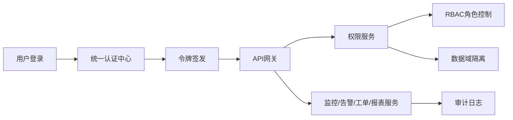

# 场景五：多基地多租户与权限隔离

项目固定背景统一参考 [项目固定背景.md](/Users/duanpeitong/Desktop/work/study/26_jgs_lw/项目固定背景.md)。

## 1. 场景定位

### 1.1 从业务角度看

多基地多租户与权限隔离场景解决的是“集团统一平台如何既能共享，又能保证边界清晰”的问题。它体现的是平台从“能用”走向“能在集团范围治理”的能力。

### 1.2 从考题角度看

这个场景适合以下题目：

- 安全架构设计
- 权限体系设计
- 多租户平台设计
- 企业统一平台治理
- 安全与审计设计

如果题目涉及“权限”“安全”“多租户”“集团化治理”，这个场景都非常适合展开。

### 1.3 从项目角度看

本项目面向总部和 3 个生产基地统一建设。如果平台不能同时满足总部监管、基地自治、角色分工和数据隔离的需求，那么平台即使功能做得再多，也很难在集团层面长期推广。

因此，这个场景在项目中承担的是“平台治理边界”的关键作用。

## 2. 场景拆解

### 2.1 业务目标与成功标准

该场景的目标主要包括：

- 总部能够统一监管集团设备运维情况
- 基地用户只能访问本基地或本职责范围内的数据
- 不同角色拥有不同的菜单和操作权限
- 敏感操作能够被审计和追溯

成功标准体现为：

- 平台共享但不越权
- 权限边界清晰可配置
- 审计能力覆盖关键管理动作

### 2.2 核心矛盾与约束条件

该场景的核心矛盾在于：

1. 总部需要跨基地看整体
2. 基地只应看本域
3. 角色分工复杂，不能只有一个“管理员”和“普通用户”
4. 统一平台一旦做大，越权风险会被放大

这意味着平台不能只做基础登录，而必须把组织、角色、数据域、审计统一纳入设计。

### 2.3 架构决策与方案选择

针对上述问题，我采用了“统一认证中心 + 角色权限模型 + 数据域隔离 + 审计日志”的复合方案。

核心思路是：

- 用统一认证中心解决身份统一问题
- 用角色模型控制功能权限
- 用数据域隔离控制可见范围
- 用审计日志记录关键行为

这样设计之后，平台既能满足总部跨基地监管，又能保证基地和车间层面的访问边界。

### 2.4 技术落点与协同关系

该场景最终主要落在以下能力上：

- 单点登录
- `OAuth 2.0 / OIDC / JWT`
- `RBAC`
- 数据域隔离
- 审计日志

典型链路可写为：

`用户登录 -> 统一认证中心 -> 令牌签发 -> API 网关鉴权 -> 业务服务按角色和数据域过滤`

### 2.5 项目推进与落地方式

这个场景的推进方式是：

- 第一期：先建立账户、角色和组织基础模型
- 第二期：补充数据域控制和跨基地授权
- 第三期：增强审计分析与安全告警

这样做的原因是，权限体系必须先解决“能管起来”，再逐步增强治理深度。

### 2.6 项目链路图示

## 3. 论文主体内容（约 1300 字）

在本项目中，多基地多租户与权限隔离场景并不是一个附属的安全问题，而是平台能否真正推广落地的前提条件。项目统一服务总部和 3 个生产基地，不同组织、不同岗位、不同业务角色对平台功能和数据的访问范围有明显差异。如果权限边界定义不清，平台越成功推广，管理混乱和越权风险就越大。因此，在总体架构设计阶段，我把权限体系作为平台基础能力之一，与监控、告警、工单等业务能力同步考虑，而不是等功能做完后再补安全。

在问题分析阶段，我首先识别到一个典型矛盾：集团层面希望通过统一平台实现跨基地监管，而基地层面又必须保留本域自治和职责边界。如果平台只强调总部统一视角，那么基地用户会觉得系统越权过多；如果平台只强调本地隔离，又无法实现集团级运营管理。因此，这个场景的本质不是“谁能登录系统”，而是“在共享平台上如何建立清晰边界”。同时，平台中的角色也远不止简单的管理员和普通用户，而是涉及总部设备管理人员、基地运维工程师、基地负责人、车间班组长等多类角色，这进一步提高了权限体系设计的复杂度。

基于这一认识，我在架构上采用了“统一认证中心 + 角色权限模型 + 数据域隔离 + 审计日志”的复合方案。首先，通过统一认证中心和单点登录机制，让监控、告警、工单、报表等模块共享同一身份体系，避免各模块各自维护账号和权限；其次，通过基于角色的权限模型，把功能菜单和操作权限与总部人员、基地人员、车间班组等不同职责绑定起来；再次，通过数据域隔离，把集团、基地、车间、产线、设备等层级纳入访问边界控制，使不同用户即便访问同一个系统，也只能看到自己有权查看的数据；最后，通过审计日志对权限变更、规则调整、强制关闭工单等关键操作进行留痕，为后续追溯和治理提供依据。

在项目实施中，我特别强调功能权限和数据权限必须分开处理。因为功能权限解决的是“能不能点某个菜单、能不能执行某个操作”，而数据权限解决的是“点进去之后能看到哪些数据”。例如，总部设备管理人员可以进入集团级驾驶舱查看跨基地汇总数据，基地运维工程师也可以进入监控和告警模块，但其可见范围仅限于本基地设备和本基地工单。这样设计之后，平台不会因为共享而失去边界，也不会因为隔离而割裂统一治理能力。

此外，我没有把审计日志当作简单的系统日志，而是把它纳入权限体系的一部分。因为在设备运维平台中，权限角色变更、告警规则调整、强制关闭工单等动作都可能直接影响运维决策和现场执行。如果这些动作没有统一留痕，一旦出现异常处置失误或权限越界问题，平台就无法还原过程、明确责任。因此，我要求所有关键管理动作都必须纳入审计日志，使平台不仅“能控权”，而且“可追溯”。

从项目效果看，多基地多租户与权限隔离场景有效支撑了平台在集团层面的统一推广。一方面，总部得以通过统一平台掌握跨基地设备运维态势，满足集团监管需求；另一方面，基地和车间用户仍能保持本域视角和职责边界，避免了共享平台带来的越权问题。更重要的是，这一场景使平台从一个功能型系统，升级为一个可以在大型组织中稳定运行、可管理、可审计的企业级平台。回顾整个过程，我认为这个场景最重要的价值，并不只是防止越权，而是在共享与边界之间建立了一套稳定、可持续扩展的治理机制，这是集团型平台建设中极其关键的一环。
