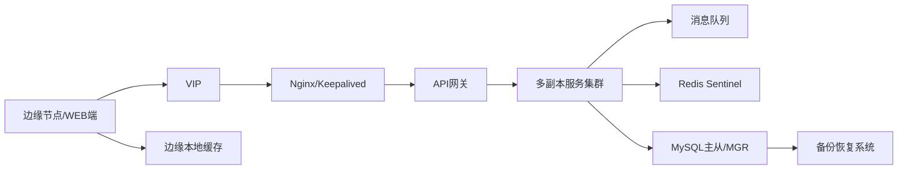

# 场景六：高可用与容灾设计

项目固定背景统一参考 [项目固定背景.md](/Users/duanpeitong/Desktop/work/study/26_jgs_lw/项目固定背景.md)。

## 1. 场景定位

### 1.1 从业务角度看

高可用与容灾场景解决的是“平台在异常情况下还能不能持续支撑设备运维业务”的问题。它体现的是平台从“具备功能”走向“具备生产级稳定性”的能力。

### 1.2 从考题角度看

这个场景适合以下题目：

- 高可用架构设计
- 容灾架构设计
- 可靠性设计
- 分布式系统稳定性设计
- 软件可靠性设计

如果题目涉及“高可用”“容灾”“稳定性”“可靠性”，这个场景都非常适合展开。

### 1.3 从项目角度看

本项目承载设备接入、状态监控、告警处理、工单闭环等多条关键链路。一旦平台整体或核心模块中断，影响的不只是某个功能页面，而是整个设备运维体系的响应效率。

同时，平台分 3 期交付并持续优化，这意味着系统不仅要稳定运行，还要支持平滑升级和持续扩展。

## 2. 场景拆解

### 2.1 业务目标与成功标准

这个场景的目标包括：

- 避免平台单点故障影响核心业务
- 在网络抖动和局部异常时尽量保证数据连续
- 支撑持续发布和持续优化

成功标准体现为：

- 核心链路具备多层冗余能力
- 异常场景下平台仍能维持基本可用
- 发布过程对现网影响可控

### 2.2 核心矛盾与约束条件

该场景的核心矛盾在于：

1. 中心平台故障会影响多个基地
2. 设备数据链路持续写入，不能轻易中断
3. 工业现场网络不稳定，边缘与中心可能短时断联
4. 分期交付意味着平台要经常发布和调整

这决定了高可用设计不能只看单个服务，而必须看全链路。

### 2.3 架构决策与方案选择

针对这些问题，我采用了“入口冗余 + 服务多副本 + 消息解耦 + 边缘缓冲 + 备份恢复”的整体方案。

核心思路是：

- 入口层具备高可用能力，避免统一入口单点
- 核心业务服务采用多副本部署
- 设备接入链路通过消息队列解耦
- 边缘节点支持本地缓存和恢复后补传
- 数据层具备备份恢复和故障切换能力

这种设计的本质，是把稳定性从单点能力升级为全链路能力。

### 2.4 技术落点与协同关系

该场景主要落在以下能力上：

- `VIP`
- `Nginx / Keepalived`
- `Kubernetes` 多副本
- 消息队列
- 边缘本地缓存
- `Redis Sentinel`
- `MySQL 主从 / MGR`
- 备份恢复与监控告警

典型链路可写为：

`边缘节点/WEB端 -> VIP -> Nginx/Keepalived -> API 网关 -> 多副本服务 -> 缓存/数据库高可用`

### 2.5 项目推进与落地方式

这个场景在项目中分阶段落地：

- 第一期：保障接入、监控和告警主链路高可用
- 第二期：增强工单、权限、缓存和数据库层稳定性
- 第三期：完善备份恢复、演练和灰度发布机制

这样做的原因是，稳定性建设需要与业务上线节奏同步推进。

### 2.6 项目链路图示

## 3. 论文主体内容（约 1300 字）

在本项目中，高可用与容灾场景不是附加优化，而是平台能否真正承担生产级设备运维任务的底线能力。平台覆盖 3 个生产基地、900 余台设备和 24 台边缘节点，承担设备接入、状态监控、告警识别、工单闭环和管理分析等多条核心链路。一旦系统中断，影响的不只是某个模块，而是整个设备运维体系都会受到冲击。因此，在总体架构设计中，我没有把高可用简单理解为“多部署几个实例”，而是把它作为入口、服务、数据、边缘和运维治理一体化建设的系统性能力。

在问题分析阶段，我首先识别到，本项目的稳定性风险来源是多层次的。第一，平台统一服务多个基地，中心平台一旦故障，会放大为集团级影响；第二，设备数据链路持续写入，不能像普通业务系统那样轻易中断；第三，工业现场与中心平台之间网络环境不稳定，边缘节点与中心的链路可能短时波动；第四，项目分 3 期交付并持续优化，系统在运行期间必然存在版本切换和结构调整。这些问题决定了高可用设计不能只盯着应用层，而必须从入口、服务、数据、边缘和发布治理多个层次统筹考虑。

基于这一判断，我首先在入口层构建了统一访问冗余能力。无论是边缘节点数据上报，还是总部和基地用户的业务访问，都必须通过平台入口进入后端系统。如果入口层采用单节点模式，那么再强的后端服务集群也无法真正提高可用性。因此，我要求入口层采用 `VIP + Nginx/Keepalived` 的方式构建高可用访问入口，使访问通道具备故障切换能力，从而保障边缘节点和用户侧都能够稳定进入平台。

在服务层，我将监控、告警、工单、权限等关键模块全部纳入多副本部署体系，通过服务集群方式避免单实例故障。同时，为了防止实时接入链路和业务处理链路相互拖累，我要求设备接入主链路通过消息队列进行解耦，使遥测数据先进入消息缓冲，再由监控和告警等服务按能力消费。这样即使个别服务实例短时波动，也不会直接阻塞整体接入链路。对于一个面向持续设备数据流的平台而言，这种解耦能力是高可用设计中非常关键的一环。

在数据层，我同步建设缓存和数据库的高可用能力。因为监控、工单、权限、设备档案等核心功能都依赖数据层，如果缓存和数据库仍然存在单点，那么服务多副本并不能真正解决问题。因此，我要求缓存层具备高可用机制，数据库层具备主从或集群切换能力，以保证关键数据服务在局部故障时仍可维持运行。与此同时，对于边缘侧，我又要求边缘节点具备本地缓存和恢复后补传能力。因为工业现场网络并不总是稳定，中心平台即便设计良好，也无法完全消除链路波动带来的风险。边缘缓存能力的存在，使平台能够在现场网络异常时依然尽量保留数据连续性。

最后，我没有把高可用停留在静态方案设计，而是把备份恢复、灰度发布、健康检查和运维监控纳入统一治理范围。因为项目并不是一次性交付，而是分期上线并持续优化，如果没有备份恢复机制和可控发布能力，所谓高可用就很容易在真实运维中失效。通过把这些能力纳入整体设计，平台不仅在故障场景下具备韧性，也在持续发布场景下具备稳定性。

从项目效果看，高可用与容灾场景有效降低了平台在多基地推广过程中的单点故障风险，提升了边缘与中心链路在异常场景下的数据连续性，也使三期交付过程中的平滑演进成为可能。回顾整个项目，我认为这个场景的核心价值，不在于某一项单独技术，而在于它把入口、服务、数据、边缘和运维治理整合为一套完整的稳定性体系，使平台真正具备了生产级运行能力。这也是智能设备运维平台能够长期支撑集团业务的重要基础。
