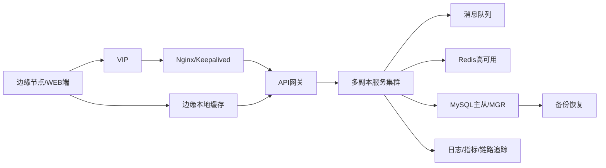

# 场景六：高可用与容灾设计

项目固定背景统一参考 [项目固定背景.md](/Users/duanpeitong/Desktop/work/study/26_jgs_lw/项目固定背景.md)。

## 1. 场景定位

### 1.1 从业务角度看

高可用与容灾设计解决的是“平台在异常情况下还能不能持续支撑设备运维业务”的问题。对于本项目而言，它不是上线后的附加优化，而是平台能否承担生产级运维任务的底线能力。

平台一旦中断，影响的不只是某个页面，而是设备接入、状态监控、告警识别、工单处置和管理分析等多条业务链路。因此，高可用必须从单点服务冗余升级为全链路韧性设计。

### 1.2 从考题角度看

这个场景适合以下题目：

- 高可用架构设计
- 容灾架构设计
- 可靠性设计
- 分布式系统稳定性设计
- 软件可靠性设计
- 自动化运维与可观测性

如果题目涉及“高可用”“容灾”“稳定性”“可靠性”“故障恢复”，这个场景都非常适合展开。写作时重点是说明入口、服务、消息、数据、边缘和发布治理如何协同，而不是只写多部署几个实例。

### 1.3 从项目角度看

本项目覆盖 3 个生产基地、900 余台设备和 24 台边缘节点，中心平台服务多个基地。一旦中心入口、核心服务或数据层发生故障，影响会被放大为集团级运维风险。

同时，项目采用三期交付并持续优化，系统在运行期间会不断发布、调整和扩展。因此，高可用不仅要应对硬件或服务故障，也要覆盖网络波动、数据补传、版本发布和回滚恢复等场景。

## 2. 场景拆解

### 2.1 业务目标与成功标准

该场景的目标包括：

- 避免平台单点故障影响核心运维链路
- 在网络抖动和局部异常时尽量保证设备数据连续
- 在服务故障时保持基本业务可用
- 支撑三期建设过程中的平滑发布和快速回退
- 保证关键数据具备备份、恢复和追溯能力

成功标准体现为：

- 核心入口、核心服务和核心数据层具备冗余能力
- 边缘到中心链路异常时，关键数据可缓存和补传
- 服务异常可被及时发现、定位和恢复
- 发布失败时影响范围可控，并能快速回滚

### 2.2 场景边界

这个场景重点解决平台运行稳定性问题，包括入口、服务、消息、缓存、数据库、边缘链路和发布治理。

它不替代具体业务模块自身的业务正确性设计。例如，工单状态机是否合理、告警规则是否准确，仍属于对应业务场景。但高可用场景要保证这些业务能力在故障、扩容、发布和恢复过程中尽量不中断、不丢关键数据、可观测、可回退。

### 2.3 核心矛盾与约束条件

该场景的核心矛盾主要有六个：

1. 中心平台统一服务多个基地，故障影响范围大
2. 设备数据持续写入，接入链路不能轻易中断
3. 工业现场网络不稳定，边缘与中心可能短时断联
4. 微服务拆分后，单个服务异常可能通过调用链放大
5. 数据层一旦不可用，会影响监控、工单、权限和报表等多个模块
6. 三期交付和持续优化要求系统支持灰度、回滚和在线观测

这些约束决定了高可用设计不能只看单个服务，而必须看全链路和全生命周期。

### 2.4 备选方案与舍弃理由

| 备选方案 | 表面优势 | 舍弃原因 |
| --- | --- | --- |
| 只给应用服务部署多实例 | 实施简单 | 入口、数据库、缓存、消息和边缘链路仍可能成为单点 |
| 所有故障都依赖人工处理 | 初期成本低 | 故障发现和恢复慢，无法满足生产级运维要求 |
| 只做中心平台高可用，不处理边缘断联 | 中心结构清晰 | 工业现场网络波动会导致数据断层，影响监控和分析 |
| 发布时全量替换 | 操作直接 | 三期持续上线风险高，失败后影响范围大 |

因此，我采用“入口冗余 + 服务多副本 + 消息解耦 + 数据高可用 + 边缘缓冲 + 可观测与灰度发布”的整体方案。

### 2.5 架构决策与边界划分

该场景按五个层次设计。

第一层是入口高可用。边缘节点和 Web 用户都通过统一入口进入平台，入口层采用 `VIP + Nginx/Keepalived` 或等价机制，避免统一访问入口成为单点。

第二层是服务高可用。监控、告警、工单、权限、分析等核心服务采用多副本部署，并通过健康检查、滚动升级和自动拉起机制降低单实例故障影响。

第三层是链路解耦。设备接入链路通过消息队列削峰和解耦，避免下游服务短时波动反向阻塞接入主链路。

第四层是数据高可用。缓存、业务数据库、时序数据和备份恢复机制分别承担不同数据类型的可靠性要求。

第五层是边缘和发布治理。边缘节点通过本地缓存和断点续传应对网络波动；平台发布通过灰度、回滚和可观测机制控制变更风险。

### 2.6 关键机制设计

#### 2.6.1 全链路冗余与故障隔离

入口层、服务层和数据层都需要避免单点。入口层保障访问可达，服务层通过多副本保障应用可用，消息队列隔离接入和处理压力，数据层通过主从、集群或备份恢复保证关键数据可恢复。

同时，平台需要限制故障传播。例如分析服务短时不可用，不应影响接入和告警链路；通知服务失败，也不应阻塞告警事件生成，而应进入重试和补偿流程。

#### 2.6.2 边缘缓存与中心幂等

工业现场网络无法完全由中心平台控制。因此边缘节点必须具备本地缓存和恢复后补传能力。中心接入服务在接收补传数据时，需要通过设备标识、测点编码、时间戳和事件编号做幂等处理，避免重复写入或重复触发告警。

这里的关键取舍是：中心侧追求统一治理，边缘侧承担现场韧性。两者配合后，即使网络短时异常，平台也能尽量保持关键数据连续。

#### 2.6.3 灰度发布、回滚与可观测

高可用不仅是故障发生后的恢复能力，也包括变更过程中的风险控制。每期上线前，需要明确变更边界、回滚路径和观测指标；上线过程中通过灰度发布逐步放量；上线后通过日志、指标和链路追踪判断服务是否稳定。

如果出现异常，应优先保护接入、监控和告警主链路，必要时降级分析、报表或非关键通知能力。

### 2.7 质量属性与架构权衡

该场景主要支撑以下质量属性。

- `可用性`
  入口、服务和数据层通过冗余和切换降低单点风险。

- `可靠性`
  边缘缓存、消息队列和数据备份保证关键数据尽量不丢、可恢复。

- `可维护性`
  灰度发布、回滚和可观测机制降低持续演进风险。

- `韧性`
  局部故障不应放大为全局中断，非关键链路可降级。

这里的取舍是：高可用会增加部署、监控和运维复杂度，不可能所有链路都按同一等级建设。因此项目中优先保障接入、监控、告警和工单等核心链路，对报表分析和低优先级任务允许延迟或降级。

### 2.8 技术落点与协同关系

该场景主要落在以下能力上：

- 入口高可用：`VIP`、`Nginx / Keepalived`
- 服务高可用：`Kubernetes` 多副本、健康检查、滚动升级
- 链路解耦：消息队列、消费组、失败重试
- 缓存高可用：`Redis Sentinel` 或集群机制
- 数据库高可用：`MySQL 主从 / MGR`、备份恢复
- 边缘韧性：本地缓存、断点续传、补传幂等
- 运维治理：日志、指标、链路追踪、告警、灰度和回滚

典型链路可写为：

`边缘节点/WEB端 -> VIP -> Nginx/Keepalived -> API网关 -> 多副本服务 -> 消息队列 -> 缓存/数据库高可用 -> 备份恢复`

### 2.9 项目推进与验证方式

该场景按三期落地：

- 第一期：保障接入、监控和告警主链路高可用
- 第二期：增强工单、权限、缓存和数据库层稳定性
- 第三期：完善备份恢复、演练、灰度发布和自动化巡检机制

验证方式包括入口切换验证、服务实例故障验证、边缘断联补传验证、数据库备份恢复验证、灰度发布回滚验证和关键链路监控验证。

### 2.10 论文转写角度

如果题目是 `高可用架构设计`，重点写入口、服务、消息、数据和边缘的分层保障。

如果题目是 `容灾设计`，重点写备份恢复、故障切换、边缘缓存和演练。

如果题目是 `软件可靠性设计`，重点写故障隔离、重试补偿、幂等和可观测性。

如果题目是 `自动化运维`，重点写健康检查、灰度发布、回滚、监控告警和自动化巡检。

### 2.11 项目链路图示

## 3. 论文主体内容（约 1300 字）

在本项目中，高可用与容灾设计不是附加优化，而是平台能否真正承担生产级设备运维任务的底线能力。平台覆盖 3 个生产基地、900 余台关键设备和 24 台边缘节点，承载设备接入、状态监控、告警识别、工单闭环和管理分析等多条核心链路。一旦系统中断，影响的不只是某个功能页面，而是整个设备运维体系。因此，在总体架构设计中，我没有把高可用简单理解为多部署几个实例，而是把它作为入口、服务、消息、数据、边缘和发布治理一体化建设的系统能力。

在方案分析阶段，我首先排除了“只给应用服务部署多实例”的简单做法。因为如果入口层仍是单点，数据库和缓存没有高可用机制，边缘断联不能缓存补传，服务多副本并不能真正保障平台可用。同样，如果所有故障都依赖人工发现和手工处理，平台在生产现场的恢复速度也难以满足要求。基于这些判断，我将稳定性风险拆分为中心入口故障、服务实例故障、消息积压、数据层故障、边缘网络波动和发布变更风险，并分别设计治理措施。

在入口和服务层，我采用统一访问入口冗余和核心服务多副本的方式。边缘节点数据上报和总部、基地用户访问都必须通过平台入口进入后端系统，因此入口层采用 `VIP + Nginx/Keepalived` 方式构建高可用访问通道，避免统一入口成为单点。监控、告警、工单、权限等核心服务则采用多副本部署，并配合健康检查、滚动升级和自动拉起机制，使单个实例故障不影响整体服务能力。

在链路和数据层，我重点通过消息队列和数据高可用机制降低故障传播风险。设备接入主链路先写入消息队列，再由监控、告警和分析等服务按能力消费。这样即使分析服务短时不可用，也不会反向阻塞设备接入和告警判断。缓存和数据库层分别建设高可用能力，例如缓存采用哨兵或集群机制，业务数据库采用主从或集群切换，并配合定期备份和恢复演练。对于告警、工单等关键业务数据，还要求记录状态变化和操作日志，保证故障后可追溯、可恢复。

对于工业现场特有的网络波动，我在边缘侧设计了本地缓存和断点续传机制。当基地到中心平台链路短时异常，边缘节点先缓存关键遥测数据、状态变化和异常事件，链路恢复后再批量补传。中心接入服务通过设备标识、测点编码、时间戳和事件编号做幂等处理，避免补传导致重复写入或重复触发告警。这样将现场网络的不确定性缓冲在边缘层，而不是直接冲击中心平台。

最后，我把灰度发布、回滚和可观测性纳入高可用设计。项目采用三期交付并持续优化，如果每次发布都是全量替换，风险会很高。因此每期上线前都要明确变更边界、回滚方案和观测指标；上线过程中逐步灰度放量；上线后通过日志、指标和链路追踪观察入口流量、消费延迟、错误率、数据库连接和关键接口耗时。一旦异常扩大，优先保护接入、监控和告警主链路，必要时降级分析报表等非关键能力。

从项目效果看，高可用与容灾设计降低了平台在多基地推广过程中的单点故障风险，提升了边缘与中心链路在异常场景下的数据连续性，也支撑了三期交付过程中的平滑演进。回顾整个项目，我认为该场景的核心价值不在于某一项单独技术，而在于把入口、服务、消息、数据、边缘和运维治理整合成一套完整的稳定性体系，使平台具备了长期支撑集团设备运维的生产级运行能力。
