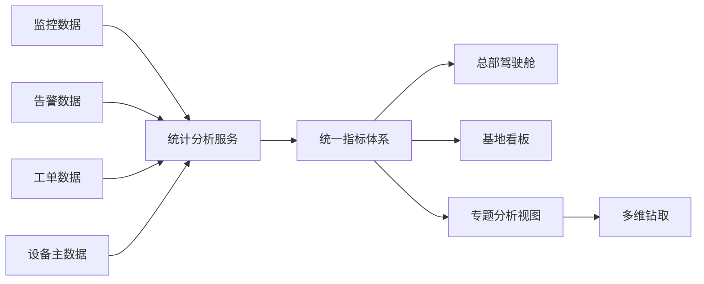

# 场景七：运维分析与可视化

项目固定背景统一参考 [项目固定背景.md](/Users/duanpeitong/Desktop/work/study/26_jgs_lw/项目固定背景.md)。

## 1. 场景定位

### 1.1 从业务角度看

运维分析与可视化解决的是“平台沉淀的数据如何转化为管理价值”的问题。它体现的是平台从支撑日常操作走向支撑运营管理和持续优化的能力。

在本项目中，可视化不是简单画图，而是要把设备状态、告警事件、工单过程和处置结果组织成统一指标，让总部、基地和班组看到与自身职责匹配的信息。

### 1.2 从考题角度看

这个场景适合以下题目：

- 数据架构设计
- 决策支持系统设计
- 管理驾驶舱设计
- 数据可视化平台设计
- 运营分析平台设计
- 指标体系设计

如果题目涉及“数据分析”“驾驶舱”“决策支持”“可视化平台”“指标体系”，这个场景都可以直接展开。写作时重点要说明指标口径和分析服务，而不是只写前端图表。

### 1.3 从项目角度看

在完成接入、监控、告警和工单闭环之后，集团管理层进一步关注平台能否看清设备运行状况、基地对比情况和运维效率，从而支撑后续决策和持续优化。

因此，该场景承担的是“从运维执行走向运维管理”的能力升级角色。

## 2. 场景拆解

### 2.1 业务目标与成功标准

该场景的目标包括：

- 建立统一的设备运维指标体系
- 让总部、基地和班组看到适合自身职责的分析视图
- 支撑横向对比、运维考核和持续优化
- 将监控、告警和工单数据转化为可解释的管理信息

成功标准主要表现为：

- 指标口径统一，总部和基地数据可比
- 不同角色看板分层清晰
- 分析结果能支撑管理决策和策略优化
- 可视化视图能支持钻取和复盘，而不是只展示汇总数字

### 2.2 场景边界

这个场景重点解决指标体系、分析服务、分层看板和多维钻取。

它不直接负责实时告警判断，也不替代数据治理底座。数据治理提供统一数据基础，运维分析与可视化负责把数据组织成面向管理角色的指标、视图和分析路径。

### 2.3 核心矛盾与约束条件

该场景的核心矛盾包括：

1. 原始数据很多，但管理层真正关心的是结果指标
2. 总部、基地和班组关注点不同，不能用一张看板解决全部问题
3. 跨基地横向比较必须建立统一口径
4. 如果统计逻辑分散在各模块里，结果会不一致
5. 图表过多会造成信息噪声，图表过少又无法支持钻取分析
6. 分析查询不能影响实时监控和告警主链路

这决定了分析与可视化不能只做前端页面，而要建立统一指标和分析服务。

### 2.4 备选方案与舍弃理由

| 备选方案 | 表面优势 | 舍弃原因 |
| --- | --- | --- |
| 各业务模块自己做统计图表 | 开发快，贴近页面 | 指标口径分散，跨模块结果不一致 |
| 只做一个集团驾驶舱 | 展示集中 | 无法满足基地、车间和班组的实际操作需求 |
| 直接查询业务库生成报表 | 实现简单 | 大查询可能影响业务库和实时链路 |
| 图表越多越好 | 看起来丰富 | 信息过载，难以支撑决策 |

因此，我采用“统一指标体系 + 统计分析服务 + 分层看板 + 多维钻取”的方案。

### 2.5 架构决策与边界划分

该场景按四层设计。

第一层是数据来源层。监控数据、告警数据、工单数据和设备主数据共同进入分析链路。

第二层是分析服务层。复杂统计逻辑统一由分析服务计算，避免前端和业务模块重复统计。

第三层是指标体系层。设备可用率、故障率、平均修复时间、工单及时率等指标统一定义。

第四层是展示应用层。按总部驾驶舱、基地看板、班组视图和专题分析组织可视化页面。

### 2.6 关键机制设计

#### 2.6.1 指标口径统一

跨基地分析最关键的是口径统一。例如设备可用率的统计周期、故障率的分母、平均修复时间的起止点、工单及时率的超时规则，都必须统一定义。

这些指标由分析服务集中计算，而不是由不同页面各自拼 SQL 或各自计算。

#### 2.6.2 分层看板设计

总部驾驶舱关注整体趋势、基地对比、严重告警分布和重点设备风险；基地看板关注本地设备状态、工单压力和班组执行；专题分析关注故障复发、设备类型、重点产线和维护策略。

这种分层设计能减少信息过载，让不同角色看到与职责相关的信息。

#### 2.6.3 分析链路与实时链路隔离

分析查询通常涉及多维聚合和长周期数据，不应直接挤占实时监控和告警链路。因此分析服务应基于汇总数据、指标表或分析层数据提供查询，避免复杂报表直接压业务库。

### 2.7 质量属性与架构权衡

该场景主要支撑以下质量属性。

- `一致性`
  统一指标定义和集中计算保证总部、基地结果一致。

- `可用性`
  分层看板让不同角色快速获得有效信息。

- `可扩展性`
  新增指标、专题和基地时，可在统一分析服务上扩展。

- `性能`
  分析链路与实时链路隔离，避免报表拖慢业务。

这里的取舍是：集中指标体系需要前期梳理业务口径，短期比直接画图慢；但它能避免后期各模块指标冲突，是管理驾驶舱可信的基础。

### 2.8 技术落点与协同关系

该场景主要落在以下能力上：

- 指标体系
- 统计分析服务
- 主题看板
- 权限分域展示
- 多维钻取分析
- 汇总表和指标缓存
- 专题分析视图

典型链路可写为：

`监控数据/告警数据/工单数据 -> 统计分析服务 -> 指标计算 -> 总部驾驶舱/基地看板/专题分析`

### 2.9 项目推进与验证方式

该场景分阶段推进：

- 第一期：完成基础运营看板，展示设备状态和告警概况
- 第二期：增加故障专题分析、工单效率分析和基地对比
- 第三期：建设管理驾驶舱、趋势分析和持续优化视图

验证重点包括指标一致性、查询性能、看板使用率、管理决策支撑效果和跨基地对比准确性。

### 2.10 论文转写角度

如果题目是 `决策支持系统设计`，重点写指标体系、分层看板和管理决策。

如果题目是 `数据架构设计`，重点写数据来源、分析服务和指标计算。

如果题目是 `可视化平台设计`，重点写角色分层、视图组织和钻取分析。

如果题目是 `性能优化`，重点写分析链路与实时链路隔离。

### 2.11 项目链路图示

## 3. 论文主体内容（约 1300 字）

在本项目中，运维分析与可视化并不是一个锦上添花的展示层，而是平台从支撑日常运维走向支撑管理决策与持续优化的关键能力。项目完成设备接入、实时监控、告警识别和工单闭环后，已经能够完成日常运维操作，但集团管理层更关注哪些基地设备状态更好、哪些设备类型故障率更高、工单处理效率是否改善、运维策略调整是否有效。如果这些问题不能通过平台直接回答，平台就仍然停留在执行工具层面。

在方案分析阶段，我没有采用各业务模块自行绘制统计图表的做法。虽然这种方式开发快，但监控、告警、工单页面各自统计，容易造成指标口径不一致。例如设备可用率的统计周期、故障率的分母、平均修复时间的起止点，如果各模块理解不同，总部驾驶舱上的横向比较就没有管理价值。我也没有选择只做一张集团大屏，因为总部、基地和班组关注点不同，单一看板无法满足所有角色。因此，我采用“统一指标体系 + 统计分析服务 + 分层看板 + 多维钻取”的方案。

具体设计上，监控数据、告警数据、工单数据和设备主数据共同进入分析链路。统计分析服务集中计算设备可用率、故障率、平均修复时间、工单及时率等关键指标，避免前端页面和业务模块各自重复统计。总部驾驶舱重点展示整体趋势、基地对比、严重告警分布和重点设备风险；基地看板重点展示本地设备状态、工单压力和班组执行情况；专题分析则围绕故障复发、设备类型和重点产线进行钻取。

在指标设计上，我特别强调统一口径。设备可用率按统一周期计算，故障率按设备类型归一，平均修复时间明确从派单到验收或关闭的起止点，工单及时率统一定义超时规则。只有这些基础口径统一，集团才能真正基于平台结果进行跨基地比较和管理判断。

在架构上，我还要求分析链路与实时链路隔离。分析查询通常涉及多维聚合和长周期数据，如果直接查询业务库或挤占实时监控资源，会影响监控和告警主链路。因此，分析服务基于汇总数据、指标表或分析层数据提供查询，对高频看板数据采用缓存或预计算方式，既保证查询体验，也降低对业务链路的影响。

从项目效果看，运维分析与可视化场景使平台真正具备了管理支撑能力。集团管理层可以通过统一平台掌握整体设备运维态势，并进行跨基地横向比较和考核；基地层面可以基于分析结果发现薄弱环节，持续优化运维策略。回顾整个项目，我认为该场景最核心的价值不在于做了多少图表，而在于把接入、监控、告警和工单沉淀的数据转化为可解释、可比较、可支撑决策的管理信息。

