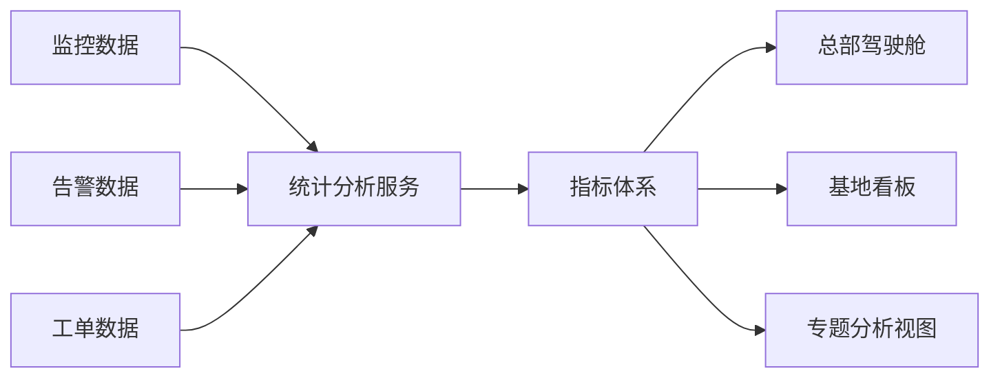

# 场景七：运维分析与可视化

项目固定背景统一参考 [项目固定背景.md](/Users/duanpeitong/Desktop/work/study/26_jgs_lw/项目固定背景.md)。

## 1. 场景定位

### 1.1 从业务角度看

运维分析与可视化场景解决的是“平台沉淀的数据如何真正转化为管理价值”的问题。它体现的是平台从“支撑日常操作”走向“支撑运营管理和持续优化”的能力。

### 1.2 从考题角度看

这个场景适合以下题目：

- 数据架构设计
- 决策支持系统设计
- 管理驾驶舱设计
- 数据可视化平台设计
- 运营分析平台设计

如果题目涉及“数据分析”“驾驶舱”“决策支持”“可视化平台”，这个场景都可以直接展开。

### 1.3 从项目角度看

在本项目中，完成接入、监控、告警和工单闭环之后，集团管理层进一步关注的是：平台能否从管理视角看清设备运行状况、基地对比情况和运维效率，从而支撑后续决策和持续优化。

因此，这个场景在项目中承担的是“从运维执行走向运维管理”的能力升级角色。

## 2. 场景拆解

### 2.1 业务目标与成功标准

该场景的目标主要包括：

- 建立统一的运维指标体系
- 让总部和基地都能看到适合自身职责的分析视图
- 支撑横向对比、运维考核和持续优化

成功标准主要表现为：

- 指标口径统一
- 不同角色看板分层清晰
- 分析结果能支撑管理决策和策略优化

### 2.2 核心矛盾与约束条件

这个场景的核心矛盾在于：

1. 原始数据很多，但管理层真正关心的是结果指标
2. 总部和基地关注点不同，不能用同一张看板解决所有问题
3. 跨基地横向比较必须建立统一口径
4. 如果统计逻辑分散在各模块里，结果会不一致

这决定了分析与可视化不能只做前端图表，而要建立统一指标和分析服务。

### 2.3 架构决策与方案选择

针对这些问题，我采用了“指标体系 + 统计分析服务 + 分层看板”的方案。

核心思路是：

- 先从业务管理角度定义关键指标
- 再把复杂统计逻辑统一下沉到分析服务
- 最后按角色输出总部驾驶舱和基地看板

这样设计的本质，是把数据分析能力平台化，而不是把图表分散在各模块页面中。

### 2.4 技术落点与协同关系

该场景主要落在以下能力上：

- 指标体系
- 统计分析服务
- 主题看板
- 权限分域展示
- 多维钻取分析

典型链路可写为：

`监控数据/告警数据/工单数据 -> 统计分析服务 -> 指标计算 -> 总部看板/基地看板`

总部关注的典型指标可包括：

- 设备可用率
- 故障率
- 平均修复时间
- 工单及时率

### 2.5 项目推进与落地方式

该场景在项目中的推进路径是：

- 第一期：完成基础运营看板
- 第二期：增加故障专题分析和工单分析
- 第三期：建设管理驾驶舱和趋势分析能力

这样做的原因是，指标体系必须先和实际业务运行对齐，再逐步扩展管理深度。

### 2.6 项目链路图示

## 3. 论文主体内容（约 1300 字）

在本项目中，运维分析与可视化场景并不是一个锦上添花的展示层，而是平台从“支撑日常运维”走向“支撑管理决策与持续优化”的关键能力。项目在完成设备接入、实时监控、告警识别和工单闭环之后，已经能够完成日常运维操作，但集团管理层真正关心的是更高层的问题：哪些基地设备运维状况更好，哪些设备类型故障率更高，工单处理效率是否在改善，运维模式调整是否真的产生了效果。如果这些问题不能通过平台直接回答，那么平台就仍然停留在执行工具层面，而没有真正形成管理价值。

在问题分析阶段，我首先识别到一个典型矛盾：平台积累了大量监控、告警和工单数据，但原始数据越多，并不意味着管理价值越高。因为管理层并不关心每一条设备原始上报记录，而是更关心设备可用率、故障率、平均修复时间、工单及时率等结果性指标。同时，总部和基地的关注点也不同：总部更关注整体趋势和横向对比，基地更关注本地设备状态、工单压力和班组执行情况。如果所有分析逻辑都分散在不同业务模块页面里，不仅结果口径不统一，也无法形成真正的驾驶舱体系。

基于这一判断，我在架构上采用了“指标体系 + 统计分析服务 + 分层看板”的方案。首先，从业务管理视角抽取关键指标，明确设备可用率、故障率、平均修复时间、工单及时率等核心指标的定义和口径；其次，把复杂的统计逻辑统一下沉到统计分析服务中，由分析服务集中计算结果，而不是让前端页面或业务模块各自重复处理；最后，再按不同角色和层级输出分层看板，使总部、基地和专题分析场景都能基于统一数据基础进行展示。这样设计以后，平台不是简单“画图”，而是建立了统一的分析与决策支撑能力。

在具体落地过程中，我特别强调指标口径统一的重要性。因为本项目覆盖 3 个基地，如果没有统一口径，总部看到的横向比较就没有意义。例如，设备可用率的统计周期是否一致，故障率是否按设备类型归一，平均修复时间是否从派单开始计算，工单及时率的超时规则如何定义，这些都必须由平台统一约定，再由分析服务集中计算。只有这样，总部才能真正基于平台结果做出跨基地比较和管理判断。

在看板设计上，我没有采用“一张看板满足所有角色”的思路，而是采用分层展示方式。总部驾驶舱重点呈现整体趋势、基地对比和重点异常；基地看板重点呈现本地设备运行、工单处理和班组执行情况；专题分析则面向故障趋势、复发问题和重点设备进行钻取。这种分层设计的价值在于，不同角色看到的内容都与其职责直接相关，既避免信息过载，也提升了平台的实际使用价值。

从项目效果看，运维分析与可视化场景使平台真正具备了管理支撑能力。一方面，集团管理层可以通过统一平台掌握整体设备运维态势，并进行跨基地横向比较和考核；另一方面，基地层面可以基于分析结果发现薄弱环节，持续优化运维策略。更重要的是，平台沉淀的数据不再只服务于当下操作，而是开始服务于后续决策和持续改进。回顾整个项目，我认为这一场景最核心的价值，不在于“做了多少图表”，而在于它把接入、监控、告警和工单沉淀的数据真正转化为了可解释、可比较、可支撑决策的管理信息，使平台完成了从运维工具到运维管理平台的能力跃迁。
