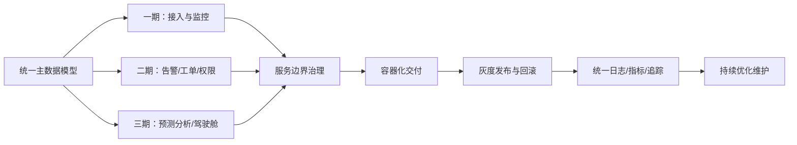

# 场景八：分期建设与架构演进

项目固定背景统一参考 [项目固定背景.md](/Users/duanpeitong/Desktop/work/study/26_jgs_lw/项目固定背景.md)。

## 1. 场景定位

### 1.1 从业务角度看

分期建设与架构演进解决的是“平台不能停产重来、又必须持续上线新能力”的问题。它不是一个独立业务功能，而是整个项目能够安全推进、持续交付和长期维护的组织方式。

对于智能设备运维平台而言，设备接入、监控、告警、工单、权限、分析等能力相互关联。如果缺少统一演进策略，项目很容易变成每期各做一套，最终功能上线了，架构却失控了。

### 1.2 从考题角度看

这个场景适合以下题目：

- 软件维护及其应用
- 架构演进设计
- 云原生架构设计
- 持续交付与自动化运维
- 平台化建设与分期实施
- 系统重构与渐进式改造

如果题目涉及“分阶段建设”“渐进式改造”“持续优化”“演进式架构”“软件维护”，这个场景都很适合作为正文主线。写作时重点是说明如何保证三期建设共享同一架构骨架，而不是简单罗列三期做了什么功能。

### 1.3 从项目角度看

本项目从 2024 年 7 月启动，到 2026 年 1 月三期交付完成后仍在持续优化。平台服务 3 个生产基地和 900 余台设备，不能通过一次性替换方式建设，只能在不停产、不中断核心运维工作的前提下渐进落地。

因此，这个场景本质上是本项目得以成功交付的架构支撑主线。

## 2. 场景拆解

### 2.1 业务目标与成功标准

该场景的目标主要包括：

- 在不影响产线稳定运行的前提下逐步上线新能力
- 让三期建设形成连续演进，而不是三套割裂系统
- 控制每期上线风险，并保证可回滚、可观测
- 为后续新增设备、新基地和持续优化保留扩展空间
- 使架构底座能够支撑从接入监控到闭环处置再到分析优化的演进

成功标准主要表现为：

- 每期上线边界清晰，且依赖关系可控
- 统一主数据、统一服务边界和统一接口规范贯穿三期
- 新旧能力能够在过渡期平滑并存
- 发布失败时可快速回退，运行状态可观测
- 三期结束后平台结构没有失控

### 2.2 场景边界

这个场景不负责讨论某一个业务模块内部如何实现，而是关注项目整体如何分期、如何演进、如何控制变更风险。

它的边界包括架构底座、服务边界、数据模型、接口兼容、发布治理、配置开关和可观测性。具体的设备接入、告警规则、工单流程和分析指标仍由对应场景展开，但它们必须服从统一演进策略。

### 2.3 核心矛盾与约束条件

这个场景的核心矛盾主要有六个：

1. 生产现场连续运行，不能因系统上线影响设备运维
2. 项目能力很多，但不可能一次性全部建成
3. 新旧流程和新旧接口在一段时间内必须并存
4. 三期交付中，数据模型、权限规则和流程规则会持续扩展
5. 团队规模有限，必须控制并行开发和发布复杂度
6. 平台上线后仍要持续维护，不能只为一期功能做局部设计

这些约束决定了项目必须采用“统一架构底座 + 分期能力演进 + 持续交付治理”的方式推进。

### 2.4 备选方案与舍弃理由

| 备选方案 | 表面优势 | 舍弃原因 |
| --- | --- | --- |
| 一次性大版本交付 | 功能完整，切换明确 | 周期长、风险集中，不适合生产现场和多基地推广 |
| 每期独立建设一套能力 | 每期推进快 | 数据模型、接口和流程容易割裂，后期维护成本高 |
| 先做页面功能，后补平台底座 | 早期展示效果好 | 后续接入、权限、告警、工单和分析会反复返工 |
| 发布完全依赖人工窗口 | 初期工具成本低 | 三期持续迭代风险高，问题定位和回滚慢 |

因此，我采用“统一架构底座 + 核心域先行 + 兼容过渡 + 灰度发布 + 可观测回滚”的演进方案。

### 2.5 架构决策与边界划分

该场景的架构决策主要体现在四个边界。

第一，先固化核心领域模型。设备、测点、告警、工单、组织、权限等对象贯穿三期，因此必须优先统一，避免每期重新定义。

第二，按业务域划分服务边界。接入、监控、告警、工单、权限、分析等服务按照职责拆分，允许分期上线，但边界不能随意漂移。

第三，接口和数据模型采用兼容策略。新增字段、规则和流程状态要尽量向前兼容，避免一期能力在二期、三期被推倒重来。

第四，发布治理前置。容器化部署、配置中心、灰度发布、回滚和可观测性在早期就纳入底座，而不是等系统复杂后再补。

### 2.6 关键机制设计

#### 2.6.1 统一主数据与服务边界

三期建设的核心风险不是功能做不完，而是每期都形成新的模型和边界。为避免这种问题，我要求设备档案、测点定义、组织结构、权限模型、告警等级和工单状态机优先统一。

这样一期完成接入和监控时建立的数据基础，可以自然支撑二期告警、工单和权限，也能继续支撑三期预测分析和驾驶舱。

#### 2.6.2 兼容过渡与配置开关

在分期建设过程中，新旧接口、新旧流程和新旧规则不可避免会共存。平台通过接口版本控制、配置中心和功能开关控制能力启用范围。

例如，某个基地可以先启用新告警规则或新工单流程，其他基地仍保留旧配置；如果上线后发现问题，可以通过开关回退，而不是紧急修改代码。

#### 2.6.3 灰度发布与可观测回滚

每一期上线前，都要完成三项检查：

- 边界检查：本期改哪些服务、接口、配置和数据结构
- 回滚检查：失败后如何快速恢复到稳定版本
- 观测检查：上线后通过哪些指标判断是否稳定

上线过程中逐步放量，上线后通过日志、指标和链路追踪观察错误率、接口耗时、消费延迟和关键业务状态。

### 2.7 质量属性与架构权衡

该场景主要支撑以下质量属性。

- `可维护性`
  统一模型和服务边界降低长期维护成本。

- `可扩展性`
  分期能力可以在统一底座上持续叠加，支持新增设备、新基地和新分析场景。

- `可靠性`
  灰度、回滚和可观测机制降低持续发布风险。

- `可演进性`
  通过接口兼容和配置开关支持新旧能力平滑过渡。

这里的取舍是：早期建设统一底座会增加一定前期工作量，短期内不如直接堆功能快；但对于 18 个月、三期交付、后续仍需维护的平台，这种前期投入可以显著降低后期返工和结构失控风险。

### 2.8 技术落点与协同关系

该场景最终落到以下能力上：

- 微服务拆分与服务边界治理
- 统一主数据模型与接口版本控制
- 容器化部署与持续交付流水线
- 配置中心、功能开关和灰度发布
- 统一日志、指标监控和链路追踪
- 自动化回滚、发布检查和巡检

典型链路可写为：

`统一领域模型 -> 服务边界 -> 接口兼容 -> 容器化交付 -> 灰度发布 -> 观测与回滚 -> 持续演进`

### 2.9 项目推进与验证方式

本场景在项目中的推进路径如下：

- 第一期：完成边缘接入、中心接入和实时监控，验证端边云主链路
- 第二期：完成告警识别、工单闭环和多基地权限控制，建立统一运维流程
- 第三期：完成预测性维护、分析驾驶舱和平台治理优化，沉淀集团级运维能力

验证重点包括：一期验证主链路是否稳定，二期验证流程闭环和权限治理是否可控，三期验证分析指标和平台治理能力是否可持续扩展。

### 2.10 论文转写角度

如果题目是 `软件维护`，重点写统一模型、接口兼容、配置管理、灰度发布和可观测回滚。

如果题目是 `架构演进设计`，重点写三期能力如何建立在同一架构底座上。

如果题目是 `云原生架构设计`，重点写容器化、持续交付、弹性扩展和发布治理。

如果题目是 `系统重构或渐进式改造`，重点写新旧能力并存、兼容过渡和风险控制。

### 2.11 项目链路图示

## 3. 论文主体内容（约 1300 字）

在本项目中，分期建设与架构演进不是项目管理层面的附属工作，而是决定平台能否真正落地的核心场景。项目服务 3 个生产基地、900 余台关键设备和 24 台边缘节点，建设周期 18 个月，采用三期交付并在全面上线后持续优化。如果采用一次性整体替换的方式推进，实施风险会集中爆发，也容易影响现场运维和生产保障。因此，我在总体架构设计阶段就明确把“统一架构底座、分期演进落地、持续可控发布”作为平台建设的重要原则。

在方案论证阶段，我首先排除了两种常见但风险较高的做法。一种是一次性大版本交付，虽然看起来功能完整，但周期长、风险集中，不适合多基地生产现场。另一种是每期独立建设一套能力，短期推进可能更快，但设备模型、接口规范、权限规则和工单流程会逐渐割裂，后期维护成本极高。基于这些判断，我认为项目必须先建立统一架构骨架，再按照业务成熟度和实施风险分批推进。

具体实施上，我采用“统一架构底座 + 核心域先行 + 兼容过渡 + 灰度发布”的演进方案。首先，一期优先打通端边云主链路，完成设备接入、中心接入和实时监控，使平台先具备稳定的数据通路。其次，二期围绕告警识别、工单闭环和权限控制补齐核心运维流程，使平台从看得见状态进一步走向可处置、可闭环。最后，三期建设预测性维护、管理驾驶舱和分析服务，把平台能力从执行层推进到管理层和优化层。这样分期的关键，不是简单按时间切任务，而是让每一期都围绕一条清晰能力主线展开。

在架构层面，我特别强调统一主数据模型和服务边界。设备档案、测点定义、组织结构、权限模型、告警等级和工单状态机贯穿三期，如果这些基础对象在不同阶段采用不同定义，后续服务协同、报表统计和权限隔离都会受到影响。因此，我要求这些核心模型优先统一，再由各期能力在此基础上扩展。接入、监控、告警、工单、权限、分析等服务也按照业务域划分边界，允许分期增强，但不允许每期重新定义职责。

为了保证演进过程真正可控，我同步建设了容器化部署、配置中心、功能开关、灰度发布和可观测回滚机制。每一期上线前，都明确本期变更涉及的服务、接口、配置和数据结构；上线过程中通过灰度方式逐步放量；上线后通过日志、指标和链路追踪观察错误率、接口耗时、消费延迟和关键业务状态。一旦出现异常，可以通过配置开关或版本回滚快速恢复。对于个别基地的新规则或新流程，也可以先局部启用，验证稳定后再推广到其他基地。

从项目效果看，分期建设与架构演进策略有效控制了实施风险，也保证了平台结构的长期稳定。一方面，项目团队能够在每一期聚焦有限边界，逐步验证设计假设并沉淀模板；另一方面，平台在三期结束后仍保持统一架构骨架，没有出现“每期一套做法”的失控现象。回顾整个项目，我认为该场景的核心价值，不在于把项目分成三期，而在于通过架构视角把三期建设组织成一条连续、可控、可回退、可持续扩展的演进主线。
