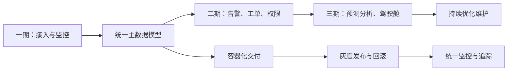

# 场景八：分期建设与架构演进

项目固定背景统一参考 [项目固定背景.md](/Users/duanpeitong/Desktop/work/study/26_jgs_lw/项目固定背景.md)。

## 1. 场景定位

### 1.1 从业务角度看

分期建设与架构演进场景解决的是“平台不能停产重来、又必须持续上线新能力”这一类问题。它不是一个独立业务功能，而是整个项目能够安全推进、持续交付和长期维护的组织方式。

### 1.2 从考题角度看

这个场景适合以下题目：

- 软件维护及其应用
- 架构演进设计
- 云原生架构设计
- 持续交付与自动化运维
- 平台化建设与分期实施

如果题目涉及“分阶段建设”“渐进式改造”“持续优化”“演进式架构”，这个场景都很适合作为正文主线。

### 1.3 从项目角度看

本项目从 2024 年 7 月启动，到 2026 年 1 月三期交付完成后仍在持续优化。平台服务 3 个生产基地、900 余台设备，不能通过一次性替换方式建设，只能在不停产、不中断核心运维工作的前提下渐进落地。

因此，这个场景本质上是本项目得以成功交付的管理与架构支撑主线。

## 2. 场景拆解

### 2.1 业务目标与成功标准

这个场景的目标主要包括：

- 在不影响产线稳定运行的前提下逐步上线新能力
- 让三期建设形成连续演进，而不是三套割裂系统
- 控制每期上线风险，并保证可回滚、可观测
- 为后续新增设备、新基地和持续优化保留扩展空间

成功标准主要表现为：

- 每期上线边界清晰
- 新旧能力能够平滑并存
- 发布失败时可快速回退
- 三期结束后平台结构没有失控

### 2.2 核心矛盾与约束条件

这个场景的核心矛盾主要有五个：

1. 生产现场连续运行，不能因系统上线影响设备运维
2. 项目能力很多，但不可能一次性全部建成
3. 新旧流程和新旧接口在一段时间内必须并存
4. 三期交付中，数据模型、权限规则和流程规则会持续扩展
5. 团队规模有限，必须控制并行开发和发布复杂度

这些约束决定了项目必须采用“统一主线架构 + 分期演进落地”的方式推进。

### 2.3 架构决策与方案选择

针对上述问题，我采用了“统一架构底座 + 核心域先行 + 双轨过渡 + 灰度发布”的方案。

这个方案的核心思路是：

- 先统一设备、告警、工单、组织、权限等核心主数据模型
- 一期优先建设设备接入和实时监控，先把数据通路打通
- 二期补充告警、工单和权限控制，形成运维闭环
- 三期建设预测分析、驾驶舱和持续优化能力
- 对外接口和关键业务流程采用兼容策略，保证新旧能力在过渡期内可并存
- 所有上线都要求具备灰度发布、回滚和观测手段

这样设计的本质，是先固化架构骨架，再分批叠加业务能力，避免每一期都重新定义系统边界。

### 2.4 技术落点与协同关系

这个场景最终会落到以下几类关键技术能力上：

- 微服务拆分与服务边界治理
- 统一主数据模型与接口版本控制
- 容器化部署与持续交付流水线
- 配置中心、开关控制和灰度发布
- 统一日志、指标监控和链路追踪

这些能力之间的协同关系可以写成：

`统一领域模型 -> 微服务边界 -> 容器化交付 -> 灰度发布 -> 观测与回滚 -> 持续演进`

### 2.5 项目推进与落地方式

本场景在项目中的推进路径如下：

- 第一期：完成边缘接入、中心接入和实时监控，验证端边云主链路
- 第二期：完成告警识别、工单闭环和多基地权限控制，建立统一运维流程
- 第三期：完成预测性维护、分析驾驶舱和平台治理优化，沉淀集团级运维能力

每一期上线前，我都要求完成三项检查：

- 边界检查：本期只改哪些服务和接口
- 回滚检查：失败后如何快速回退
- 观测检查：上线后通过哪些指标判断是否稳定

### 2.6 项目链路图示

## 3. 论文主体内容（约 1300 字）

在本项目中，分期建设与架构演进并不是项目管理层面的附属工作，而是决定平台能否真正落地的核心场景。项目服务于 3 个生产基地、900 余台关键设备，建设周期 18 个月，采用三期交付并在全面上线后持续优化。如果采用一次性整体替换的方式推进，不仅实施风险极高，而且极易对现场运维和生产保障造成冲击。因此，我在总体架构设计阶段就明确把“统一架构底座、分期演进落地、持续可控发布”作为平台建设的重要原则。

在问题分析阶段，我识别到这个项目面临的典型矛盾：一方面，业务方希望尽快看到设备接入、监控、告警、工单和分析等完整能力；另一方面，产线环境不允许系统大范围试错，平台也不可能一次性覆盖所有场景。此外，三期建设中设备范围、告警规则、工单流程和权限体系都会持续扩展，如果每一期都重新定义数据结构和接口边界，平台后续一定会陷入结构失控。因此，我认为项目必须先建立统一的架构骨架，再按照业务成熟度和实施风险分批推进。

基于这一判断，我采用了“统一架构底座 + 核心域先行 + 双轨过渡 + 灰度发布”的演进方案。首先，在一期建设中优先打通端边云主链路，完成设备接入、中心接入和实时监控，使平台先具备稳定的数据通路；其次，在二期围绕告警识别、工单闭环和权限控制补齐运维核心流程，使平台从看得见状态进一步走向可处置、可闭环；最后，在三期继续建设预测性维护、管理驾驶舱和分析服务，把平台能力从执行层推进到管理层和优化层。这样分期的关键，不是简单按时间切任务，而是让每一期都围绕一条清晰能力主线展开，并建立在同一套主数据模型和服务边界之上。

在架构层面，我特别强调统一主数据模型和接口兼容策略。因为三期建设中设备档案、测点定义、组织结构、权限模型和告警等级等基础对象都会贯穿始终，如果这些核心对象在不同阶段采用不同定义，后续服务协同、报表统计和权限隔离都会受到影响。为此，我要求设备主数据、组织权限和工单状态机等基础模型优先统一，再由各期能力在此基础上扩展。同时，对外接口和关键流程采用兼容策略，在过渡期允许新旧能力并存，避免因为一次性切换而放大上线风险。

为了保证演进过程真正可控，我没有把分期建设仅仅理解为开发任务分批，而是同步建设了容器化部署、灰度发布、统一配置和观测回滚机制。每一期上线前，都明确本期变更涉及的服务边界、配置项和回滚方案；上线过程中通过灰度方式逐步放量；上线后再通过统一日志、指标监控和链路追踪观察运行状态。一旦出现异常，可以快速定位问题并回退到稳定版本。对于一个分三期建设、仍需长期维护的平台来说，这些工程化能力比一次性的功能堆叠更重要。

从项目效果看，分期建设与架构演进策略有效控制了实施风险，也保证了平台结构的长期稳定。一方面，项目团队能够在每一期聚焦有限边界，逐步验证设计假设并沉淀模板；另一方面，平台在三期结束后仍保持统一架构骨架，没有出现“每期一套做法”的失控现象。更重要的是，这种演进方式为后续新增设备、扩展新基地和持续优化维护保留了空间。回顾整个项目，我认为这个场景最核心的价值，不在于“把项目分了三期”，而在于通过架构视角把三期建设组织成一条连续、可控、可回退、可持续扩展的演进主线。
