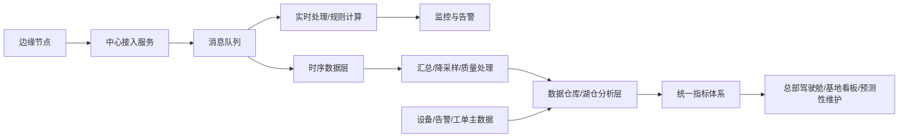

# 场景九：运维数据治理与大数据分析

项目固定背景统一参考 [项目固定背景.md](/Users/duanpeitong/Desktop/work/study/26_jgs_lw/项目固定背景.md)。

## 1. 场景定位

### 1.1 从业务角度看

运维数据治理与大数据分析解决的是“平台沉淀大量数据之后，如何让这些数据变成统一、可信、可分析的管理资产”的问题。它不是单纯做报表，而是把设备数据、告警数据、工单数据和设备档案数据统一治理起来，支撑监控、复盘、预测分析和集团决策。

如果缺少数据治理，平台采集的数据越多，越可能暴露出命名不一致、口径不统一、质量不可控和分析不可比的问题。

### 1.2 从考题角度看

这个场景适合以下题目：

- 大数据处理架构设计
- 数据架构设计
- 数据治理及其应用
- 决策支持系统设计
- 实时数据分析平台设计
- 智能运维平台设计
- 数据湖仓与流批处理设计

如果题目涉及“大数据”“数据治理”“数据仓库”“流批一体”“决策分析”“指标体系”，这个场景都可以作为正文主线。写作时要突出实时链路与离线链路的边界，以及统一数据口径的治理价值。

### 1.3 从项目角度看

平台覆盖 3 个生产基地、900 余台设备和 24 台边缘节点，每天持续产生设备状态、测点数据、告警事件、工单过程和运维结果数据。项目初期关注“接得进来、看得见、能处置”，三期推进后集团更关注跨基地指标是否统一、故障规律能否分析、运维策略能否优化。

因此，该场景承担的是从业务系统走向数据资产平台的能力升级角色。

## 2. 场景拆解

### 2.1 业务目标与成功标准

该场景的目标包括：

- 打通设备、告警、工单和分析数据链路
- 建立统一设备主数据、测点模型和指标口径
- 支撑实时监控、离线分析和管理驾驶舱
- 为预测性维护和持续优化提供可信数据基础
- 控制长期历史数据存储和查询成本

成功标准主要表现为：

- 数据来源清楚，链路可追溯
- 指标口径统一，总部和基地结果一致
- 实时处理和离线分析职责清晰
- 数据质量问题可识别、可修正、可治理
- 历史数据保留成本可控

### 2.2 场景边界

这个场景重点解决数据接入后的治理、存储、处理、汇总和分析。

它不替代实时监控场景，也不直接负责前端看板体验。实时监控关注低延迟状态和告警，大数据分析关注长期沉淀、多维汇总、指标口径和趋势复盘；可视化场景负责把分析结果呈现给不同角色。

### 2.3 核心矛盾与约束条件

该场景的核心矛盾包括：

1. 设备数据持续上报，数据量大且写入频繁
2. 数据来源多，包括遥测、告警、工单、人员、组织和设备档案
3. 实时告警要求低延迟，管理分析要求长周期和多维汇总
4. 不同基地原有设备命名、故障分类和统计口径不统一
5. 长期历史数据需要保留，但不能无限占用高性能存储
6. 边缘补传和网络波动可能带来乱序、重复和缺失数据

这些约束决定了平台不能只依赖单一数据库，也不能让统计逻辑分散在各业务模块中。

### 2.4 备选方案与舍弃理由

| 备选方案 | 表面优势 | 舍弃原因 |
| --- | --- | --- |
| 所有数据都写入业务库 | 简单统一 | 高频时序写入和复杂分析会拖慢业务库 |
| 各模块各自统计指标 | 开发快 | 指标口径不一致，跨基地结果不可比 |
| 只保留原始高频数据 | 数据最完整 | 长期存储成本高，查询效率差 |
| 只保留汇总数据 | 成本低 | 无法支持故障复盘和追溯 |

因此，我采用“实时链路 + 离线链路 + 数据治理 + 统一指标体系 + 冷热分层”的方案。

### 2.5 架构决策与边界划分

该场景按五层设计。

第一层是数据接入层。边缘节点和中心接入服务将设备数据标准化后写入消息队列。

第二层是实时处理层。实时链路负责监控状态、规则判定和告警触发。

第三层是明细存储层。时序库保存近期高频测点，业务库保存设备、告警、工单和权限等事务数据。

第四层是分析沉淀层。通过汇总、清洗、关联和降采样，将数据沉淀到数据仓库或湖仓分析层。

第五层是指标应用层。统一指标体系支撑总部驾驶舱、基地看板、故障专题分析和预测性维护。

### 2.6 关键机制设计

#### 2.6.1 主数据与指标口径治理

设备编码、基地组织、设备类型、测点定义、告警分类和工单状态必须统一。否则同一类设备在不同基地使用不同命名，分析结果就无法比较。

关键指标如设备可用率、故障率、平均修复时间和工单及时率，由分析服务统一定义和计算，避免各模块自行统计。

#### 2.6.2 流批分层与职责隔离

实时链路负责低延迟状态和告警，离线链路负责长周期汇总和多维分析。两者共享数据基础，但目标不同。

这样既能保证告警及时性，也能支持日报、月报、趋势分析和预测性维护等分析场景。

#### 2.6.3 冷热分层与数据质量处理

近期高频数据保留在热数据层，服务实时监控和短周期趋势查询；历史数据通过分钟级、小时级或日级聚合后进入冷数据或分析层。

对于边缘补传导致的乱序、重复和缺失，需要在接入、汇总和分析环节进行校验、去重、补齐和质量标记，保证结果可信。

### 2.7 质量属性与架构权衡

该场景主要支撑以下质量属性。

- `一致性`
  主数据和指标口径统一，保证跨基地分析可信。

- `可追溯性`
  原始数据、汇总数据和指标结果之间链路清楚。

- `可扩展性`
  新增设备、新指标和新分析主题时，可以在统一数据架构上扩展。

- `性能与成本`
  冷热分层和降采样兼顾查询效率和长期存储成本。

这里的取舍是：保留全部原始高频数据成本很高，只保留汇总数据又会削弱追溯能力。因此项目中对近期关键明细保留较高粒度，对长期历史做聚合归档，以平衡分析价值和资源成本。

### 2.8 技术落点与协同关系

该场景最终落到以下能力上：

- 数据接入：边缘节点、接入服务、消息队列
- 实时处理：实时计算、规则判定、告警事件处理
- 数据存储：时序库、业务库、数据仓库或湖仓分析层
- 数据治理：设备主数据、指标口径、数据质量校验、血缘追踪
- 分析应用：总部驾驶舱、基地看板、故障专题分析、预测性维护

典型链路可写成：

`边缘节点 -> 接入服务 -> 消息队列 -> 实时处理/规则计算 -> 时序库/业务库 -> 数据仓库或湖仓 -> 指标体系 -> 驾驶舱/预测性维护`

### 2.9 项目推进与验证方式

该场景按三期推进：

- 第一期：建立设备数据接入和基础时序存储，支撑实时监控
- 第二期：补齐告警、工单和设备主数据关联关系，支撑闭环复盘
- 第三期：建设统一指标体系和分析层，支撑集团驾驶舱和预测性维护

验证重点包括数据完整性、指标一致性、跨基地口径一致性、查询性能、历史数据存储成本和分析结果可追溯性。

### 2.10 论文转写角度

如果题目是 `大数据处理架构设计`，重点写实时链路、离线链路、湖仓分析和冷热分层。

如果题目是 `数据治理`，重点写主数据、指标口径、质量标记和血缘追踪。

如果题目是 `数据架构设计`，重点写时序库、业务库、分析层和指标体系。

如果题目是 `智能运维`，重点写数据如何支撑预警、复盘和预测性维护。

### 2.11 项目链路图示

## 3. 论文主体内容（约 1300 字）

在本项目中，运维数据治理与大数据分析并不是平台上线后的附属报表能力，而是支撑集团级设备运维持续优化的关键场景。项目覆盖 3 个生产基地、900 余台关键设备和 24 台边缘节点，每天持续产生设备状态、测点值、告警事件、工单流转和处置结果等数据。项目初期重点是把设备接进来、把状态看清楚、把告警处置起来；但随着三期建设推进，集团管理层更关注这些数据能否形成统一指标、能否支撑跨基地比较、能否帮助发现故障规律并优化运维策略。

在方案分析阶段，我没有选择把所有数据都写入业务库。因为设备数据具有持续、高频和时间序列特征，如果高频测点、业务事务和复杂分析都挤在同一数据库中，会影响业务库稳定性和查询性能。我也没有让各模块自行统计指标，因为不同模块对设备可用率、故障率、平均修复时间等指标的理解如果不一致，总部看到的横向比较就不可信。因此，我采用“实时链路 + 离线链路 + 数据治理 + 统一指标体系 + 冷热分层”的方案。

在总体架构上，边缘节点上报的数据进入中心接入服务后，先写入消息队列。实时链路负责监控状态、规则判定和告警事件生成，保证核心运维链路低延迟；离线链路则负责历史沉淀、多维汇总和指标计算。近期高频测点保留在时序数据层，设备档案、告警、工单和权限等事务数据保存在业务库中，经过清洗、关联、汇总和降采样后进入数据仓库或湖仓分析层，支撑驾驶舱、专题分析和预测性维护。

在数据治理方面，我重点推动设备主数据、测点模型、告警分类和工单状态统一。因为本项目覆盖多个基地，如果同一种设备在不同基地采用不同编码，同一类故障采用不同分类，或者工单处理时长的起止口径不一致，分析结果就无法比较。为此，平台统一设备编码、基地组织、设备类型、测点定义和故障分类，并由分析服务集中计算设备可用率、故障率、平均修复时间和工单及时率等关键指标。

在存储和成本控制方面，我采用冷热分层和降采样策略。近期高频数据服务实时监控、告警上下文和短周期趋势查询；较长时间的历史数据通过分钟级、小时级或日级聚合后进入冷数据或分析层，用于长期趋势、驾驶舱和复盘分析。对于边缘补传、网络抖动和测点变化带来的重复、乱序和缺失，则在接入和汇总环节进行校验、去重、补齐和质量标记，保证分析数据连续可信。

从项目效果看，运维数据治理与大数据分析能力使平台的数据价值明显提升。平台不再只是记录设备状态和告警事件，而是能够把设备、告警、工单和处置结果关联起来，形成可追溯的运维数据链路；总部和基地也能够基于统一指标进行横向比较和趋势分析。回顾整个项目，我认为大数据架构在本项目中的价值，不在于简单引入某个数据平台，而在于围绕设备运维业务建立实时处理、历史沉淀、统一治理和决策分析的一体化能力。
