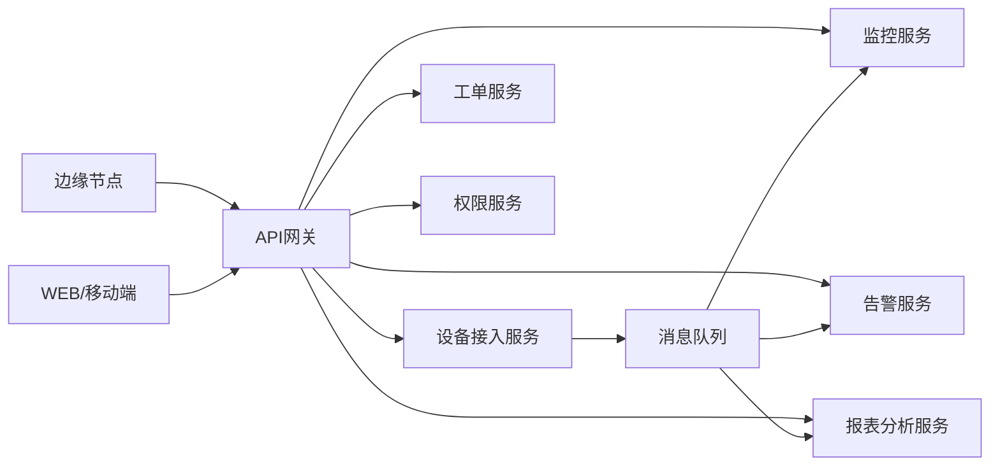

# 技术一：微服务与服务治理

项目固定背景统一参考 [项目固定背景.md](/Users/duanpeitong/Desktop/work/study/26_jgs_lw/项目固定背景.md)。

## 1. 技术定位

### 1.1 从技术角度看

微服务与服务治理解决的核心问题，不是“把系统拆小”这么简单，而是让平台在功能持续增长、访问压力持续增加、发布节奏持续演进的情况下，仍然保持可扩展、可治理和可维护。

这一技术方向通常包含几项关键能力：

- 业务域拆分
- 服务注册与发现
- 配置集中管理
- API 网关统一入口
- 服务调用与异步协同
- 限流、熔断、监控等服务治理能力

因此，微服务不是目标本身，而是支撑平台演进的一种组织方式。

### 1.2 从考题角度看

这个技术方向适合以下题目：

- 微服务架构设计
- 分布式系统设计
- 服务治理设计
- 平台化架构设计
- 架构演进设计

如果题目是“微服务”“分布式”“服务治理”，这一主题本身就可以成为论文主体；如果题目是“高可用”“性能优化”，它也可以作为整体架构基础写入正文。

### 1.3 从项目角度看

在本项目中，平台不是一个单一功能系统，而是同时覆盖：

- 设备接入
- 设备主数据管理
- 实时监控
- 告警识别
- 工单闭环
- 权限控制
- 报表分析

如果仍采用单体系统，问题会非常明显：

1. 任意一个模块变更都可能影响整个平台
2. 三期交付过程中，发布风险会不断叠加
3. 高并发设备接入和低频报表分析会互相干扰
4. 22 人团队难以按模块并行协作

因此，在本项目中选择微服务，重点不是追求时髦，而是为了支撑“多模块、多阶段、多角色、多基地”的长期演进。

## 2. 技术分析

这一部分只写和项目主链路强相关的技术点。

### 2.1 技术点一：业务域拆分

#### 技术解释

业务域拆分是微服务设计的起点，核心是按业务职责而不是按页面或数据库表拆分系统能力。

#### 项目中的使用场景

本项目中，可将平台拆分为以下几个核心服务域：

- 设备接入服务：负责边缘节点上报、接入认证、设备连接管理
- 设备主数据服务：负责设备档案、测点定义、设备分类
- 监控服务：负责状态聚合、实时监控面板
- 告警服务：负责规则判定、告警事件生成与分发
- 工单服务：负责工单流转、派单、验收与关闭
- 权限服务：负责统一认证、鉴权和数据域控制
- 报表分析服务：负责统计分析、管理驾驶舱和趋势看板

#### 为什么这样贴合项目

因为本项目本身就是一个平台型系统，不同模块的访问模式和发布节奏差异很大。例如，监控和告警链路偏实时，报表和分析链路偏统计，工单链路偏流程管理，天然不适合长期耦合在同一个单体里。

### 2.2 技术点二：注册中心与配置中心

#### 技术解释

在微服务环境下，服务实例地址和配置项会动态变化，因此需要统一的服务注册与配置管理机制。

#### 项目中的使用场景

本项目采用多实例部署和分期交付方式，监控、告警、工单等服务后续都会扩容。如果没有统一注册机制，服务地址一旦变化，其他模块的调用配置就需要逐个调整，维护成本极高。

同时，平台中存在大量需要集中管理的配置，例如：

- 服务实例地址
- 网关路由规则
- 阈值参数
- 基地级环境参数
- 通知通道配置

因此需要通过统一的注册中心和配置中心对这些内容进行治理。

#### 为什么这样贴合项目

这个项目不是一次性交付就结束，而是分 3 期上线并持续优化，统一注册与配置管理能力是后续持续扩展的前提。

### 2.3 技术点三：API 网关

#### 技术解释

API 网关负责统一入口、路由转发、前置鉴权、限流和治理控制，是微服务平台的入口枢纽。

#### 项目中的使用场景

本项目中，外部请求来源主要有三类：

- 边缘节点上报请求
- Web 端运维管理请求
- 移动端工单处理请求

这些请求不会直接访问内部服务，而是统一进入 API 网关，再由网关按业务域路由到监控、告警、工单、权限等后端服务。

典型链路可写为：

`边缘节点/WEB端/移动端 -> API 网关 -> 监控服务/告警服务/工单服务/权限服务`

#### 为什么这样贴合项目

因为这个平台既有设备接入流量，又有人员访问流量，入口必须统一治理，否则服务接口会直接暴露，权限和流量控制也会失去边界。

### 2.4 技术点四：同步调用与异步协同

#### 技术解释

微服务之间不可能全部走同步接口，也不可能全部走异步消息，关键在于区分场景。

#### 项目中的使用场景

本项目中，两类链路最典型：

- 同步链路：权限校验、设备详情查询、工单详情查询
- 异步链路：设备状态上报、告警分发、统计分析任务

可写成下面两条典型链路：

`用户请求 -> API 网关 -> 工单服务 -> 权限服务 -> 结果返回`

`边缘节点 -> 接入服务 -> 消息队列 -> 监控服务/告警服务/分析服务`

#### 为什么这样贴合项目

因为设备遥测链路天然高频，适合异步解耦；而用户查询与流程操作更强调实时响应，适合同步调用。

### 2.5 技术点五：服务治理与可观测

#### 技术解释

微服务一旦拆分，治理问题就会随之出现，因此必须补上：

- 限流
- 熔断
- 调用监控
- 统一日志
- 服务指标监控

#### 项目中的使用场景

本项目中，设备接入高峰、告警集中爆发、报表统计任务启动时，都可能导致局部服务过载。此时如果没有限流和监控能力，异常会迅速扩散。

因此在服务治理上，需要保证：

- 核心链路优先
- 故障服务可降级
- 调用链可追踪
- 关键指标可观测

### 2.6 项目链路图示

## 3. 论文主体内容（约 1300 字）

在本项目的总体架构设计中，微服务与服务治理并不是为了追求技术形式上的先进性，而是为了解决平台在多业务域、多基地、多阶段交付条件下的长期演进问题。项目覆盖设备接入、实时监控、告警管理、工单闭环、权限控制和报表分析等多个模块，如果仍采用传统单体架构，任何一个模块的调整都可能影响整个平台，发布窗口会被不断拉长，局部性能问题也会放大为整体问题。特别是在本项目需要分 3 期交付、后续还要继续接入新设备和扩展新基地的背景下，单体模式很难支撑持续演进。因此，我从项目一开始就将微服务架构确立为平台建设的基础方向。

在具体设计上，我首先按业务域而不是按技术层进行服务拆分。平台被拆分为设备接入服务、设备主数据服务、监控服务、告警服务、工单服务、权限服务和报表分析服务等多个核心服务域。这样做的原因是，这些模块承担的职责不同、访问模式不同、扩容方式也不同。例如，监控和告警链路强调实时处理能力，工单链路强调流程可追踪性，报表链路则更偏统计分析。如果把它们耦合在同一个系统中，不仅影响性能优化，也会导致后续维护复杂度持续上升。通过业务域拆分，各服务都可以围绕自己的职责独立演进，使平台具备更清晰的边界和更稳定的结构。

服务拆分之后，新的问题是如何治理这些服务。我没有把微服务理解为“拆完就结束”，而是同步补齐了服务治理能力。首先是统一入口，外部来自边缘节点、Web 端和移动端的请求，都不直接访问内部服务，而是统一先进入 API 网关，再由网关完成前置鉴权、路由转发和流量控制。这样既可以统一管理访问边界，也有利于后续服务扩容和地址调整。其次是统一注册与配置管理。由于平台采用多实例部署和分期交付模式，服务实例地址、网关路由、通知参数、基地级配置都会动态变化，如果没有统一注册中心和配置中心，系统后续维护成本会迅速失控。因此，我要求所有核心服务都纳入统一的服务注册和配置管理体系，使平台具备持续扩容与配置集中治理的能力。

在服务协同方式上，我特别强调同步调用和异步协同的区分。像权限校验、工单查询、设备详情展示等链路，适合保留同步调用，以保证交互实时性；而设备状态上报、告警事件分发、统计分析任务等高频链路，则必须改造为异步协同方式，通过消息队列完成解耦。这样做既降低了服务之间的直接依赖，也避免高并发状态下单点服务阻塞引发级联故障。此外，我还在治理层面补充了限流、熔断、统一日志和指标监控能力，确保在局部服务异常时，平台仍能维持关键链路运行。

从项目实施效果看，微服务与服务治理设计有效支撑了平台的分期建设和持续演进。一方面，22 人团队可以按服务域并行推进开发与测试，显著提高交付效率；另一方面，监控、告警、工单、报表等核心模块都具备独立扩容和独立优化能力，减少了互相牵制。更重要的是，这一架构为平台后续复制到更多设备、更多基地乃至相邻业务场景奠定了基础。回顾整个项目，我认为微服务的价值不在于“拆得多细”，而在于是否真正支撑了平台的可治理、可扩展和可演进，这也是本项目在架构设计中最关键的经验之一。
