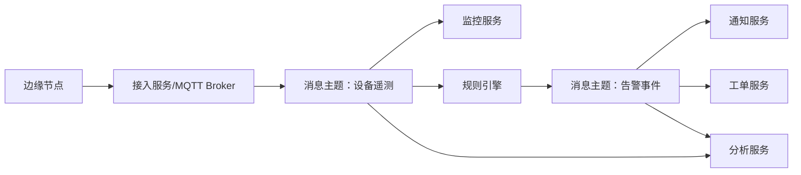

# 技术二：消息队列与异步削峰

项目固定背景统一参考 [项目固定背景.md](/Users/duanpeitong/Desktop/work/study/26_jgs_lw/项目固定背景.md)。

## 1. 技术定位

### 1.1 从技术角度看

消息队列与异步削峰解决的是分布式系统中的两个关键问题：

- 上游高频写入如何不压垮下游处理链路
- 多个系统之间如何在降低耦合的前提下完成协同

这一技术方向通常包含以下能力：

- 生产者与消费者解耦
- 请求削峰填谷
- 事件广播与分发
- 消费组并行处理
- 重试、死信、幂等等可靠性机制

### 1.2 从考题角度看

这个技术方向适合以下题目：

- 高并发架构设计
- 事件驱动架构设计
- 性能优化设计
- 系统解耦设计
- 大数据采集与处理架构设计

如果题目涉及“高并发”“异步处理”“事件驱动”“海量数据接入”，消息队列通常都可以成为正文中的核心技术点。

### 1.3 从项目角度看

在本项目中，消息队列的必要性非常强，主要来自三类压力：

1. 24 台边缘节点持续上报遥测数据，中心平台会形成持续写入压力
2. 告警一旦产生，需要同时通知多个下游模块，如通知、工单、分析
3. 统计分析和运营看板不应直接挤占实时监控链路的资源

因此，本项目写消息队列，不是为了“加一个中间件”，而是为了把设备数据链路、告警事件链路和统计分析链路合理分层。

## 2. 技术分析

### 2.1 技术点一：接入层异步化

#### 技术解释

接入层异步化的核心是：上游设备先把数据写入消息链路，再由下游服务按各自能力处理，而不是要求所有服务同步完成。

#### 项目中的使用场景

本项目中，边缘节点采集到设备状态、测点值和异常事件后，不直接同步调用监控、告警和分析服务，而是先进入接入服务和消息通道。

典型链路可以写为：

`边缘节点 -> MQTT Broker/接入服务 -> 消息主题(device.telemetry.raw) -> 监控服务`

#### 为什么这样贴合项目

因为设备遥测数据天然具有持续性和高频性，如果全部改成同步接口链路，监控服务一旦抖动，整个接入链路都会被拖垮。

### 2.2 技术点二：设备遥测数据总线

#### 技术解释

遥测数据总线是平台内部承接设备状态、测点值和事件流的核心通道，通常由消息队列承担。

#### 项目中的使用场景

本项目可采用 `Kafka` 或 `RocketMQ` 作为设备遥测数据总线，把不同来源的设备数据汇入统一主题，再按业务用途拆分消费：

- 监控服务消费实时状态数据
- 规则引擎消费异常判定数据
- 分析服务消费统计分析数据

典型链路可写为：

`边缘节点 -> 接入服务 -> Kafka/RocketMQ Topic(device.telemetry.raw) -> 监控服务/规则服务/分析服务`

#### 为什么这样贴合项目

因为这个平台既有实时处理需求，也有统计分析需求，统一遥测数据总线可以避免多个模块重复接入同一份设备数据。

### 2.3 技术点三：告警事件分发

#### 技术解释

消息队列的第二个典型作用，是把一个告警事件同时分发给多个下游系统。

#### 项目中的使用场景

在本项目中，规则引擎判定异常后，不应只把结果写进告警列表，而应形成告警事件并分发到多个下游：

- 通知服务：发送短信、站内信、企业微信提醒
- 工单服务：自动派单或生成待处理任务
- 分析服务：用于统计告警趋势和复发情况

典型链路可写为：

`规则引擎服务 -> Topic(alarm.event) -> 通知服务 / 工单服务 / 分析服务`

#### 为什么这样贴合项目

因为平台的目标不是“看到告警”，而是推动后续处置和闭环，事件分发机制正好承接这一业务目标。

### 2.4 技术点四：消费组与并行处理

#### 技术解释

消费组机制用于让多个消费者并行处理同一类消息，提高吞吐能力并支持横向扩容。

#### 项目中的使用场景

本项目中，监控链路和分析链路都可能因为接入设备增多而需要扩容。通过消费组方式，监控服务和分析服务可以按实例数横向扩展，而不需要调整上游生产方式。

#### 为什么这样贴合项目

因为项目后续会继续接入更多设备和新基地，消费组机制能让处理能力随着实例数平滑增加。

### 2.5 技术点五：重试、死信与幂等

#### 技术解释

消息队列一旦进入生产环境，就必须解决可靠性问题，因此至少要补齐：

- 重试机制
- 死信队列
- 幂等消费
- 失败补偿

#### 项目中的使用场景

在本项目中，像告警派单、通知发送、统计写入等场景都可能出现局部失败。如果没有死信和重试机制，异常事件就可能直接丢失；如果没有幂等，重试又可能造成重复派单。

#### 为什么这样贴合项目

设备运维平台不是可以容忍“偶发漏处理”的系统，任何关键告警或工单消息丢失，都会直接影响业务闭环。

### 2.6 项目链路图示

## 3. 论文主体内容（约 1300 字）

在本项目的架构设计中，消息队列与异步削峰并不是附属能力，而是支撑平台稳定运行的关键基础设施。项目面向 3 个生产基地、24 台边缘节点和 900 余台设备，遥测数据会持续进入平台。如果设备状态上报、告警识别、工单联动和统计分析全部采用同步调用方式，那么任一环节的处理能力下降，都可能引发整条链路阻塞，最终影响设备运维主业务的连续性。因此，我在项目设计早期就明确要求：设备数据主链路必须异步化，平台内部协同必须事件化。

在方案设计时，我首先把设备遥测数据链路从传统同步处理模式中剥离出来。边缘节点采集到的设备状态、测点值和异常事件，不再直接同步提交给多个后端服务，而是先由接入服务统一接收，再写入消息主题。这样做的直接好处是，把“上游写入速度”和“下游处理速度”隔离开来。即使监控服务、规则服务或分析服务短时性能波动，上游接入链路仍可通过消息缓冲保持稳定，不至于因为局部堵塞而影响整体接入能力。对于一个持续接收设备数据的平台来说，这种能力比单纯提升某个服务的处理速度更重要。

在本项目中，消息队列的第一个核心作用是承接设备遥测数据总线。设备遥测数据进入统一消息主题之后，监控服务负责消费状态数据并刷新实时看板，规则引擎负责消费异常判定相关数据，分析服务则负责消费统计分析所需的数据。这样做避免了多个模块分别重复接入同一份设备数据，也使平台内部形成了“接入一次、按需分发”的处理模式。更重要的是，这种架构使监控、告警和分析三个链路既共享同一数据源，又彼此解耦，任何一个模块的扩容或调整都不需要反向改造接入链路。

消息队列在本项目中的第二个核心作用，是承接告警事件分发。平台建设目标不是停留在“看到告警”，而是要形成从异常识别到处置闭环的完整链路。因此，规则引擎一旦识别出告警，就不应只把结果记录到数据库，而应把它发布为告警事件，由通知服务、工单服务和分析服务分别消费。这样一来，平台可以做到告警产生后自动通知相关人员、自动生成工单、自动纳入统计分析，形成真正的运维闭环。相比传统点对点调用方式，这种事件分发方式更适合一个需要持续演进的平台，因为未来只要新增一个下游模块，例如智能分析服务或 AI 诊断服务，就可以直接订阅既有事件，而不必改造原有告警链路。

为了让异步架构真正可用，我在设计中同步补齐了可靠性机制。首先，对关键消息链路引入重试和死信队列，保证异常场景下消息不会直接丢失；其次，对工单生成、通知发送等关键消费动作设计幂等机制，避免重试导致重复执行；最后，通过消费组机制支撑监控服务、分析服务按实例数横向扩容，使处理能力能够随着设备规模增长而平滑提升。实践证明，这一整套设计有效缓解了平台高峰期处理压力，也显著降低了同步调用导致的链路级阻塞风险。

从项目效果看，消息队列与异步削峰设计成功支撑了设备状态上报、告警事件联动和统计分析等多个核心场景，使平台既具备了更强的吞吐能力，也具备了更好的架构弹性。回顾整个项目，我认为消息队列真正的价值不在于“用了某个中间件”，而在于它帮助平台建立了面向事件的协同机制，使设备运维业务从过去松散的点对点处理，演进为结构清晰、可扩展、可闭环的事件驱动体系。这是本项目在架构设计层面非常关键的一次能力升级。
