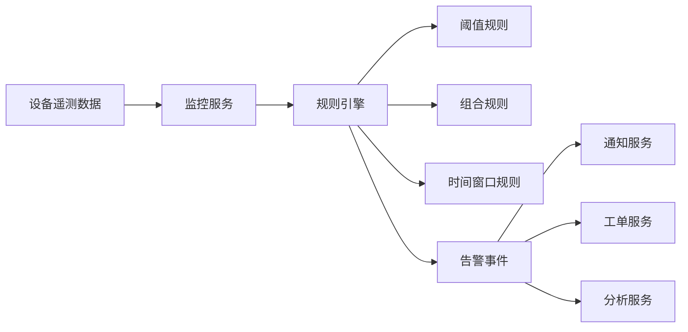

# 技术三：规则引擎与告警设计

项目固定背景统一参考 [项目固定背景.md](/Users/duanpeitong/Desktop/work/study/26_jgs_lw/项目固定背景.md)。

## 1. 技术定位

### 1.1 从技术角度看

规则引擎与告警设计解决的是“如何把原始监控数据转化为可执行运维动作”的问题。它的核心不是单纯判断是否超阈值，而是把业务规则、设备经验和异常策略沉淀成可配置、可调整、可复用的识别机制。

这一技术方向通常包含：

- 阈值规则
- 组合规则
- 时间窗口规则
- 复杂事件处理
- 告警分级与收敛
- 告警联动与闭环

### 1.2 从考题角度看

这个技术方向适合以下题目：

- 规则平台设计
- 告警系统设计
- 智能运维设计
- 平台能力抽象设计
- 数据驱动运维设计

如果题目涉及“智能运维”“规则平台”“监控告警”，规则引擎几乎都可以作为正文核心内容。

### 1.3 从项目角度看

在本项目中，平台最终目标不是只把设备状态展示出来，而是要及时识别异常、降低误报、推动闭环处理。因此，仅靠静态阈值判断远远不够，必须建立统一规则能力，把不同设备、不同测点、不同基地的运维策略沉淀下来。

项目中规则引擎的必要性主要来自三点：

1. 设备类型多，异常判定条件不可能全部硬编码
2. 运维策略会随着经验积累持续调整
3. 告警必须直接联动通知和工单，而不是停留在看板展示层

## 2. 技术分析

### 2.1 技术点一：阈值规则

#### 技术解释

阈值规则是最基础的规则类型，用于判断单一指标是否超过上限或下限。

#### 项目中的使用场景

本项目中，温度、电流、振动、转速等测点都可以配置阈值规则。例如：

- 电机温度超过设定上限触发高温告警
- 电流连续波动超出区间触发异常负载告警
- 振动值超过安全阈值触发机械异常告警

#### 为什么这样贴合项目

因为设备运维场景中的第一类异常识别，本质上就是“指标超界”。阈值规则可以快速落地，也是整个平台最先上线的能力之一。

### 2.2 技术点二：组合规则

#### 技术解释

组合规则用于把多个指标、状态和条件一起纳入判断，避免单点规则误报。

#### 项目中的使用场景

本项目中，一个设备单独出现轻微温升不一定意味着故障，但如果同时伴随振动升高和电流波动，就更可能是故障前兆。因此可以写成：

- 温度升高 + 振动异常 -> 一级预警
- 电流波动 + 长时间高负载 -> 重点关注
- 设备停机状态 + 告警持续存在 -> 派单优先级提升

#### 为什么这样贴合项目

因为真实设备异常通常不是单个指标单独变化，而是多个测点共同异常。组合规则更符合运维现场经验。

### 2.3 技术点三：时间窗口与复杂事件处理

#### 技术解释

时间窗口和复杂事件处理能力，解决的是“异常是否持续”“多个事件是否在一段时间内连续发生”的判断问题。

#### 项目中的使用场景

本项目中，可设计如下规则：

- 温度连续 10 分钟高于阈值才触发告警
- 30 分钟内同一设备重复出现 3 次同类异常则升级
- 同一设备短时间内连续触发多个不同告警，视为复合故障

#### 为什么这样贴合项目

因为工业现场数据会有抖动，如果没有时间窗口约束，平台很容易产生大量误报，影响运维人员信任。

### 2.4 技术点四：告警分级与收敛

#### 技术解释

规则引擎除了产生告警，还必须决定告警级别、重复事件如何收敛、是否需要升级处理。

#### 项目中的使用场景

本项目中，可将告警分为：

- 提示级
- 一般级
- 严重级
- 紧急级

同时，对短时间内重复触发的同类告警进行合并，避免“告警风暴”。

#### 为什么这样贴合项目

因为平台服务 3 个基地和 900 余台设备，如果所有异常都以同等优先级展示，运维人员很快就会被告警淹没，反而看不到真正关键的问题。

### 2.5 技术点五：告警联动工单

#### 技术解释

规则引擎在运维平台中的真正价值，不是“判定异常”，而是让异常进入闭环处理流程。

#### 项目中的使用场景

本项目中，严重级或紧急级告警产生后，可以直接联动：

- 通知服务：推送企业微信、短信、站内信
- 工单服务：自动生成工单
- 分析服务：记录异常趋势和重复故障

典型链路可写为：

`设备遥测数据 -> 监控服务 -> 规则引擎 -> 告警事件 -> 通知服务/工单服务/分析服务`

#### 为什么这样贴合项目

因为本项目强调的是设备运维闭环，而不是单纯的告警展示平台。

### 2.6 项目链路图示

## 3. 论文主体内容（约 1300 字）

在本项目中，规则引擎与告警设计承担了平台从“数据可见”走向“异常可识别、问题可闭环”的关键职责。平台建设的目标并不只是把设备状态采集上来，而是要在海量设备数据中及时发现异常、降低误报率，并推动后续运维动作落地。如果没有统一的规则能力，那么设备异常识别要么只能依赖人工判断，要么只能把逻辑散落在各个模块代码中，既难维护，也无法随着运维经验积累持续优化。因此，我在总体架构中将规则引擎设计为独立的智能运维能力，而不是监控模块里的一个附属功能。

在方案设计阶段，我首先判断本项目不适合一开始就完全依赖复杂算法模型。原因很直接：项目虽然需要具备预测性维护能力，但在建设初期，数据质量、历史样本和运维经验都还处于积累阶段，如果一开始就把异常识别完全寄托于模型，实施风险很高，也不利于快速落地。因此，我采用了“规则优先、逐步演进”的策略，先通过阈值规则、组合规则和时间窗口规则构建可解释、可配置、可验证的异常识别体系，再为后续智能分析和健康评分预留扩展空间。

在规则设计上，我没有把规则简单理解为“超过阈值就报警”。对于设备运维平台而言，单一阈值判断只是最基础的一层。首先，平台需要对温度、电流、振动、转速等关键测点配置阈值规则，快速识别显性异常；其次，需要把多个指标和状态组合起来形成组合规则，例如温度升高同时伴随振动异常、负载波动，才能更准确地识别故障前兆；再次，需要引入时间窗口规则，例如某项指标连续异常 10 分钟才触发告警，同一设备 30 分钟内重复出现 3 次异常则自动升级。这样做的根本目的，是让告警更接近真实现场，而不是让平台产生大量噪声。

为了让规则能力真正支撑业务闭环，我进一步把告警分级、告警收敛和工单联动纳入了统一设计。因为项目覆盖 3 个基地和 900 余台设备，如果没有分级和收敛，运维人员每天会面对大量重复和低价值告警，反而无法聚焦关键问题。因此，我将告警划分为提示级、一般级、严重级和紧急级，并要求系统对短时间内重复触发的同类事件进行合并收敛。与此同时，严重级和紧急级告警不只停留在监控看板上，而是自动联动通知服务和工单服务，推动后续派单、处理和验收。这使规则引擎从“判断工具”升级为“业务闭环驱动器”。

从项目效果看，规则引擎与告警设计有效提升了平台的异常识别能力和运维闭环效率。一方面，规则配置化使不同基地和不同设备类型的运维策略可以持续调整，降低了每次变更都依赖研发发版的成本；另一方面，告警分级、收敛和工单联动机制显著降低了告警风暴带来的干扰，提高了关键异常的可见性和处置效率。回顾整个项目，我认为规则引擎最大的价值，并不在于它用了多少复杂规则，而在于它把设备异常识别从分散的临时判断，沉淀成了一套可配置、可演进、可闭环的运维能力。这正是本项目从传统设备管理方式走向智能运维平台的重要一步。
