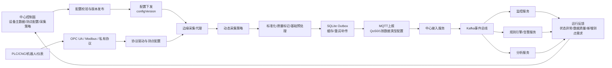

# 技术四：边缘计算与数据采集

项目固定背景统一参考 [项目固定背景.md](/Users/duanpeitong/Desktop/work/study/26_jgs_lw/项目固定背景.md)。

## 1. 技术定位

### 1.1 从技术角度看

边缘计算与数据采集解决的是“工业现场设备如何稳定、统一、可治理地接入平台”的问题。它在本项目中不是为了在边缘侧做复杂算法，而是为了把设备协议差异、现场网络波动和高频采集压力隔离在边缘层，避免中心平台直接面对复杂工业现场。

本项目的技术口径明确为：

- 设备到边缘：`OPC UA`、`Modbus TCP/RTU`、厂商私有协议
- 边缘本地缓存：`SQLite`
- 边缘到中心遥测上报：`MQTT`
- 边缘管理类接口：`HTTPS`
- 中心内部事件分发：`Kafka`

### 1.2 从考题角度看

这个技术方向适合以下题目：

- 边缘计算架构设计
- 物联网平台设计
- 数据采集架构设计
- 异构系统集成设计
- 工业互联网平台设计
- 高可用与可靠性设计
- 数据架构设计

如果题目涉及“边缘计算”“工业设备接入”“异构协议”“采集可靠性”，这一主题都可以作为论文主体。写作时不要停留在“用了 OPC UA、Modbus、MQTT”，而要说明它们分别处在哪一层、解决什么问题、为什么不能互相替代。

### 1.3 从项目角度看

本项目面向 3 个生产基地、900 余台关键设备和 24 台边缘节点。设备类型包括数控机床、焊接机器人、PLC、仪表和部分专用设备，设备来源厂商不同、协议不同、测点定义不同，现场网络也存在波动。

因此，边缘计算在本项目中的必要性主要来自五点：

1. 现场协议异构，中心平台不适合直接适配所有协议
2. 老旧设备不具备直接接入中心平台的能力
3. 高频测点数据如果全部原样上传，会增加网络和中心处理压力
4. 工业现场网络存在抖动，需要本地缓存和断点续传
5. 后续新增设备和新基地时，需要形成可复制的接入模板

## 2. 技术分析

### 2.1 技术点一：协议分层与总体链路

#### 技术解释

边缘计算场景最容易混淆的是协议层次。本项目不是在 `OPC UA/Modbus` 和 `MQTT` 之间二选一，而是把它们放在不同链路中：

- `OPC UA/Modbus/私有协议`：设备到边缘节点之间的现场采集协议
- `MQTT`：边缘节点到中心平台之间的遥测上报协议
- `HTTPS`：边缘节点注册、配置拉取、版本信息上报等管理类接口
- `Kafka`：中心平台内部的数据和事件分发总线

#### 项目中的具体场景

典型链路如下：

`PLC/CNC/机器人 -> OPC UA/Modbus/私有协议 -> 边缘采集代理 -> 标准化与质量标记 -> SQLite Outbox -> MQTT -> 中心接入服务 -> Kafka -> 监控/告警/分析`

例如，某基地的数控机床通过 `OPC UA` 暴露主轴转速、运行状态和报警码；老旧 PLC 通过 `Modbus RTU` 暴露温度、电流和启停状态；边缘采集代理将这些数据统一转换为平台标准结构，再通过 `MQTT` 上报中心接入服务。

#### 架构师决策点

我没有让中心平台直接连接底层设备，也没有让设备或边缘节点直接写 Kafka。前者会让中心平台暴露在复杂现场协议和网络波动中，后者会抬高边缘侧接入复杂度，也会把中心内部事件总线暴露到现场网络。通过端边云分层，可以把现场复杂度封装在边缘层，把统一治理和业务处理放在中心平台。

### 2.2 技术点二：OPC UA 设备接入

#### 技术解释

`OPC UA` 全称为 `OPC Unified Architecture`，现代语境下 OPC 常解释为 `Open Platform Communications`。它是工业自动化领域常见的标准通信架构，适合数控机床、自动化设备、机器人控制系统等较新设备暴露结构化测点数据。

#### 项目中的具体场景

本项目中，部分数控机床和自动化设备支持 `OPC UA`。边缘采集代理作为 OPC UA Client 连接设备或现场 OPC UA Server，读取设备状态、主轴转速、运行模式、报警码、加工节拍等测点。

典型映射可以写成：

| 设备侧测点 | 平台测点编码 | 用途 |
| --- | --- | --- |
| 主轴转速 | `spindle_speed` | 监控设备运行状态 |
| 运行模式 | `running_mode` | 判断自动/手动/停机 |
| 报警码 | `alarm_code` | 触发告警规则 |
| 加工计数 | `process_count` | 支撑产线效率分析 |

#### 架构师决策点

对于支持 OPC UA 的设备，我优先采用 OPC UA 接入。原因是它比直接读寄存器更结构化，测点含义更清晰，也更适合后续扩展。但我没有把 OPC UA 作为唯一接入标准，因为项目中仍有大量老旧 PLC 和仪表不支持 OPC UA，必须同时保留 Modbus 和私有协议适配能力。

### 2.3 技术点三：Modbus TCP/RTU 设备接入

#### 技术解释

`Modbus` 是工业现场常见通信协议，核心方式是读取或写入设备寄存器、线圈等地址。`Modbus TCP` 基于以太网，`Modbus RTU` 多用于串口、RS-485 等老旧现场链路。

#### 项目中的具体场景

本项目中，老旧 PLC、仪表、采集模块和部分辅助设备通过 `Modbus TCP/RTU` 接入边缘节点。边缘采集代理按设备地址、寄存器地址、数据类型和缩放系数读取数据，再映射为平台测点。

典型配置可以写成：

| 设备 | 协议 | 地址或寄存器 | 平台测点 |
| --- | --- | --- | --- |
| 老旧 PLC | Modbus RTU | 40001 | `temperature` |
| 电流表 | Modbus RTU | 40002 | `current` |
| 采集模块 | Modbus TCP | 00001 | `run_status` |
| 气压仪表 | Modbus TCP | 40010 | `air_pressure` |

#### 架构师决策点

Modbus 的优点是现场覆盖面广、老旧设备支持度高，缺点是语义弱，寄存器地址本身不能表达业务含义。因此我没有让上层服务直接理解寄存器地址，而是在边缘侧建立“寄存器地址 -> 平台测点编码”的映射关系。这样上层监控和告警只面对 `temperature`、`current`、`run_status` 等统一测点，而不是面对各种寄存器地址。

### 2.4 技术点四：边缘采集代理

#### 技术解释

边缘采集代理是边缘节点的核心执行组件，负责连接设备、加载协议驱动、执行采集计划、转换数据格式、写入本地缓存并上传中心平台。

#### 项目中的具体场景

本项目中，24 台边缘节点分别部署在 3 个基地的关键网络位置。每个边缘节点运行采集代理，管理一组设备和测点配置。采集代理主要承担：

- 设备连接管理：维护 OPC UA、Modbus 或私有协议连接状态
- 采集计划管理：区分 1 秒、5 秒、30 秒等不同采集周期
- 状态感知采集：根据运行、停机、故障、离线等状态动态调整采集频率
- 测点转换：将设备原始测点转换为平台标准测点
- 质量标记：标记正常、缺失、补传、异常值等状态
- 本地缓存：写入 SQLite 等待上传确认
- 上传控制：通过 MQTT 将遥测数据上报中心

#### 架构师决策点

我没有把边缘节点设计成“透明转发器”。透明转发虽然简单，但无法处理协议差异、网络波动、数据质量和补传问题。边缘采集代理必须承担现场复杂性的封装职责，但也不能承担复杂告警规则和工单流程，否则会削弱中心平台统一治理能力。

### 2.5 技术点五：状态感知的动态采集策略

#### 技术解释

状态感知的动态采集策略，是指边缘采集代理不按固定频率采集所有测点，而是根据设备运行状态、故障状态、连接状态和测点重要性动态调整采集频率。

它解决的问题是：设备运行时需要高频采集支撑实时监控和告警；设备停机或故障后，如果仍按运行态频率采集振动、转速等高频测点，会造成大量低价值数据，增加边缘缓存、网络传输和中心处理压力。

#### 项目中的具体场景

本项目中，我将设备状态大致分为四类：

| 设备状态 | 采集策略 | 典型测点 |
| --- | --- | --- |
| 运行中 | 高频采集关键运行测点 | 振动、温度、电流、转速、气压 |
| 故障停机 | 保留状态、故障码和安全相关测点，运行态测点降频或暂停 | 故障码、设备状态、关键温度、连接心跳 |
| 计划停机 | 低频采集状态和心跳，暂停大部分高频运行测点 | 设备状态、心跳、少量安全测点 |
| 采集断联 | 上报设备连接异常事件，停止无效测点读取 | 连接状态、断联原因、最后采集时间 |

例如，设备运行时可以 1 秒采集一次振动和电流，5 秒采集一次温度；设备故障停机后，振动和转速可以暂停或降为低频，故障码、设备状态、连接心跳和关键温度仍持续采集。这样既能判断设备是否恢复，也能减少无效数据上报。

#### 架构师决策点

我没有让所有测点始终按最高频率采集。因为平台覆盖 900 余台设备，如果停机设备仍持续上报全部高频测点，会浪费边缘存储、网络带宽和中心消费能力。动态采集的关键是把测点分级：状态、故障、心跳属于必须持续感知的数据；振动、转速等运行态测点则根据设备状态调整频率。

同时，动态采集策略必须配置化，不能写死在采集程序中。不同设备类型、不同基地和不同测点的重要性不同，应通过测点配置定义运行态频率、停机态频率、上报优先级和是否触发告警。边缘遥测数据统一先进入 SQLite Outbox，再由上传线程按优先级和重试策略向中心平台补传。

### 2.6 技术点六：控制面与数据平面分离

#### 技术解释

设备和测点配置会变化，例如新增设备、停用测点、调整采集频率、修改寄存器地址、增加告警关联字段等。如果这些配置变化直接作用在高频采集线程上，容易造成采集中断、数据口径漂移或错误配置立即扩散。

因此，本项目将边缘接入拆成两个平面：

- `控制面`：负责设备档案、测点配置、采集频率、协议参数、配置版本、审批发布和审计。
- `数据平面`：负责按已生效配置执行高频采集、缓存、MQTT 上报和补传。

#### 项目中的具体场景

中心平台的设备主数据服务维护设备档案和测点配置，例如：

| 配置项 | 示例 |
| --- | --- |
| 设备标识 | `CNC-018` |
| 协议类型 | `OPC_UA` |
| 设备地址 | `opc.tcp://10.10.3.18:4840` |
| 测点编码 | `spindle_speed` |
| 设备侧地址 | `ns=2;s=Machine.Spindle.Speed` |
| 运行态频率 | `1s` |
| 停机态频率 | `60s` |
| 上报优先级 | `high` |
| 本地保留周期 | `72h` |
| 配置版本 | `v2025.03.12.01` |

配置变更时，不是直接改采集线程，而是按流程发布新版本：

`配置编辑 -> 校验 -> 生成版本 -> 下发边缘节点 -> 边缘本地校验 -> 热加载或灰度生效 -> 回报生效结果`

边缘节点本地保留最近一个稳定配置版本。如果新配置校验失败或热加载异常，边缘节点继续使用上一版稳定配置，避免高频采集链路被错误配置打断。

#### 架构师决策点

我没有把测点配置写死在边缘采集程序中，也没有让业务人员的配置修改直接影响数据平面。控制面和数据平面分离后，测点变化可以通过版本化配置治理，数据平面则保持稳定采集。

同时，每条上报数据携带 `configVersion`。这样当中心平台发现某段时间数据异常时，可以追溯当时边缘节点使用的是哪一版测点配置，便于排查是设备异常、协议异常，还是配置变更导致的数据口径变化。

### 2.7 技术点七：统一测点模型与数据结构

#### 技术解释

统一测点模型解决的是“不同设备采上来的数据如何被平台统一理解”的问题。设备侧的寄存器、节点、报警码和原始字段不能直接进入上层业务，必须先映射为统一数据结构。

#### 项目中的具体场景

本项目中，边缘采集代理将原始数据转换为统一结构，至少包含：

- `baseId`：基地标识
- `edgeId`：边缘节点标识
- `deviceId`：设备标识
- `metricCode`：平台测点编码
- `timestamp`：采集时间
- `value`：测点值
- `quality`：数据质量标记
- `sourceProtocol`：来源协议
- `configVersion`：采集配置版本

示例结构可以写成：

```json
{
  "baseId": "B01",
  "edgeId": "EDGE-03",
  "deviceId": "CNC-018",
  "metricCode": "spindle_speed",
  "timestamp": "2025-03-12T09:30:05+08:00",
  "value": 3200,
  "quality": "normal",
  "sourceProtocol": "OPC_UA",
  "configVersion": "v2025.03.12.01"
}
```

#### 架构师决策点

统一测点模型是接入层能否长期维护的关键。没有统一模型，上层监控、告警和分析都要理解不同设备协议；有了统一模型，协议变化主要影响边缘侧驱动和配置，上层服务可以保持稳定。

### 2.8 技术点八：SQLite 本地缓存与断点续传

#### 技术解释

本地缓存与断点续传解决的是“中心平台短时不可用或网络波动时，关键数据如何不丢”的问题。

#### 项目中的具体场景

本项目中，我决策边缘节点采用 `SQLite` 作为轻量级本地 Outbox 队列。进入上传链路的关键遥测数据、状态变化事件和异常事件，不是先尝试 MQTT 发送、失败后才写 SQLite，而是先在边缘侧完成标准化和质量标记，再写入 SQLite，最后由独立发送线程按顺序发布到 MQTT。中心接入服务确认后，边缘节点再将本地记录标记为已确认并按清理策略删除。

缓存记录可按状态管理：

- `pending`：已采集，尚未上传
- `sent`：已发送，等待中心确认
- `acked`：中心已确认，可按策略清理
- `failed`：多次失败，等待重试或人工排查

正常情况下，数据流转为：

`采集 -> 标准化 -> 写入 SQLite(pending) -> MQTT 发布 -> 中心确认 -> 标记 acked/清理`

当基地到中心网络抖动、中心入口维护或 MQTT 连接断开时，数据仍然先进入 SQLite，发送线程暂停或重试；链路恢复后，再按时间顺序和批次补传。中心接入服务按 `edgeId + deviceId + metricCode + timestamp` 或事件编号做幂等去重。

这不是传统意义上“同时写两套最终存储”的双写，而是边缘侧的本地可靠队列模式。SQLite 保存的是待发送和待确认数据，中心平台才是最终的数据处理和存储位置。

#### 架构师决策点

我没有在边缘节点部署 `InfluxDB`。原因是边缘侧的职责是采集、缓存和补传，不做复杂时序查询；在 24 台边缘节点上维护时序数据库会增加部署、备份、升级和故障处理成本。长期时序存储、趋势查询和冷热分层统一放在中心平台数据层处理。

### 2.9 技术点九：MQTT 上报与 HTTPS 管理接口

#### 技术解释

边缘节点完成本地采集、标准化、质量标记和缓存后，需要把设备遥测数据稳定送到中心平台。本项目统一采用 `MQTT` 承载边缘到中心的遥测主链路。

`HTTPS` 不作为高频遥测主通道，只用于低频管理类接口，例如节点注册、配置拉取、版本信息上报、管理指令确认等。

#### 项目中的具体场景

MQTT Topic 可以按基地、边缘节点、设备和数据类型组织，例如：

```text
factory/B01/edge/EDGE-03/device/CNC-018/telemetry
factory/B01/edge/EDGE-03/device/CNC-018/status
factory/B01/edge/EDGE-03/device/CNC-018/event
```

QoS 策略按数据类型区分：

- 普通高频遥测：`QoS 0` 或 `QoS 1`，根据重要性配置
- 关键状态变化：`QoS 1`
- 异常事件：`QoS 1`，中心侧做幂等处理

#### 架构师决策点

我没有让遥测数据在 MQTT 和 HTTPS 之间摇摆。统一 MQTT 有利于管理 Topic、QoS、断线重连和边缘弱网络接入；HTTPS 保留给管理类接口，可以让遥测链路和管理链路职责清晰。

### 2.10 技术点十：中心接入服务与 Kafka 衔接

#### 技术解释

中心接入服务负责承接边缘节点上报的数据，并把边缘数据转化为平台内部可消费的事件流。它不是简单网关，而是边缘层和平台业务层之间的治理边界。这里的 Kafka 不是边缘到中心的上报协议，而是数据已经进入中心平台之后的内部事件总线。

#### 项目中的具体场景

中心接入服务收到 MQTT 数据后，主要完成：

- 边缘节点身份校验
- 设备与测点合法性校验
- 配置版本校验
- 字段补齐和格式校验
- 数据质量标记校验
- 幂等去重
- 写入 Kafka Topic

进入 Kafka 后，监控服务、规则引擎和分析服务分别以消费组方式处理数据。典型 Topic 可包括：

- `device.telemetry.raw`
- `device.telemetry.standard`
- `device.status.changed`
- `alarm.event.created`

#### 架构师决策点

我没有让 MQTT Broker 直接承担平台内部所有下游分发，也没有让监控、告警和分析服务直接订阅边缘主题。MQTT 负责边缘到中心的接入，Kafka 负责中心内部的高吞吐事件流、消费解耦和数据回放。这样既保留边缘接入的轻量性，也保证中心处理链路的可扩展性。

### 2.11 项目闭环链路图示



## 3. 论文主体内容（约 1300 字）

在本项目中，边缘计算与数据采集不是一个附属接入能力，而是整个平台能够真正落地的基础前提。项目面向 3 个生产基地、900 余台设备和 24 台边缘节点，设备类型覆盖数控机床、焊接机器人、PLC、仪表及部分专用设备，来源厂商、通信协议和测点定义都不统一。如果中心平台直接与底层设备逐个建立连接，不仅协议适配工作量巨大，而且一旦现场网络波动或设备侧环境变化，中心平台就会被大量底层细节拖累。因此，我从项目一开始就明确将边缘计算层作为独立层次来建设。

在协议接入设计上，我首先明确了不同协议的边界。支持 OPC UA 的数控机床和自动化设备，由边缘采集代理作为客户端读取主轴转速、运行模式、报警码和加工计数等结构化测点；老旧 PLC、仪表和采集模块则通过 Modbus TCP/RTU 读取寄存器或线圈状态，再由边缘侧配置把寄存器地址映射为平台统一测点；个别专用设备通过厂商私有协议或接口文档接入。这样一来，中心平台不再直接面对设备协议差异，而是只处理边缘层转换后的标准化数据。

在边缘采集代理设计上，我没有把它定位成简单转发器，而是要求其承担设备连接、采集计划、动态采集、测点转换、质量标记、本地缓存和上传控制等职责。例如，同一台边缘节点可能同时管理支持 OPC UA 的数控机床和通过 Modbus RTU 接入的仪表，采集代理需要按不同周期读取测点，并统一转换为包含基地、边缘节点、设备、测点编码、时间戳、值、质量标记、来源协议和配置版本的标准结构。这样上层监控、告警和分析服务只面对统一测点模型，不需要理解寄存器地址、OPC UA 节点或厂商私有字段。

考虑到不同设备的测点配置不同，而且测点地址、采集频率和启停状态可能随现场改造而变化，我进一步把边缘接入拆成控制面和数据平面。控制面由中心平台维护设备档案、测点配置、采集频率、协议参数和配置版本，并通过校验、发布和审计流程下发到边缘节点；数据平面则只按照本地已生效配置执行高频采集、SQLite 入队和 MQTT 上报。配置变更不会直接冲击采集线程，而是以版本方式热加载或灰度生效；如果新配置校验失败，边缘节点继续使用上一版稳定配置。每条遥测数据携带 `configVersion`，便于后续追溯数据口径变化。

在采集频率设计上，我进一步采用状态感知的动态采集策略。设备运行时，对振动、电流、转速等运行态测点按较高频率采集，以支撑实时监控和告警；设备故障停机或计划停机后，不再按运行态频率采集所有测点，而是持续采集设备状态、故障码、连接心跳和少量安全相关测点，对振动、转速等高频运行测点降频或暂停。这样既能持续感知设备是否恢复，又能降低停机期间的无效数据量，避免边缘缓存、网络带宽和中心消费能力被低价值数据占用。

为了提升接入链路可靠性，我在边缘节点本地采用 SQLite 作为轻量级 Outbox 队列，而没有在边缘侧部署 InfluxDB。原因是边缘节点主要承担采集、缓存和补传职责，不负责复杂时序查询；如果在 24 台边缘节点分别维护时序数据库，会增加部署、升级、备份和故障处理成本。边缘采集代理对进入上传链路的关键数据先写入 SQLite，再由发送线程通过 MQTT 发布；中心确认后再标记为已确认并清理。网络抖动、中心入口维护或 MQTT 连接中断时，数据仍保留在 SQLite 中，链路恢复后按批次补传；中心接入服务再根据边缘节点、设备、测点和时间戳做幂等处理，避免重复入库或重复触发告警。

在边缘到中心的通信方式上，我统一采用 MQTT 承载设备遥测主链路，而不是在 MQTT 和 HTTPS 之间摇摆。MQTT 适合边缘弱网络环境下的轻量发布订阅、断线重连和 QoS 管理。普通高频遥测可根据重要性采用 QoS 0 或 QoS 1，关键状态变化和异常事件采用 QoS 1，并在中心侧配合幂等机制处理重复投递。HTTPS 只用于节点注册、配置拉取、版本信息上报和管理指令确认等低频管理类接口。这样数据链路和管理链路职责清晰，也便于统一治理 Topic、QoS 和补传策略。

最后，中心接入服务承担边缘层和平台业务层之间的治理边界。它对边缘节点身份、设备主数据、测点合法性、字段格式和数据质量进行校验，完成标准化后再写入 Kafka 等平台内部事件总线。监控服务、规则引擎和分析服务分别以消费组方式消费数据，从而避免 MQTT Broker 直接承担平台内部长期数据总线职责。通过这种设计，平台既保留了边缘接入的轻量性，又具备中心侧高吞吐分发、回放和扩展能力。

从项目效果看，边缘计算与数据采集设计有效支撑了平台对多基地、多类型设备的统一纳管。一方面，边缘层屏蔽了现场协议和网络环境差异，使中心平台聚焦于监控、告警、工单和分析等业务能力；另一方面，SQLite 本地缓存、MQTT 可靠上报和中心幂等接收共同提升了数据连续性。回顾整个项目，我认为边缘计算的价值不在于边缘侧做了多少复杂计算，而在于它通过清晰的协议分层、采集代理、统一测点模型和可靠上传机制，把复杂工业现场纳入了可治理、可扩展的平台架构。
