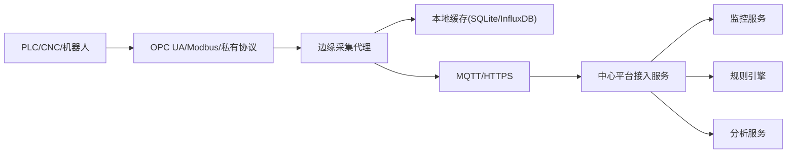

# 技术四：边缘计算与数据采集

项目固定背景统一参考 [项目固定背景.md](/Users/duanpeitong/Desktop/work/study/26_jgs_lw/项目固定背景.md)。

## 1. 技术定位

### 1.1 从技术角度看

边缘计算与数据采集解决的是“工业现场设备如何稳定接入平台”的问题。它关注的重点并不是复杂算法计算，而是让异构设备在复杂现场环境下能够被统一接入、稳定采集、可靠上传。

这一技术方向通常包含：

- 协议适配
- 边缘采集代理
- 本地缓存与断点续传
- 上传协议与接入服务
- 边缘预处理与质量控制

### 1.2 从考题角度看

这个技术方向适合以下题目：

- 边缘计算架构设计
- 物联网平台设计
- 数据采集架构设计
- 异构集成设计
- 工业互联网平台设计

如果题目涉及“边缘计算”“物联网”“工业设备接入”“数据采集”，这一主题都可以成为论文主体。

### 1.3 从项目角度看

在本项目中，平台服务对象不是单一业务系统，而是 3 个生产基地、900 余台不同类型设备。项目的第一道难题不是监控和分析，而是设备到底能不能稳定接进来。

边缘计算在本项目中的必要性主要来自四点：

1. 设备来源复杂，协议不统一
2. 老旧设备不具备直接接入中心平台的能力
3. 工业现场网络环境存在波动
4. 中心平台不适合直接维护大量底层连接

因此，边缘计算在本项目中是平台能够落地的前提，而不是一个附加亮点。

## 2. 技术分析

### 2.1 技术点一：协议适配

#### 技术解释

协议适配的作用，是把不同厂商、不同年代设备的通信方式统一转换成平台可识别的数据格式。

#### 项目中的使用场景

本项目中的典型协议包括：

- `OPC UA`
- `Modbus TCP/RTU`
- 厂商私有协议

例如：

- 数控机床通过 `OPC UA` 暴露测点数据
- 老旧 PLC 通过 `Modbus RTU` 接入边缘网关
- 部分专用设备通过厂商私有协议接入边缘采集代理

#### 为什么这样贴合项目

因为汽车零部件集团内部设备型号复杂，来源厂商不统一，协议差异是项目落地初期最现实的障碍。

### 2.2 技术点二：边缘采集代理

#### 技术解释

边缘采集代理负责在现场完成设备连接、协议转换、数据格式化和本地控制，是边缘节点的核心执行组件。

#### 项目中的使用场景

本项目中，24 台边缘节点分别部署在 3 个基地的关键网络位置，每个边缘节点运行边缘采集代理，承担以下职责：

- 与 PLC、CNC、机器人建立连接
- 轮询或订阅设备测点
- 把原始数据转换为统一结构
- 对接平台接入服务

典型链路可写为：

`PLC/CNC/机器人 -> OPC UA/Modbus 驱动 -> 边缘采集代理 -> 平台标准格式数据`

#### 为什么这样贴合项目

因为中心平台如果直接面对底层协议，复杂度会迅速失控，而边缘代理正好可以把现场差异封装在边缘侧。

### 2.3 技术点三：本地缓存与断点续传

#### 技术解释

本地缓存与断点续传能力，解决的是“中心平台短时不可用或网络波动时，设备数据如何不丢”的问题。

#### 项目中的使用场景

本项目中，边缘节点本地可使用：

- `SQLite`
- `InfluxDB`

来暂存关键遥测数据和事件数据。当网络恢复后，再批量补传。

典型场景包括：

- 基地到中心平台网络抖动
- 平台入口短时维护
- 边缘节点与中心平台临时断连

#### 为什么这样贴合项目

工业现场网络并不总是稳定，边缘侧如果没有缓存能力，一旦链路抖动，监控和分析就会出现数据断层。

### 2.4 技术点四：上传协议与接入服务

#### 技术解释

边缘节点完成本地采集后，必须通过统一上传协议把数据送到中心平台。

#### 项目中的使用场景

本项目中，边缘节点可通过：

- `MQTT`
- `HTTPS`

将格式化后的设备数据发送到中心平台接入服务，再由接入服务转入监控、规则和分析链路。

典型链路可写为：

`边缘采集代理 -> MQTT/HTTPS -> 中心平台接入服务 -> 消息队列/监控服务`

#### 为什么这样贴合项目

因为中心平台不能直接维护设备级协议连接，边缘与中心之间必须有统一、稳定、可治理的上传通道。

### 2.5 技术点五：边缘预处理

#### 技术解释

边缘预处理是指在边缘侧对原始数据进行清洗、过滤、聚合和质量控制，降低中心平台压力。

#### 项目中的使用场景

本项目中，边缘节点可以在本地完成：

- 去除无效值
- 过滤重复状态
- 按时间窗口聚合高频数据
- 补齐时间戳与设备标识

#### 为什么这样贴合项目

因为部分设备测点频率高，如果所有原始数据毫无选择地直接上传中心平台，不仅浪费带宽，也会增加中心侧处理压力。

### 2.6 项目链路图示

## 3. 论文主体内容（约 1300 字）

在本项目中，边缘计算与数据采集并不是单独的接入能力，而是整个平台能够真正落地的基础前提。项目面向 3 个生产基地、900 余台设备，设备类型覆盖数控机床、焊接机器人、PLC 及各类辅助设备，不同设备来源厂商不同、协议不同、网络环境也不同。如果中心平台直接与底层设备逐个建立连接，不仅协议适配工作量巨大，而且一旦现场网络波动或设备侧环境变化，中心平台就会被大量底层细节拖累。因此，在总体架构设计中，我从一开始就明确将边缘计算层作为平台的独立层次来建设。

在方案设计阶段，我首先解决的是协议异构问题。本项目中的设备并不具备统一接口能力，部分数控机床支持 `OPC UA`，部分老旧 PLC 只能通过 `Modbus RTU` 通信，还有少数设备需要通过厂商私有协议接入。如果不先把协议问题解决掉，后续监控、告警、分析这些上层能力都无从谈起。基于这一判断，我要求在 3 个基地部署 24 台边缘节点，由边缘采集代理负责与底层设备建立连接，并完成协议转换和数据格式统一。这样一来，中心平台不再直接面对设备协议，而是只处理统一结构化后的设备数据，从而把最复杂、最易变的现场差异封装在边缘侧。

在边缘节点的能力设计上，我没有把它定位成一个简单转发器，而是要求它具备接入、缓存和预处理三类能力。首先，边缘采集代理负责从 PLC、CNC、机器人等设备中读取测点数据和状态信息；其次，边缘节点本地要具备缓存能力，在网络抖动、平台维护或中心短时不可用时，把关键数据暂存在本地 `SQLite` 或时序缓存中，待链路恢复后再补传，确保平台不会因为网络波动而出现数据断层；再次，边缘侧需要承担一定的数据预处理职责，例如无效值过滤、重复状态压缩、时间戳补齐和基础聚合，以降低中心平台直接处理原始高频数据的压力。这样设计以后，边缘节点既成为设备接入层的统一代理，也成为中心平台稳定性的缓冲层。

在边缘与中心平台的连接方式上，我强调统一上传通道的重要性。边缘侧完成协议转换和本地处理后，通过 `MQTT` 或 `HTTPS` 把数据送入中心平台接入服务，再由接入服务转入监控、规则和分析链路。这种做法有两个明显好处：一是中心平台只需要治理统一的接入协议，不必直接管理海量底层设备连接；二是上传链路可以与消息队列、监控服务和规则引擎自然衔接，使平台形成“边缘采集、中心处理、闭环处置”的标准化架构。对一个需要持续扩展设备规模的平台来说，这种分层方式能够明显降低后续扩展成本。

从项目实施效果看，边缘计算与数据采集设计有效支撑了平台对多基地、多类型设备的统一纳管。一方面，边缘层屏蔽了现场协议和网络环境差异，使中心平台得以聚焦于监控、告警、工单和分析等业务能力；另一方面，本地缓存和断点续传机制提升了数据连续性，降低了网络异常对平台业务的影响。更重要的是，这一架构使后续新增设备、接入新产线或扩展新基地时，不需要反复改造中心平台，而是主要在边缘侧扩展协议适配和采集规则即可。回顾整个项目，我认为边缘计算的价值并不在于“边缘上做了多少计算”，而在于它让复杂工业现场被平台化、标准化地纳入统一架构，这是本项目能够真正从设备管理走向智能运维平台的基础。
