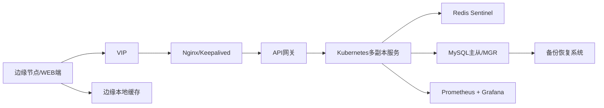

# 技术六：高可用与容灾

项目固定背景统一参考 [项目固定背景.md](/Users/duanpeitong/Desktop/work/study/26_jgs_lw/项目固定背景.md)。

## 1. 技术定位

### 1.1 从技术角度看

高可用与容灾解决的是“系统在异常情况下如何持续提供服务”的问题。它不是单一组件的稳定性，而是入口、服务、缓存、数据库、边缘节点、备份恢复和运维监控的全链路保障能力。

这一技术方向通常包含：

- 入口高可用
- 服务多副本部署
- 缓存与数据库高可用
- 边缘侧容错
- 备份恢复
- 可观测性与演练机制

### 1.2 从考题角度看

这个技术方向适合以下题目：

- 高可用架构设计
- 容灾设计
- 软件可靠性设计
- 稳定性工程设计
- 系统演进设计

如果题目考“高可用”“可靠性”“容灾”，这一主题本身就足以展开成一篇论文主体。

### 1.3 从项目角度看

在本项目中，平台一旦中断，影响的不是单一功能，而是整条设备运维主链路：

- 设备状态无法及时接入
- 告警无法及时识别
- 工单无法及时派发与处理
- 管理层无法获取运行态势

同时，项目采用分 3 期交付，后续还要持续优化，这意味着平台不仅要“运行起来”，还要“能够不停地升级和扩展”。因此，高可用与容灾在本项目中属于底线能力，而不是锦上添花。

## 2. 技术分析

### 2.1 技术点一：入口高可用

#### 技术解释

入口高可用解决的是“用户和边缘节点如何稳定进入平台”的问题，通常通过多入口节点、虚拟地址和反向代理集群完成。

#### 项目中的使用场景

本项目中，边缘节点上报请求和用户访问请求都要先经过统一入口。若入口层只有单节点，一旦故障，整个平台就会整体不可用。因此需要在入口层通过：

- `Nginx`
- `Keepalived`
- `VIP`

实现访问入口高可用。

典型链路可写为：

`边缘节点/WEB端 -> VIP -> Nginx/Keepalived -> API 网关`

#### 为什么这样贴合项目

因为本项目同时有设备接入流量和人员访问流量，入口层是所有业务的共同前提。

### 2.2 技术点二：服务多副本部署

#### 技术解释

服务多副本部署用于避免单个业务实例故障导致核心能力中断。

#### 项目中的使用场景

本项目中的监控、告警、工单、权限等核心服务，都不应以单实例方式运行，而应通过：

- `Kubernetes`
- 多副本服务部署

方式运行，保证某个实例故障时流量可切换到其他健康实例。

#### 为什么这样贴合项目

因为监控、告警和工单都属于核心链路，任一单点故障都可能直接影响运维闭环。

### 2.3 技术点三：缓存与数据库高可用

#### 技术解释

平台服务稳定，不仅取决于应用实例，还取决于缓存与数据库是否具备故障切换能力。

#### 项目中的使用场景

本项目中，可采用以下方式提升数据层可靠性：

- 缓存层采用 `Redis Sentinel`
- 数据库层采用 `MySQL 主从` 或 `MGR`

这样做可以在单节点故障时维持核心数据读写能力。

#### 为什么这样贴合项目

因为工单、告警、权限、设备档案等核心数据都依赖数据库和缓存，一旦数据层不可用，应用层多副本也没有意义。

### 2.4 技术点四：边缘侧容错

#### 技术解释

边缘侧容错解决的是“中心平台异常或网络抖动时，现场数据如何不丢”的问题。

#### 项目中的使用场景

本项目中，边缘节点具备本地缓存和恢复后补传能力。当中心平台入口临时不可用或链路波动时，边缘节点仍可先保存关键遥测数据，待恢复后补传，避免采集链路完全中断。

#### 为什么这样贴合项目

工业现场与中心平台之间的网络不可能始终稳定，边缘容错是平台真实可用的重要保障。

### 2.5 技术点五：可观测性与备份恢复

#### 技术解释

高可用不只是架构设计，还必须通过监控、日志、备份和演练机制持续验证。

#### 项目中的使用场景

本项目中，需要至少补齐以下能力：

- `Prometheus + Grafana` 监控关键指标
- 核心服务、缓存、数据库的统一日志与告警
- 数据备份与恢复流程
- 分阶段容灾演练
- 灰度发布与回滚预案

#### 为什么这样贴合项目

因为项目是分期交付并持续优化的，若没有监控、备份和演练，所谓“高可用”就只停留在设计图层面。

### 2.6 项目链路图示

## 3. 论文主体内容（约 1300 字）

高可用与容灾设计是本项目能够在生产环境长期稳定运行的底线能力。平台覆盖 3 个生产基地、900 余台设备和 24 台边缘节点，承担设备接入、状态监控、告警识别、工单闭环和管理分析等多条核心业务链路。如果系统在关键时刻不可用，影响的不只是某个页面打不开，而是整条运维体系的响应效率和管理能力都会受到冲击。因此，在项目总体架构设计中，我并没有把高可用理解为“服务多部署几台机器”，而是把它作为入口、应用、数据、边缘和运维体系协同建设的一项系统性能力。

在入口层，我首先解决的是统一访问通道不能单点的问题。无论是边缘节点的持续数据上报，还是总部和基地人员的 Web、移动端访问，都必须先经过平台入口。如果入口层故障，后端服务是否健康就失去了意义。因此，我要求入口层采用 `VIP + Nginx + Keepalived` 的方式构建高可用访问入口，让边缘节点和用户侧都通过统一地址访问平台，在入口节点异常时由备用节点快速接管，保证访问通道不中断。这一设计让平台首先具备了“能稳定进入”的基础条件。

在应用层，我把监控、告警、工单、权限等核心服务全部纳入多副本部署体系，通过 `Kubernetes` 等容器编排平台实现副本调度、故障替换和横向扩展。这样做的直接原因是，这些服务任何一个单点故障都可能影响运维闭环。如果仍采用单实例模式，即便系统其余部分设计良好，也无法真正保障平台连续性。通过多副本部署与网关流量分发配合，平台在单个实例异常时仍能维持核心业务对外服务能力。

在数据层，我进一步把高可用能力下沉到缓存和数据库。因为在真实生产环境中，应用层稳定并不代表系统整体稳定，如果缓存和数据库不能承受故障切换，监控、工单、权限这些核心服务仍然无法工作。因此，在设计中我要求缓存层具备 `Redis Sentinel` 级别的故障感知和主从切换能力，数据库层具备 `MySQL 主从` 或高可用集群能力，以保障核心业务数据在异常场景下仍然可访问。只有应用层和数据层一起设计，平台的高可用才是完整的。

同时，本项目还有一个区别于普通业务系统的重要特点，就是平台外部还连接着大量工业现场设备和边缘节点。因此，高可用设计不能只看中心平台，还必须覆盖边缘侧容错。当中心平台入口短时不可用，或者基地与中心之间的网络发生抖动时，边缘节点必须具备本地缓存和恢复后补传能力，确保关键遥测数据不会因为链路波动而永久丢失。正是由于边缘侧具备这一能力，平台才能在复杂现场环境下维持数据连续性，而不是一遇到网络问题就出现明显断层。

最后，我没有把高可用停留在静态架构方案上，而是同步建设可观测性、备份恢复与演练机制。一方面，通过 `Prometheus + Grafana` 等手段持续监控核心服务、缓存、数据库和入口层状态，及时识别风险；另一方面，通过数据备份、恢复预案、灰度发布和回滚策略，把高可用能力延伸到发布与运维阶段。对于一个分 3 期交付、持续优化的平台来说，这些工程能力往往比单点的高性能更重要。

从项目效果看，高可用与容灾设计有效支撑了平台在多基地推广中的稳定运行。它既降低了入口层、服务层和数据层的单点故障风险，也提升了边缘侧在异常网络环境下的数据韧性，使平台能够在持续扩展和持续发布的过程中保持稳定。回顾整个项目，我认为高可用的价值不在于某一项单独技术，而在于是否把入口、服务、数据、边缘和运维治理整合成一套完整体系。这也是本项目在架构层面最值得总结的实践经验之一。
