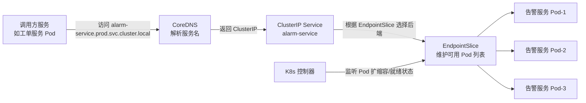
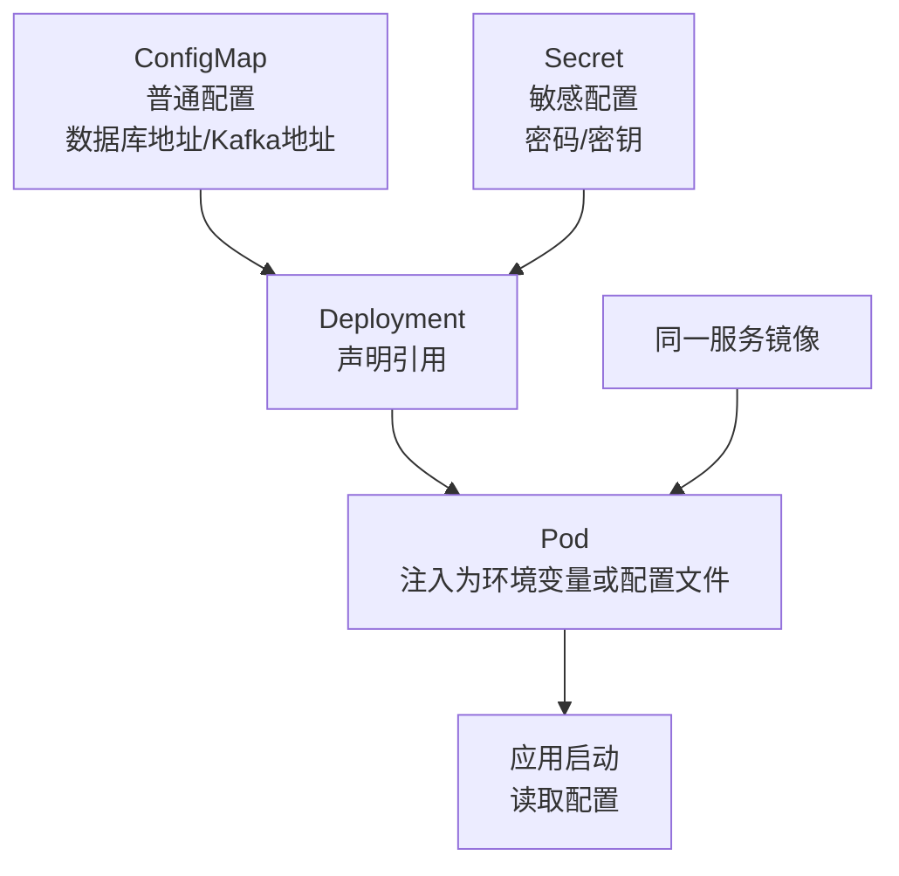

# 技术一：微服务与云原生架构

项目固定背景统一参考 [项目固定背景.md](/Users/duanpeitong/Desktop/work/study/26_jgs_lw/项目固定背景.md)。

## 1. 技术定位

### 1.1 从技术角度看

微服务与云原生架构解决的核心问题，不是"把系统拆小"或"用最新技术"，而是让平台在功能持续增长、访问压力持续增加、发布节奏持续演进的情况下，仍然保持可扩展、可治理和可维护。

这一技术方向通常包含几项关键能力：

- 业务域拆分与服务边界定义
- 服务注册与发现、配置集中管理
- API 网关统一入口
- 服务调用与异步协同
- 限流、熔断、降级等服务治理能力
- 容器化封装与容器编排
- 服务网格与流量治理
- 无服务器与事件驱动计算

因此，微服务是架构模式，云原生是运行体系，服务治理是保障能力，三者共同构成平台长期演进的技术基础。

### 1.2 从考题角度看

这个技术方向适合以下题目：

- 微服务架构设计
- 云原生架构设计
- 分布式系统设计
- 服务治理设计
- 无服务器架构设计
- 平台化架构设计
- 架构演进设计

如果题目是"微服务""云原生""服务治理""Serverless"，这一主题本身就可以成为论文主体；如果题目是"高可用""性能优化""软件维护"，它也可以作为整体架构基础写入正文。

### 1.3 从项目角度看

在本项目中，平台不是一个单一功能系统，而是同时覆盖设备接入、设备主数据管理、实时监控、告警识别、工单闭环、权限控制和报表分析等多个模块。如果仍采用单体系统，问题会非常明显：任意一个模块变更都可能影响整个平台；三期交付过程中发布风险会不断叠加；高并发设备接入和低频报表分析会互相干扰；22 人团队难以按模块并行协作。

因此，在本项目中选择微服务与云原生架构，重点不是追求时髦，而是为了支撑"多模块、多阶段、多角色、多基地"的长期演进。

## 2. 技术分析

这一部分只写和项目主链路强相关的技术点。

### 2.1 技术点一：业务域拆分

#### 技术解释

业务域拆分是微服务设计的起点，核心是按业务职责而不是按页面或数据库表拆分系统能力。

#### 项目中的使用场景

本项目中，可将平台拆分为以下几个核心服务域：

| 服务域 | 核心职责 | 访问模式 | 发布频率 | 扩容特点 |
| --- | --- | --- | --- | --- |
| 设备接入服务 | 边缘节点上报、接入认证、设备连接管理 | 高频写入、长连接 | 低 | 按设备规模扩容 |
| 设备主数据服务 | 设备档案、测点定义、设备分类 | 低频读写 | 低 | 主备热备即可 |
| 监控服务 | 状态聚合、实时监控面板 | 高频读写、实时推送 | 中 | 按在线用户数扩容 |
| 告警服务 | 规则判定、告警事件生成与分发 | 高频计算、事件驱动 | 高（规则频繁调整） | 按规则复杂度和数据量扩容 |
| 工单服务 | 工单流转、派单、验收与关闭 | 中频、流程驱动 | 中 | 按工单量扩容 |
| 权限服务 | 统一认证、鉴权和数据域控制 | 中频、同步调用 | 低 | 多副本保障高可用 |
| 报表分析服务 | 统计分析、管理驾驶舱和趋势看板 | 低频、重计算 | 低 | 按查询复杂度扩容 |

服务间的数据流与依赖关系：

```
设备接入服务 → Kafka → 监控服务 / 告警服务 / 报表分析服务
告警服务 → Kafka → 工单服务 / 通知服务
工单服务 → 权限服务（鉴权）→ 设备主数据服务（设备信息）
监控服务 → 权限服务（鉴权）→ 设备主数据服务（测点定义）
报表分析服务 → 设备主数据服务（设备维度聚合）
```

#### 架构师决策点

我没有按页面功能或数据库表拆分，而是按业务职责拆分。关键决策有两个：

**决策一：监控与告警为什么拆开？** 二者虽然在页面上关系紧密，但变化原因不同。监控服务负责设备状态聚合和实时展示，指标模型相对稳定；告警服务负责规则判断、告警生成和通知分发，规则算法和阈值策略变化较快。如果耦合在一起，告警规则的频繁调整会影响监控模块的稳定性，两个开发团队的协作成本也会上升。拆开后，告警服务可以独立进行灰度发布和规则调整，不影响监控展示链路。

**决策二：设备主数据服务为什么独立？** 设备主数据是监控、告警、工单和报表分析的共同基础。如果设备档案、测点定义分散维护在各业务模块中，新增或调整设备时需要多个服务同步修改，容易出现设备信息不一致。独立为设备主数据服务后，各模块统一引用，数据口径一致，也为后续跨基地扩展提供了稳定基础。

我没有拆得更细（如把"告警生成"和"告警通知"再拆成两个服务），原因是当前阶段服务数量已经不少（7 个），拆得过细会增加服务间通信复杂度和运维成本。如果后续告警通知逻辑变得足够复杂（如需要支持多通道策略编排），再考虑进一步拆分。

### 2.2 技术点二：服务发现与配置治理

#### 技术解释

在微服务环境下，服务实例会随着扩容、发布和故障恢复而变化，系统需要具备服务发现能力，使调用方不依赖具体实例地址。同时，网关路由、环境参数、通知通道、阈值策略等配置也需要集中治理，避免配置分散在各个服务或部署脚本中。

如果平台运行在 Kubernetes 环境中，服务发现通常可以由 Service、CoreDNS、EndpointSlice 等机制承担；配置治理可以由 ConfigMap、Secret 或外部配置平台承担。因此，这里强调的重点不是一定要单独建设"注册中心"，而是微服务架构必须具备稳定的服务发现和配置治理能力。

#### 项目中的使用场景

本项目运行在 Kubernetes 环境中，服务发现由 K8s 原生机制承担：

| 机制 | 作用 | 本项目使用方式 |
| --- | --- | --- |
| ClusterIP Service | 为一组 Pod 提供稳定的虚拟 IP 和 DNS 名称 | 各服务通过 `服务名.命名空间.svc.cluster.local` 互相访问 |
| CoreDNS | 集群内部 DNS 解析 | 服务调用方通过 DNS 名称访问，不关心具体 Pod IP |
| EndpointSlice | 跟踪 Pod 实例变化 | K8s 自动维护，Pod 扩缩容时调用方无感知 |

三者协作关系：



> 调用方只感知稳定的服务名；CoreDNS 负责把服务名解析为 Service 的 ClusterIP；Service 通过 EndpointSlice 感知当前可用 Pod，并把流量转发到健康实例。Pod 扩缩容或故障恢复时，EndpointSlice 自动更新，调用方无需修改配置。

以告警服务为例，当设备接入规模扩大或告警高峰到来时，K8s 自动增加告警服务 Pod 副本，EndpointSlice 自动更新，调用方通过 Service 名称访问即可路由到新实例，无需任何配置变更。

配置治理方面，本项目没有把所有配置都打包进镜像，而是区分普通运行配置和敏感配置，并通过 Kubernetes 原生机制注入运行中的服务：

| 配置类型 | 示例 | 管理方式 | 变更频率 |
| --- | --- | --- | --- |
| 环境配置 | 数据库地址、MQTT Broker 地址、Kafka 集群地址 | K8s ConfigMap，按环境隔离 | 低，仅基础设施变更时 |
| 敏感配置 | 数据库密码、API 密钥、JWT 签名密钥 | K8s Secret + 外部密钥管理服务 | 低，定期轮换 |

配置治理流程图：



这样设计以后，同一份服务镜像不需要为开发、测试和生产环境分别构建。数据库地址、Kafka 地址、MQTT Broker 地址等普通配置通过 `ConfigMap` 注入；数据库密码、JWT 签名密钥、第三方接口密钥等敏感信息通过 `Secret` 注入。应用启动时从环境变量或挂载文件中读取配置，避免把环境差异和敏感信息固化到镜像中。

#### 架构师决策点

我没有单独建设 Eureka、Consul 等注册中心，而是直接使用 K8s 原生的服务发现机制。原因是本项目已经采用 K8s 作为容器编排平台，K8s 的 Service + CoreDNS + EndpointSlice 已经完整覆盖了服务发现需求，额外引入注册中心只会增加架构复杂度和运维成本。配置治理方面，我没有把数据库地址、Kafka 地址、密钥等配置写死在镜像或代码中，而是通过 ConfigMap 和 Secret 注入运行时环境。这样同一镜像可以在不同环境复用，环境差异和敏感信息不进入镜像，也便于后续通过滚动更新或密钥轮换完成配置调整。

### 2.3 技术点三：API 网关

#### 技术解释

API 网关负责统一入口、路由转发、前置鉴权、限流和治理控制，是微服务平台的入口枢纽。

#### 项目中的使用场景

本项目中，外部访问流量分为两类：一类是边缘节点的高频遥测上报，走 `MQTT Broker -> 中心接入服务 -> Kafka` 链路；另一类是 Web 端、移动端和边缘节点管理类请求，走 API 网关。API 网关不承接高频遥测数据流，而是承接人员访问、边缘节点注册、配置拉取、版本上报和管理指令确认等 HTTP/HTTPS 请求，再按业务域路由到后端服务。

在具体组件上，本项目采用 `Nginx Ingress Controller + Apache APISIX` 的组合：`Nginx Ingress Controller` 负责把进入 K8s 集群的 HTTP/HTTPS 流量转发到 API 网关服务；`Apache APISIX` 作为 API 网关，负责统一鉴权、限流、审计、灰度和按业务域路由。也就是说，Ingress 解决“流量如何进入集群中的网关服务”，APISIX 解决“进入平台后的业务访问如何治理”。

典型链路：

```text
Nginx -> Nginx Ingress Controller -> APISIX Gateway -> K8s Service -> 业务 Pod
```

路由规则设计：

| 请求来源 | 路径前缀 | 目标服务 | 鉴权方式 | 限流策略 |
| --- | --- | --- | --- | --- |
| 边缘节点管理请求 | /api/v1/edge/* | 设备接入服务/配置服务 | 设备证书认证 | 按 edgeId 限流 |
| Web 端 | /api/v1/monitor/* | 监控服务 | JWT + RBAC | 按用户限流 |
| Web 端 | /api/v1/alarm/* | 告警服务 | JWT + RBAC | 按用户限流 |
| Web 端 | /api/v1/workorder/* | 工单服务 | JWT + RBAC | 按用户限流 |
| 移动端 | /api/v1/mobile/* | 工单服务（移动端适配） | JWT + RBAC | 按用户限流 |
| 内部服务 | /api/v1/internal/* | 各内部服务 | 服务间 Token | 不限流 |

认证鉴权流程：

```
请求到达 → API 网关（Apache APISIX）
  ├── 提取 Token（JWT 或设备证书）
  ├── 验证 Token 有效性（签名、过期时间）
  ├── 提取用户/设备身份信息
  ├── 基于 Token 声明或权限缓存做基础 RBAC 校验
  ├── 校验访问频率并记录访问日志
  ├── 注入用户上下文到请求 Header（userId、roleId、baseId）
  └── 转发到后端服务，必要时由后端调用权限服务做细粒度授权
```

APISIX 与权限服务不是替代关系，而是分层协作关系。APISIX 位于入口层，负责快速完成 Token 校验、设备证书校验、基础接口权限、限流和审计；权限服务维护用户、角色、组织、基地、菜单、按钮、接口和数据域等权限模型，并为网关和业务服务提供授权依据。对于告警查询、监控查看这类通用接口权限，可以由 APISIX 基于 Token 声明或本地缓存完成入口校验；对于工单分派、跨基地数据访问、临时授权等细粒度业务权限，则由后端服务结合权限服务进一步判断。

限流配置分三层：

| 层级 | 粒度 | 目的 | 示例 |
| --- | --- | --- | --- |
| 网关层全局限流 | 整个网关入口 | 防止总流量超过后端承载能力 | 网关总 QPS 上限 10000 |
| 服务层限流 | 按目标服务 | 防止单个服务被打垮 | 告警服务 QPS 上限 3000 |
| 接口层限流 | 按具体接口 + 用户 | 防止单用户滥用 | 单用户查询接口 QPS 上限 100 |

边缘管理请求与 Web/移动端请求的差异化处理：

| 维度 | 边缘管理请求 | Web/移动端请求 |
| --- | --- | --- |
| 认证方式 | 设备证书（长期有效，自动轮换） | JWT（短期有效，用户登录获取） |
| 数据格式 | 标准 JSON，主要是配置和状态信息 | 标准 JSON |
| 连接模式 | HTTPS 短连接，低频管理类请求 | 短连接 + 单次请求 |
| 限流策略 | 按 edgeId，防止异常节点刷接口 | 按用户 ID，平滑限流 |
| 优先级 | 高（影响节点注册和配置下发） | 中（用户请求可排队） |

#### 架构师决策点

以具体访问场景看，运维人员打开 Web 控制台查询某基地设备告警时，请求先通过 `Nginx Ingress Controller` 进入 K8s 集群，再由 `Apache APISIX` 校验登录态、角色权限、数据域和访问频率，最后路由到告警服务；边缘节点上线后调用注册接口、拉取采集配置或确认管理指令执行结果时，也走同一 HTTP/HTTPS 管理入口，但 APISIX 校验的是设备证书、edgeId 和接口调用频率，再转发到设备接入服务、配置服务或指令服务。

我没有让高频遥测数据走 API 网关，因为设备状态和测点数据频率高、持续性强，更适合通过 `MQTT Broker` 承接，再由中心接入服务写入 Kafka；也没有让各业务服务自行暴露外部接口。统一 API 网关后，用户鉴权、设备证书校验、路由转发、限流和访问日志都在入口层集中处理，后端服务只需关注业务逻辑，中心内部 Kafka 也不会直接暴露到现场网络。

### 2.4 技术点四：同步调用与异步协同

#### 技术解释

微服务之间不可能全部走同步接口，也不可能全部走异步消息，关键在于区分场景。

#### 项目中的使用场景

本项目中，两类链路最典型：

同步 vs 异步的决策标准：

| 判断维度 | 适合同步 | 适合异步 |
| --- | --- | --- |
| 响应要求 | 调用方需要立即获得结果 | 调用方不需要等待结果 |
| 数据量 | 少量数据 | 大量高频数据 |
| 实时性 | 用户正在等待页面响应 | 后台处理，用户无感知 |
| 容错性 | 失败需要立即反馈 | 允许延迟处理和重试 |
| 典型场景 | 权限校验、工单查询、设备详情 | 设备上报、告警分发、报表计算 |

同步链路示例：

`用户请求 → API 网关 → 工单服务 → 权限服务（鉴权）→ 设备主数据服务（设备信息）→ 结果返回`

同步调用的超时与重试策略：

| 调用链路 | 超时时间 | 重试次数 | 重试策略 |
| --- | --- | --- | --- |
| 网关 → 工单服务 | 3 秒 | 0 | 超时直接返回错误 |
| 工单服务 → 权限服务 | 1 秒 | 1 | 快速失败，返回未授权 |
| 工单服务 → 设备主数据服务 | 2 秒 | 1 | 超时返回部分信息 |

异步链路示例（告警事件从产生到通知的完整链路）：

```
设备数据上报 → 接入服务 → Kafka(device.telemetry.standard)
                              ↓
                         告警服务（规则判定）
                              ↓
                         Kafka(alarm.event.created)
                              ↓
                    ┌─────────┼─────────┐
                    ↓         ↓         ↓
              通知消费组  工单消费组  分析消费组
                    ↓
              短信/企业微信/邮件
```

异步链路的消息保证机制：

| 机制 | 作用 | 本项目实现 |
| --- | --- | --- |
| At-least-once 投递 | 保证消息不丢 | Kafka 生产者 acks=all，消费手动提交 offset |
| 幂等去重 | 防止重复消费导致重复告警/工单 | 消费端按业务 ID 去重（如 alarmId、orderId） |
| 死信队列 | 消费多次失败的消息不丢弃 | 失败消息转入 dead-letter topic，人工排查后重试 |
| 消息顺序 | 保证同一业务对象状态演进有序 | 设备消息按 `baseId + deviceId` 分区，告警事件按 `alarmId` 分区，工单事件按 `workorderId` 分区 |

顺序性在本项目中非常关键。比如同一设备先故障后恢复，监控服务和规则服务必须按这个顺序处理；同一告警先创建后关闭，工单服务不能先收到关闭事件、后收到创建事件。因此我没有追求 Kafka 全局有序，而是按业务对象保证局部有序。边缘节点断网补传时，SQLite Outbox 中的消息带有 `localSeq`，中心接入服务写入 Kafka 时继续按 `baseId + deviceId` 作为消息 key，同一设备消息进入同一分区；告警生命周期事件使用 `alarmId` 作为 key，保证创建、确认、关闭、撤回等事件按顺序被同一消费组处理。

#### 架构师决策点

因为设备遥测链路天然高频（900 台设备、秒级采集），适合异步解耦；而用户查询与流程操作更强调实时响应，适合同步调用。我没有把所有链路都设计为异步，原因是同步调用的调试和排障更简单，对于用户正在等待的交互场景，异步处理反而增加复杂度。也没有把所有链路都设计为同步，原因是设备上报高峰期如果同步写入多个下游服务，单个服务变慢会导致整条链路阻塞。通过 Kafka 异步解耦，各消费组按自己的速率独立消费，互不影响；同时通过分区 key 控制同一设备、同一告警、同一工单的局部顺序，避免异步化带来状态乱序。

### 2.5 技术点五：服务治理

#### 技术解释

微服务一旦拆分，治理问题就会随之出现。服务治理不是某个单一机制，而是一组保障服务间可靠协作的能力集合。

#### 项目中的使用场景

本项目中，设备接入高峰、告警集中爆发、报表统计任务启动时，都可能导致局部服务过载。此时如果没有治理能力，异常会迅速扩散。

服务治理的核心机制：

| 治理机制 | 解决什么问题 | 本项目场景 |
| --- | --- | --- |
| 限流 | 防止单个服务被打垮 | 设备接入高峰时限流保护接入服务 |
| 熔断 | 防止级联故障 | 告警服务调用通知服务超时时熔断，避免阻塞告警生成 |
| 降级 | 核心链路优先 | 报表服务降级时返回缓存数据，保障监控和告警链路资源 |
| 超时控制 | 防止无限等待 | 服务间调用设置合理超时时间，避免线程池耗尽 |
| 调用监控 | 发现异常调用 | 通过链路追踪定位慢调用和错误调用 |
| 统一日志 | 集中排查问题 | 结构化日志 + traceId，支持跨服务问题定位 |

限流的具体实现分两层：

| 层级 | 实现方式 | 配置内容 |
| --- | --- | --- |
| 网关层限流 | API 网关内置限流插件 | 按服务粒度配置 QPS 上限，超出返回 429 |
| 服务层限流 | 服务内嵌治理 SDK | 按接口粒度配置，保护下游依赖（如数据库、Redis） |

熔断器的状态机：

```
Closed（正常）→ 失败率超过阈值 → Open（熔断）
Open → 等待超时时间 → Half-Open（试探）
Half-Open → 试探请求成功 → Closed（恢复正常）
Half-Open → 试探请求失败 → Open（继续熔断）
```

本项目中熔断的典型场景：规则服务消费设备遥测数据并进行告警判定时，需要读取设备主数据、测点定义和当前生效的规则配置。如果设备主数据服务或配置服务连续超时，熔断器从 Closed 切换到 Open，规则服务不再同步等待该依赖，而是使用本地缓存的设备档案、测点定义和规则快照继续处理主链路数据，并对缓存命中的结果打上规则版本标记。超时时间过后进入 Half-Open，发送少量试探请求；如果成功则恢复正常调用，如果失败则继续熔断。这样避免了主数据或配置服务抖动导致 Kafka 消费阻塞，保证“设备上报 -> 规则判定 -> 告警生成”主链路持续运行。

降级的具体策略：

| 降级场景 | 降级动作 | 影响范围 |
| --- | --- | --- |
| 报表服务过载 | 返回最近一次缓存结果 | 用户看到的数据可能延迟 5-10 分钟 |
| 设备详情查询超时 | 返回基础信息，跳过扩展信息 | 用户看不到设备的实时状态和历史趋势 |
| 权限服务不可用 | 网关层使用本地缓存的权限数据 | 新授权的权限可能延迟生效 |
| 监控大屏刷新超时 | 返回上一次刷新的数据 | 大屏数据可能延迟 30 秒 |

治理策略与可观测体系的联动：限流触发时，通过 Prometheus 指标记录限流次数，Grafana 看板实时展示；熔断状态变化时，自动发送告警通知；降级触发时，在日志中记录降级原因和影响范围。这些数据汇入可观测体系统一管理，便于事后分析治理策略是否合理。

#### 架构师决策点

我没有把治理能力理解为"加个组件就行"。治理能力需要贯穿在服务设计、配置管理、运行监控和发布流程的全过程中。例如限流策略需要配合 API 网关统一配置，熔断策略需要配合服务发现动态调整，监控和日志需要配合可观测体系统一采集。治理能力本身也需要治理。具体来说，我没有把限流、熔断参数硬编码在各服务中，而是通过配置中心统一管理，支持动态调整。当发现某个服务的限流阈值不合理时，运维人员可以在配置中心修改参数，实时生效，无需重新发布服务。

### 2.6 技术点六：容器化封装

#### 技术解释

容器化的核心价值，是把应用及其运行依赖封装为一致的交付单元，降低不同环境之间的差异。

#### 项目中的使用场景

本项目中的设备接入服务、监控服务、告警服务、工单服务、权限服务和分析服务都以容器镜像方式交付。

镜像分层设计：

```
┌─────────────────────────────┐
│  应用代码层（最频繁变更）      │  ← 每次代码提交重建
├─────────────────────────────┤
│  依赖库层（偶尔变更）          │  ← 依赖变化时重建
├─────────────────────────────┤
│  运行时层（很少变更）          │  ← JDK/Node.js 等运行时
├─────────────────────────────┤
│  基础镜像层（几乎不变）        │  ← Alpine/Debian 基础镜像
└─────────────────────────────┘
```

通过多阶段构建（Multi-stage Build），编译阶段和运行阶段分离，最终镜像只包含运行所需的最小文件集，镜像体积从 1.2GB 缩减到约 200MB。

镜像版本标签策略：

| 标签格式 | 示例 | 用途 |
| --- | --- | --- |
| 语义化版本 | alarm-service:1.2.3 | 正式发布版本，用于生产环境 |
| Git commit hash | alarm-service:a1b2c3d | CI 自动构建，用于测试环境 |
| 分支名 | alarm-service:feature-xxx | 开发分支，用于开发环境 |
| latest | alarm-service:latest | 最新稳定版本，仅用于开发环境 |

生产环境禁止使用 `latest` 标签，因为不可追溯。每次部署都使用明确的版本标签，出问题时可以快速定位到具体版本。

镜像安全扫描：CI 流水线中集成镜像扫描工具（如 Trivy），自动检测镜像中的已知漏洞。高危漏洞阻断流水线，不允许部署到生产环境。

#### 架构师决策点

因为本项目是分期持续建设的，环境差异和版本漂移会随着时间不断放大，容器化能明显降低这类风险。同时，容器化也是后续容器编排、弹性伸缩和持续交付的基础。我没有使用过大的基础镜像（如 Ubuntu），而是选择 Alpine Linux，原因是镜像体积小、拉取快、攻击面小。也没有把配置文件打包进镜像，而是通过 K8s ConfigMap 挂载，保证同一镜像可以在不同环境中运行。

### 2.7 技术点七：容器编排与弹性运行

#### 技术解释

容器编排平台负责容器调度、实例伸缩、健康检查和故障迁移，是云原生运行层的核心。

#### 项目中的使用场景

本项目中的监控、告警、工单和权限等服务都需要多副本部署，以支持高可用和流量波动下的弹性处理。通过容器编排平台，可以统一管理实例副本、资源配额和健康检查策略。

K8s 在本项目中承担的核心能力：

| 能力 | 解决什么问题 | 本项目场景 |
| --- | --- | --- |
| 多副本部署 | 单实例故障导致服务不可用 | 核心服务至少 3 副本，保障高可用 |
| 健康检查 | 自动检测服务异常 | Liveness Probe 检测存活、Readiness Probe 检测就绪 |
| 自动重启 | 异常实例自动恢复 | Pod 崩溃后自动重启，秒级恢复 |
| 滚动升级 | 发布时不停机 | 先更新 1 个副本，观察指标后再更新剩余副本 |
| 资源调度 | 合理分配计算资源 | CPU/内存 Request/Limit 防止单服务占满资源 |
| 弹性伸缩 | 应对流量波动 | HPA 根据 CPU 和消费 Lag 自动扩缩容 |

弹性伸缩配置（以规则引擎服务为例）：

```yaml
apiVersion: autoscaling/v2
kind: HorizontalPodAutoscaler
metadata:
  name: rule-engine-hpa
spec:
  scaleTargetRef:
    apiVersion: apps/v1
    kind: Deployment
    name: rule-engine
  minReplicas: 3
  maxReplicas: 10
  metrics:
  - type: Resource
    resource:
      name: cpu
      target:
        type: Utilization
        averageUtilization: 70
  - type: Pods
    pods:
      metric:
        name: kafka_consumer_lag
      target:
        type: AverageValue
        averageValue: "5000"
```

Pod 拓扑分布约束：核心服务的多个副本分布在不同的物理节点上，避免单节点故障导致所有副本同时不可用。

```yaml
topologySpreadConstraints:
- maxSkew: 1
  topologyKey: kubernetes.io/hostname
  whenUnsatisfiable: DoNotSchedule
  labelSelector:
    matchLabels:
      app: alarm-service
```

ConfigMap 与 Secret 管理方式：业务配置通过 ConfigMap 挂载为环境变量或配置文件，敏感信息通过 Secret 挂载并启用 K8s 的加密存储。配置更新时，部分配置支持热加载（无需重启），部分配置需要重启 Pod 生效（通过 K8s 滚动更新自动完成）。

#### 架构师决策点

因为项目既有高频设备上报流量，也有人工查询和工单处理流量，服务规模和资源需求会随阶段不断变化。K8s 不只是"部署工具"，它同时承担了调度、伸缩、自愈和发布治理的职责，是云原生架构的运行时底座。我没有把所有服务都配置相同的副本数和资源配额，而是根据服务的重要性和流量特点差异化配置：接入服务和告警服务配置较高副本数和弹性伸缩，报表分析服务配置较低副本数且不配置弹性伸缩（避免报表查询高峰时无限制扩容）。

### 2.8 技术点八：服务网格

#### 技术解释

服务网格（Service Mesh）解决的是微服务数量增多后，服务间通信治理复杂度急剧上升的问题。它的核心思想是把通信治理逻辑从业务代码中剥离出来，下沉到基础设施层。

服务网格的典型架构是 Sidecar 模式：每个服务实例旁部署一个代理（如 Envoy），所有出入流量都经过代理，由代理统一处理负载均衡、熔断、重试、灰度路由、mTLS 加密和链路追踪。业务代码不需要关心这些治理逻辑。

#### 遇到的问题

本项目目前采用 SDK 内嵌方式实现服务治理（限流、熔断、链路追踪等写在业务代码中）。随着项目推进到二期，服务数量从一期的 4 个增长到 7 个，这种方式的问题逐渐暴露：

| 问题 | 具体表现 | 影响 |
| --- | --- | --- |
| 治理逻辑重复 | 每个服务都需要引入相同的治理 SDK，配置限流、熔断、超时参数 | 新增一个服务需要 2-3 天配置治理逻辑 |
| SDK 版本碎片化 | 一期上线的服务用 SDK v1.2，二期新服务用 SDK v1.5，参数格式不兼容 | 统一调整策略时需要分批升级 |
| 灰度路由能力不足 | 当前只能通过 K8s 滚动更新替换实例，无法按流量比例或请求标签路由 | 想把 B01 基地 10% 的流量路由到新版本，技术上做不到 |
| 治理策略与业务代码耦合 | 限流、熔断逻辑写在业务代码中，修改策略需要重新发布服务 | 告警服务想临时降低限流阈值，需要走一遍发布流程 |
| 缺乏跨服务的流量可观测 | 能看到单个服务的指标，但看不到服务间的调用拓扑和流量分布 | 排障时不知道是 A→B 慢还是 B→C 慢 |

#### 考虑的方案对比

| 方案 | 优势 | 劣势 | 适合阶段 |
| --- | --- | --- | --- |
| 继续用 SDK 内嵌 | 无额外组件、学习成本低 | 上述问题会随服务增多持续放大 | 服务 < 5 个 |
| Istio | 功能最全、社区最大、支持所有治理能力 | 架构复杂、资源开销大（每个 Sidecar 约 100MB 内存）、学习曲线陡 | 服务 > 15 个、团队有 K8s 运维经验 |
| Linkerd | 轻量（Rust 实现，内存占用小）、安装简单 | 功能较 Istio 少、社区较小 | 服务 5-15 个、希望渐进式引入 |
| Cilium Service Mesh | 基于 eBPF，无需 Sidecar，性能最好 | 较新、生态不如 Istio 成熟 | 对性能要求极高、内核版本 >= 5.10 |

#### 项目中的具体场景

以灰度发布为例，当前做法是通过 K8s 滚动更新逐步替换实例，本质上是"替换"而不是"分流"——一旦更新开始，旧版本实例就被替换掉，无法按流量比例灰度。引入服务网格后，可以实现：

- **按基地灰度**：将 B01 基地的流量路由到新版本，B02、B03 继续使用旧版本
- **按比例灰度**：将 10% 的流量路由到新版本，观察指标后再逐步放量
- **按用户灰度**：将内部测试用户的流量路由到新版本，其他用户不受影响

再以故障排查为例，当前只能看到单个服务的 Prometheus 指标，看不到服务间的调用关系和流量分布。引入服务网格后，可以自动获取服务拓扑图、每条边的调用延迟和错误率，快速定位"是 A→B 慢还是 B→C 慢"。

#### 架构师决策点

本项目当前阶段采用 SDK 内嵌 + 统一配置中心的方式，原因是：一、服务数量 7 个，治理复杂度还在可控范围；二、团队 22 人中只有 3 人有 K8s 深度运维经验，引入 Istio 的学习成本过高；三、项目部署在私有云环境，Istio 的资源开销（每个 Pod 多一个 Sidecar 容器）对集群容量有影响。

但我没有等到问题爆发再引入服务网格，而是提前做了两件事：一是统一治理 SDK 的版本和配置格式，减少后续迁移成本；二是所有服务间调用都通过 K8s Service 名称（而非硬编码 IP），为后续切换到服务网格的流量管理做好准备。

下一阶段，当服务数量增长到 12-15 个时，计划引入 Linkerd 作为服务网格方案。选择 Linkerd 而非 Istio 的原因是：Linkerd 资源开销小（每个 Sidecar 约 20MB 内存，是 Istio 的 1/5）、安装简单（一条命令即可部署）、对现有服务无侵入（自动注入 Sidecar），适合团队渐进式学习和使用。后续如果对流量治理有更高要求（如复杂的多集群管理），再考虑迁移到 Istio。

### 2.9 技术点九：无服务器架构

#### 技术解释

无服务器（Serverless）不是"没有服务器"，而是开发者不需要关心服务器的管理和运维。平台按需分配资源，按实际使用量计费，开发者只关注业务逻辑代码。

无服务器的两种主要形态：

- **函数计算（FaaS）**：事件触发执行，执行完即释放资源
- **后端即服务（BaaS）**：数据库、认证、消息等能力以服务形式提供

#### 遇到的问题

本项目中有一类工作负载让我不满意当前的实现方式——低频、短时、突发的任务：

| 场景 | 当前实现 | 问题 |
| --- | --- | --- |
| 报表生成 | 报表分析服务常驻 2 个副本 | 大部分时间空闲，但用户请求报表时需要快速响应，缩容到 0 个副本会响应慢 |
| 数据同步 | 常驻消费组处理跨基地数据同步 | 数据量波动大（白天多、夜间少），常驻实例浪费资源 |
| Webhook 回调 | 专门的回调服务处理第三方通知 | 回调频率低（每天几十次），但需要保证可靠送达 |
| 定时统计 | CronJob 在 K8s 中定时启动 Pod | 每次启动 Pod 有冷启动延迟（30-60 秒），统计高峰期频繁启停 |

核心矛盾是：这些任务不适合常驻（浪费资源），但用 K8s CronJob 又有冷启动延迟和状态管理问题。

#### 考虑的方案对比

| 方案 | 原理 | 优势 | 劣势 | 适合场景 |
| --- | --- | --- | --- | --- |
| K8s CronJob | 定时创建 Pod 执行任务 | K8s 原生、无额外组件 | 冷启动慢（30-60 秒）、无事件驱动、不适合实时任务 | 纯定时任务（如每日报表） |
| KEDA | 基于事件源自动扩缩 K8s Deployment，可缩容到 0 | K8s 原生扩展、支持多种事件源（Kafka、HTTP、Cron）、可缩容到 0 | 需要额外安装、配置较复杂 | 事件驱动 + 需要缩容到 0 |
| OpenFaaS | 在 K8s 上构建 FaaS 平台 | 支持多种语言、有模板机制、社区活跃 | 引入额外平台层、运维复杂度增加 | 希望完整的 FaaS 体验 |
| Knative | 基于 K8s 的 Serverless 平台 | 支持缩容到 0、流量灰度、事件驱动 | 架构复杂、依赖 Istio/Contour | 已有 Istio 环境、需要完整 Serverless |
| 公有云 FaaS | 阿里云函数计算、AWS Lambda 等 | 完全免运维、按调用计费 | 数据出公网、延迟不可控、私有云无法使用 | 公有云部署、对延迟不敏感 |

#### 项目中的具体场景

以规则引擎为例来分析。当前作为常驻服务运行，3 个副本，即使凌晨设备停机期间也占用资源。如果改为 Serverless 模式：

**适合 Serverless 化的部分**：
- 定时统计任务（每日/每周的设备 OEE 统计）→ 用 K8s CronJob 或 KEDA Cron scaler
- 数据同步（跨基地数据汇总）→ 用 KEDA 基于 Kafka Lag 触发
- Webhook 回调（第三方系统通知）→ 用 KEDA 基于 HTTP 触发，无请求时缩容到 0

**不适合 Serverless 化的部分**：
- 实时规则判定：需要维护规则快照和时间窗口状态（如"过去 10 分钟内温度连续 3 次超过阈值"），函数计算的无状态特性无法满足
- 设备接入长连接：MQTT 长连接需要保持会话状态，不能按请求触发
- 实时监控刷新：WebSocket 长连接需要持续推送，不适合事件触发模式

#### 架构师决策点

本项目当前没有全面采用无服务器架构，原因是：

一、设备数据上报是持续高频流（每秒数百条），常驻服务的稳定性优于函数计算。函数计算在高并发下的冷启动延迟和实例调度开销可能影响实时性。

二、规则引擎需要维护状态。时间窗口规则需要缓存过去 N 分钟的数据，组合规则需要关联多个设备的状态。函数计算的无状态特性意味着每次执行都需要从外部存储加载状态，增加了延迟和复杂度。

三、项目部署在私有云环境，没有成熟的 Serverless 平台。公有云的函数计算服务无法使用，自建 OpenFaaS 或 Knative 的运维成本对 3 人运维团队来说过高。

但我没有完全放弃 Serverless 的思路。对于低频短时任务，我采用了 KEDA 作为折中方案：它基于 K8s 原生扩展，支持基于 Kafka Lag、Cron 表达式等事件源自动扩缩 Deployment，并且可以缩容到 0 个副本。这样既利用了事件驱动的弹性优势，又不需要引入额外的 FaaS 平台。目前数据同步和定时统计任务已经通过 KEDA 管理，资源利用率相比常驻部署提升了约 40%。

### 2.10 项目链路图示

> 图示见 [项目图示.md — 三、中心层数据流](/Users/duanpeitong/Desktop/work/study/26_jgs_lw/项目图示.md)。

## 3. 论文主体内容（按细分主题选用）

本文件不只准备一篇“微服务与云原生”的通用主体。考试题目如果落在 API 网关、服务治理、服务网格或无服务器架构，应优先选对应小节，再搭配 1 个支撑小节重写。不要机械拼接，写作时仍按“问题识别 -> 方案选择 -> 技术落地 -> 效果与取舍”组织。

推荐组合：

| 考题方向 | 主体取材 |
| --- | --- |
| 微服务架构 | 3.1 + 3.2 + 3.3 |
| API 网关 / 统一入口 | 3.2 + 3.3 + 3.4 |
| 服务治理 | 3.3 + 3.5 + 3.4 |
| 云原生架构 | 3.4 + 3.3 + 3.6 |
| 服务网格 | 3.5 + 3.3 + 3.4 |
| 无服务器架构 | 3.6 + 3.4 + 3.3 |

### 3.1 微服务架构设计主体

在本项目的总体架构设计中，我没有把微服务简单理解为“把系统拆小”，而是把它作为支撑多基地、多模块、分期建设和长期演进的架构方法。平台覆盖设备接入、设备主数据、实时监控、告警识别、工单闭环、权限控制和报表分析等能力，如果仍采用单体架构，监控页面调整、告警规则变更、工单流程优化和报表统计改造都会集中在同一个发布单元中，任何局部变更都可能影响整个平台。特别是本项目采用 3 期交付，后续还要不断接入新设备、新测点和新基地，单体模式会使发布窗口越来越长，也会让 22 人团队难以并行协作。

在服务划分时，我没有按页面菜单或数据库表拆分，而是按业务职责、变化原因和扩容方式划分服务边界。平台核心服务包括设备接入服务、设备主数据服务、监控服务、告警服务、工单服务、权限服务和分析服务。其中，设备接入服务负责边缘节点身份校验、数据接入和路由分发；设备主数据服务维护设备档案、测点定义、基地归属和配置版本；监控服务侧重设备状态聚合和实时展示；告警服务负责规则判定、告警生成和事件分发；工单服务负责派单、处理、验收和关闭流程。这样的拆分使不同业务域能够独立开发、独立发布和按需扩容。

服务边界中最关键的取舍，是监控服务、告警服务和设备主数据服务的拆分。监控与告警虽然在页面上关系紧密，但变化原因不同：监控服务的指标模型相对稳定，强调低延迟刷新；告警服务的规则、阈值和通知策略变化频繁，需要独立灰度和回滚。如果把二者放在一起，告警规则调整可能影响监控主链路。设备主数据服务则是各模块的共同基础，如果设备档案和测点定义分散在监控、告警、工单和报表服务中，新增设备时就会出现多处维护和口径不一致。因此我将设备主数据独立出来，作为全平台统一引用的数据基础。

服务拆分后，我通过事件驱动方式降低服务间耦合。边缘节点通过 MQTT 将标准化遥测数据上报到中心接入服务，中心接入服务完成基础校验、幂等处理和路由后写入 Kafka。监控服务、告警服务和分析服务分别以消费组方式消费所需数据，互不阻塞。告警服务生成告警事件后，再通过 Kafka 驱动通知服务、工单服务和分析链路。这样，设备数据主链路不会因为工单服务升级或报表计算变慢而被阻塞。

从实施效果看，微服务拆分使平台具备了清晰的业务边界和演进空间。团队可以围绕服务域并行推进，设备接入、告警规则和工单流程可以按不同节奏迭代。架构上的价值不在于服务数量变多，而在于各服务围绕稳定职责独立演进，并通过事件总线和统一治理机制形成可扩展的平台结构。

### 3.2 API 网关统一入口主体

在本项目中，API 网关解决的不是简单转发问题，而是多入口、多角色、多服务条件下的统一访问治理问题。平台既面向总部和基地运维人员提供 Web 管理端，也面向现场人员提供移动端工单处理能力，还需要支持边缘节点注册、配置拉取、版本上报和管理指令确认等管理类接口。如果每个后端服务都直接对外暴露接口，就会导致鉴权逻辑重复、路由规则分散、审计口径不统一，也会增加内部服务被误访问的风险。

因此，我在平台入口层采用 `Nginx Ingress Controller + Apache APISIX` 的组合，将 Web 端、移动端和边缘节点管理类请求统一纳入网关治理。其中，Nginx Ingress Controller 负责把 HTTP/HTTPS 流量引入 K8s 集群，Apache APISIX 作为 API 网关负责 JWT 校验、设备证书校验、基础接口权限、限流和访问审计，再按路径路由到监控、告警、工单、权限和分析等服务。权限服务则负责维护用户、角色、组织、基地和数据域等权限模型，并为 APISIX 和后端服务提供授权依据。边缘节点管理类请求主要包括节点注册、配置拉取、版本上报和指令确认。需要特别区分的是，高频设备遥测数据不走 API 网关，而是采用 `边缘节点 -> MQTT Broker -> 中心接入服务 -> Kafka` 的接入链路，避免把网关变成高频数据通道。

在网关路由设计上，我按业务域设置路径前缀，例如 `/api/v1/monitor/*` 路由到监控服务，`/api/v1/alarm/*` 路由到告警服务，`/api/v1/workorder/*` 路由到工单服务，`/api/v1/edge/*` 路由到边缘管理接口。网关在转发前将用户身份、角色、所属基地和数据域信息注入请求上下文，后端服务不再重复解析登录态，只基于可信上下文处理业务逻辑。这样既降低了服务开发复杂度，也保证了权限审计的一致性。

在流量治理上，我把网关限流分为全局限流、服务限流和接口限流三层。全局限流保护平台入口不被异常流量冲垮；服务限流根据监控、告警、工单等服务的承载能力设置阈值；接口限流限制单用户高频查询或异常调用。对于移动端工单查询这类用户请求，可以通过排队或返回友好提示降级；对于边缘节点配置拉取和注册类请求，则按 edgeId 控制频率，防止异常节点反复请求影响中心服务。

我没有让 API 网关承载所有治理逻辑。网关负责入口鉴权、路由、限流和访问日志，复杂业务校验仍由后端服务处理；高频遥测流量由 MQTT 和中心接入服务承接，Kafka 也不直接暴露给现场网络。这样，API 网关成为 HTTP 访问和管理类接口的统一边界，而不是把所有链路都压到同一个入口组件上，既保证了边界清晰，也避免了网关职责过度膨胀。

### 3.3 服务治理主体

微服务拆分以后，系统风险从“单体内部复杂”转变为“服务间协作复杂”。本项目中，设备接入、监控刷新、规则判定、通知发送、工单联动和分析统计构成一条较长的业务链路。任何一个服务超时、过载或发布异常，都可能影响上游服务。如果没有治理机制，微服务架构反而会把局部故障扩散为链路故障。

为此，我把服务治理设计成一组贯穿运行期的机制，而不是某个单独组件。首先是服务发现和配置治理。平台运行在 Kubernetes 上，各服务通过 Service 和 CoreDNS 获得稳定访问入口，Pod 扩缩容和故障迁移对调用方透明。配置方面，数据库地址、Kafka 地址等环境配置由 ConfigMap 管理，敏感信息由 Secret 和密钥管理服务管理，业务配置如告警阈值、通知模板、网关路由规则则进入配置中心，支持版本化、校验、灰度生效和回滚。

其次是限流、熔断、降级和超时控制。网关层限流保护入口和服务整体容量，服务层限流保护数据库、Redis、设备主数据服务和配置服务等下游依赖；规则服务处理设备遥测时，如果主数据或配置服务连续超时，就打开熔断并使用本地缓存的设备档案、测点定义和规则快照继续完成告警判定，避免主链路被同步依赖拖慢；报表服务过载时返回最近一次缓存结果，保证监控和告警链路优先使用资源。通过这些机制，非核心链路可以降级，核心链路保持可用。

在同步和异步协同上，我也做了边界划分。权限校验、工单查询、设备详情这类用户正在等待结果的场景保留同步调用，并设置严格超时；设备遥测上报、告警事件分发、通知发送和报表统计则通过 Kafka 异步解耦。Kafka 消费端通过幂等键、手动提交 offset、死信主题和重试机制保证事件可靠处理。这样，工单服务发布中或分析服务消费变慢时，不会反向阻塞设备接入和告警判定主链路。

治理机制必须与可观测体系联动，否则无法判断策略是否有效。限流触发次数、熔断状态、服务调用延迟、错误率和 Kafka 消费 Lag 都进入 Prometheus 指标体系；日志中统一携带 traceId 和业务编号；告警通知中附带服务、接口和影响范围。通过这些数据，我可以在发布后观察服务治理策略是否过严或过松，并通过配置中心动态调整阈值，而不是每次都重新发布服务。

从项目效果看，服务治理让微服务拆分后的复杂度处于可控范围。它保证平台在设备上报高峰、通知通道异常、报表查询压力增大或局部服务发布时，仍能优先保障设备接入、实时监控和告警生成等关键链路。我的体会是，服务治理的关键不是简单引入限流熔断组件，而是把治理策略、配置管理、可观测数据和发布流程放在一起设计。

### 3.4 云原生运行与交付主体

在本项目中，云原生架构的重点不是“上 Kubernetes”本身，而是建立标准化交付、弹性运行和故障自愈能力。平台建设周期 18 个月，采用 3 期交付，服务数量和接入设备规模持续增加。如果仍然依赖手工部署和固定机器部署，环境差异、版本漂移、故障恢复慢和发布风险都会不断放大。

我首先要求核心服务全部以容器镜像方式交付。设备接入、监控、告警、工单、权限和分析服务都采用统一镜像构建流程，镜像中只包含应用和运行依赖，不把环境配置写死在镜像内。配置通过 ConfigMap、Secret 和配置中心注入，保证同一镜像可以在测试、预发布和生产环境中运行。镜像使用明确版本号和 Git commit 标识，生产环境禁止使用 `latest`，确保发布和回滚可追溯。

在运行层，我使用 Kubernetes 统一管理服务副本、健康检查、资源配额和调度策略。核心服务至少 3 副本部署，通过 Liveness Probe 和 Readiness Probe 检测存活和就绪状态；Pod 异常退出时自动重启，发布时通过滚动更新逐步替换实例。对于设备接入、告警服务和监控服务，我配置 HPA，根据 CPU 使用率、接口延迟和 Kafka 消费 Lag 自动扩缩容，既能应对设备上报高峰，也能在低谷期控制资源成本。

在发布策略上，我没有采用停机切换。常规功能更新采用滚动升级，先更新少量副本并观察错误率、延迟和消费 Lag，指标正常后再继续发布；重大版本或架构调整采用分基地灰度，先选择 1 个基地试点运行 1-2 天，再逐步推广到其他基地。发布后，可观测体系自动检查核心指标，异常时快速回滚到上一版本。这种方式与本项目“3 个基地分期上线”的组织方式匹配，能把发布风险控制在较小范围内。

云原生运行体系也服务于团队协作。22 人团队可以按服务域独立构建、测试和发布，CI/CD 流水线统一完成代码扫描、单元测试、镜像构建、集成测试和部署审批。对架构师而言，云原生不是单个运行平台，而是把服务拆分、持续交付、弹性伸缩、可观测和自动恢复连接起来的一整套工程能力。

### 3.5 服务网格主体

在本项目初期，我没有一开始就引入服务网格，而是采用“SDK 内嵌治理 + 配置中心 + Kubernetes Service”的方式实现限流、熔断、超时和链路追踪。这个选择是基于项目阶段做出的：一期服务数量较少，团队对 Kubernetes 的运维经验还在积累，直接引入 Istio 这类复杂服务网格会增加学习成本和资源开销，不利于项目按期落地。

随着二期建设推进，服务数量从一期的 4 个增长到 7 个，SDK 内嵌治理的问题开始显现。每个服务都要引入治理 SDK，限流、熔断和重试参数散落在各服务配置中；不同服务使用的 SDK 版本不完全一致，统一调整策略时需要分批升级；灰度发布主要依靠 Kubernetes 滚动更新，本质是替换实例，而不是按流量比例、基地或用户标签精细分流。例如我希望将 B01 基地 10% 的请求路由到新版本告警服务，当前方式实现成本较高。

因此，我把服务网格作为后续服务治理演进方向。服务网格通过 Sidecar 代理承接服务间通信，把负载均衡、熔断、重试、超时、mTLS、灰度路由和链路追踪从业务代码中下沉到基础设施层。业务服务仍然只处理设备接入、监控、告警和工单逻辑，通信治理由 Sidecar 和控制面统一管理。这样可以减少治理代码重复，也让策略调整不再依赖业务服务重新发布。

在方案选择上，我对比了 Istio、Linkerd 和 Cilium Service Mesh。Istio 功能完整，但控制面复杂、Sidecar 资源开销较大；Cilium 基于 eBPF，性能优势明显，但生态和团队经验不足；Linkerd 相对轻量，安装和运维成本低，更适合本项目从 SDK 治理逐步演进到服务网格。因此，我规划在服务数量增长到 12-15 个、跨服务灰度和安全通信需求更明确后，优先引入 Linkerd。

为降低后续迁移成本，当前阶段我已经做了两项准备：一是统一治理 SDK 的版本和配置格式，避免策略分散；二是所有服务间调用都通过 Kubernetes Service 名称，不硬编码 Pod IP 或实例地址。这样后续引入服务网格时，可以通过 Sidecar 注入逐步接管服务间流量。服务网格在本项目中的价值，不是为了追求新技术，而是当服务规模和治理复杂度上升后，把通信治理从业务代码中剥离出来，使平台继续保持可治理、可观测和可演进。

### 3.6 无服务器架构主体

无服务器架构并不适合把本项目整体改造成函数计算平台。本项目的设备遥测上报是持续高频流，规则引擎需要维护时间窗口和状态，MQTT 连接也需要长期会话。如果把实时接入、规则判定和监控刷新全部改成函数触发模式，会带来冷启动、状态管理和调度延迟问题，反而影响设备运维平台最核心的实时性和稳定性。

但我没有否定 Serverless 的思想，而是将其限定在适合的工作负载上。本项目中存在一类低频、短时、突发任务，例如每日设备利用率统计、跨基地数据同步、第三方 Webhook 回调、临时报表生成和低频数据补偿。这些任务不适合长期常驻多个副本，但又需要在事件到来时快速启动并处理。如果全部部署为常驻服务，会造成资源浪费；如果全部使用 Kubernetes CronJob，又缺少对 Kafka Lag、HTTP 请求等事件源的弹性响应能力。

在私有云环境下，我没有采用公有云函数计算，也没有直接建设 OpenFaaS 或 Knative。原因是公有云 FaaS 会带来网络边界和数据合规问题，自建完整 FaaS 平台又会增加运维复杂度。结合本项目已经使用 Kubernetes 的现状，我选择 KEDA 作为折中方案。KEDA 可以基于 Kafka Lag、Cron 表达式、HTTP 请求等事件源自动扩缩 Kubernetes Deployment，并支持缩容到 0，既保留了 Serverless 的按需弹性思想，又不需要引入完整函数平台。

在落地上，我将数据同步、定时统计和低频回调任务纳入 KEDA 管理。例如跨基地汇总任务在 Kafka Lag 增大时自动扩容消费实例，处理完成后缩容；每日统计任务按 Cron 触发，执行完成后释放资源；Webhook 回调服务在无请求时缩容到 0，有请求时再启动实例。对于实时规则判定、设备接入长连接和监控推送这类核心链路，仍采用常驻服务和 HPA 弹性伸缩，保证稳定性和低延迟。

从项目效果看，这种“核心链路常驻、低频任务事件驱动”的方式更符合工业运维平台特点。它没有为了无服务器而无服务器，而是把 Serverless 作为云原生弹性能力的一部分，用在资源利用率低、状态要求弱、触发条件清晰的任务上。这样既降低了部分后台任务的资源占用，也没有牺牲实时监控和告警链路的可靠性。
