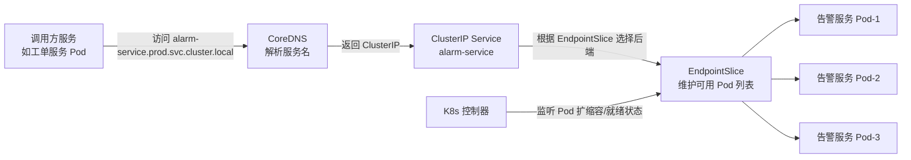
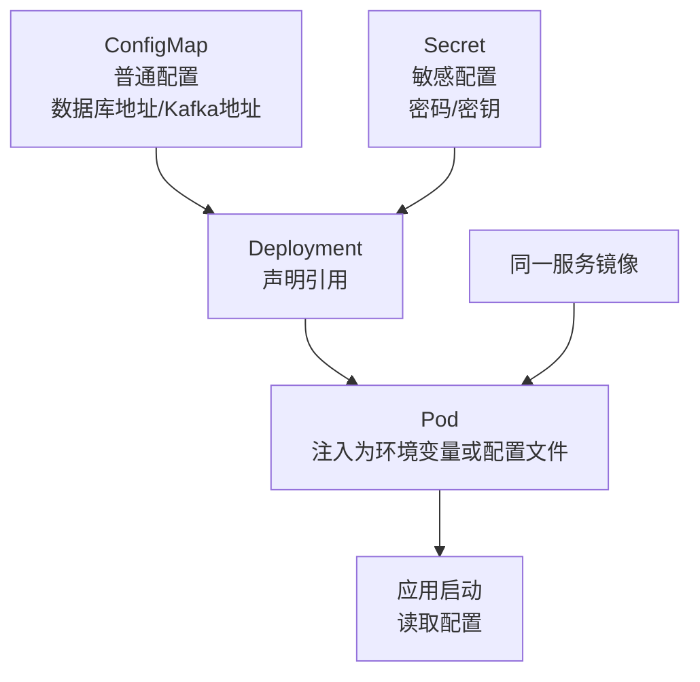

# 技术一：微服务与云原生架构


## 1. 技术定位

### 1.1 从技术角度看

微服务与云原生架构解决的核心问题，不是"把系统拆小"或"用最新技术"，而是让平台在功能持续增长、访问压力持续增加、发布节奏持续演进的情况下，仍然保持可扩展、可治理和可维护。

这一技术方向通常包含几项关键能力：

- 业务域拆分与服务边界定义
- 服务注册与发现、配置集中管理
- API 网关统一入口
- 服务调用与异步协同
- 限流、熔断、降级等服务治理能力
- 容器化封装与容器编排
- 服务网格与流量治理
- 无服务器与事件驱动计算

因此，微服务是架构模式，云原生是运行体系，服务治理是保障能力，三者共同构成平台长期演进的技术基础。

### 1.2 从考题角度看

这个技术方向适合以下题目：

- 微服务架构设计
- 云原生架构设计
- 分布式系统设计
- 服务治理设计
- 无服务器架构设计
- 平台化架构设计
- 架构演进设计

如果题目是"微服务""云原生""服务治理""Serverless"，这一主题本身就可以成为论文主体；如果题目是"高可用""性能优化""软件维护"，它也可以作为整体架构基础写入正文。

### 1.3 从项目角度看

在本项目中，平台不是一个单一功能系统，而是同时覆盖设备接入、设备主数据管理、实时监控、告警识别、工单闭环、权限控制和报表分析等多个模块。如果仍采用单体系统，问题会非常明显：任意一个模块变更都可能影响整个平台；三期交付过程中发布风险会不断叠加；高并发设备接入和低频报表分析会互相干扰；22 人团队难以按模块并行协作。

因此，在本项目中选择微服务与云原生架构，重点不是追求时髦，而是为了支撑"多模块、多阶段、多角色、多基地"的长期演进。

## 2. 技术分析

这一部分按照“总览表一项技术点，对应后文一个小节”的方式组织。与其他主题文件高度重合的技术点，在本文件中只保留微服务与云原生架构视角，重点说明它在本项目中的使用场景、落地方式和架构取舍，详细方案再链接到对应专题。

### 2.0 细分技术点总览

| 技术点 | 对应小节 | 本项目写作侧重点 | 关联素材 |
| --- | --- | --- | --- |
| 业务域拆分 | 2.1 | 按设备接入、监控、告警、工单、权限、分析拆分服务域 | 本文件 |
| 服务边界设计 | 2.2 | 按职责、变化原因、扩容方式划分边界，避免按页面拆分 | 本文件 |
| 数据库拆分 | 2.3 | 各服务拥有自己的数据模型，主数据统一维护，跨服务通过事件协同 | 06、13 |
| API 网关 | 2.4 | APISIX 承接 HTTP/HTTPS 管理类请求的统一入口 | 本文件、12 |
| 统一认证鉴权 | 2.5 | APISIX 做入口基础鉴权，权限服务维护角色、组织、数据域 | 11 |
| 服务注册与发现 | 2.6 | 使用 K8s Service、CoreDNS、EndpointSlice | 本文件 |
| 配置中心 | 2.7 | ConfigMap/Secret 管运行配置，内网配置模块管业务动态配置 | 本文件 |
| 服务间通信 | 2.8 | 用户等待型请求走同步调用，设备上报和告警分发走异步事件 | 本文件 |
| 消息队列异步解耦 | 2.9 | 设备遥测、告警事件、工单事件通过 Kafka 解耦 | 05 |
| 可靠消息最终一致性 | 2.10 | Outbox、ACK、offset、死信和对账保证事件不丢 | 05、13 |
| 分布式事务补偿 | 2.11 | 告警撤回、工单关闭、通知取消等通过补偿事件处理 | 13 |
| 接口幂等设计 | 2.12 | 按 alarmId、workorderId、deviceId + timeWindow 去重 | 05、13 |
| 限流 | 2.13 | 网关层保护入口，服务层保护数据库、Redis、下游接口 | 本文件 |
| 熔断 | 2.14 | 依赖短时异常时打开熔断，避免拖垮主链路 | 本文件 |
| 降级 | 2.15 | 报表、扩展信息等非核心能力可返回缓存或部分数据 | 本文件 |
| 超时控制 | 2.16 | 同步调用设置明确超时，避免线程池被长期占用 | 本文件 |
| 重试机制 | 2.17 | 对可恢复失败做有限重试，不可恢复失败进入死信或错误队列 | 05、13 |
| 负载均衡 | 2.18 | HTTP 管理请求走 DNS/VIP、Nginx、APISIX、K8s Service | 12 |
| 灰度发布 | 2.19 | 按服务、接口或业务域逐步放量，观察指标后扩大范围 | 03、12 |
| 蓝绿发布 | 2.20 | 作为考试扩展点，可用于大版本切换和快速回退 | 03 |
| 滚动发布 | 2.21 | K8s Deployment 逐步替换 Pod，保证发布不中断 | 本文件、03 |
| 容器编排 | 2.22 | K8s 统一调度、部署、多副本和资源管理 | 本文件 |
| 弹性伸缩 | 2.23 | HPA 负责常驻服务水平伸缩，KEDA 负责事件源驱动伸缩 | 本文件 |
| 健康检查 | 2.24 | Liveness/Readiness Probe 与入口健康检查联动 | 本文件、12 |
| 故障自愈 | 2.25 | Pod 异常自动重启，故障实例从服务端点摘除 | 本文件、04 |
| 日志集中管理 | 2.26 | 结构化日志带 traceId，进入统一数据管道和 ES 检索 | 02 |
| 链路追踪 | 2.27 | OpenTelemetry 采集 trace/span，Jaeger 展示异步链路耗时 | 02 |
| 指标监控 | 2.28 | Prometheus 采集运行指标，Grafana 展示健康状态 | 02 |
| 告警机制 | 2.29 | Alertmanager 分级通知，业务告警与工单联动 | 02、08 |
| CI/CD 自动化部署 | 2.30 | 镜像构建、测试、扫描、发布和回滚流水线 | 03 |
| 服务网格 | 2.31 | 服务数量继续增长后的治理演进方向，当前不作为主方案 | 本文件 |
| Serverless 事件处理 | 2.32 | 低频任务用 KEDA/CronJob，核心实时链路不 Serverless 化 | 本文件 |

### 2.1 技术点 1：业务域拆分

- **项目场景**：本项目是某汽车零部件集团智能设备运维平台，覆盖 3 个生产基地、900 余台设备和 24 台边缘节点，业务能力从设备接入、实时监控、异常告警、工单闭环延伸到权限控制和分析优化。
- **技术落地**：核心服务域拆为设备接入服务、设备主数据服务、监控服务、告警服务、工单服务、权限服务和报表分析服务。拆分目标不是增加服务数量，而是让不同职责可以独立开发、独立发布和按需扩容。
- **架构取舍**：我没有把平台做成一个大单体，也没有把每个页面都拆成服务；拆分粒度以业务闭环和团队协作边界为准，保证 22 人团队在三期交付中能并行推进。

### 2.2 技术点 2：服务边界设计

- **项目场景**：监控、告警和工单在页面上关系紧密，但变化原因不同。监控服务强调设备状态聚合和低延迟展示，告警服务强调规则判定和事件分发，工单服务强调流程状态流转。
- **技术落地**：服务边界按职责稳定性、变化原因和扩容方式划分。设备接入服务按设备规模扩容，告警服务按规则复杂度和消息量扩容，报表分析服务按查询复杂度扩容。
- **架构取舍**：监控与告警拆开，避免告警规则频繁调整影响监控主链路；告警规则判定与告警事件生成当前保持在同一服务内，避免过早拆分导致事件协作和排障成本上升。

### 2.3 技术点 3：数据库拆分

- **项目场景**：设备档案、测点定义、告警记录、工单流转和报表统计的数据生命周期不同，如果共用一个大库，服务拆分后仍会在数据库层重新耦合。
- **技术落地**：设备主数据服务统一维护设备档案、测点定义和基地归属；告警服务维护告警事件和规则命中记录；工单服务维护工单状态和处理记录；分析侧通过事件汇聚形成统计模型。
- **架构取舍**：跨服务不直接跨库联表，而通过服务接口、事件同步和分析侧数据汇聚协同。数据库建模和分析汇聚细节见 [02_数据架构与大数据处理_收敛版.md](/Users/duanpeitong/Desktop/work/study/26_jgs_lw/论文主题素材/02_数据架构与大数据处理_收敛版.md)，一致性取舍见 [12_分布式事务与数据一致性.md](/Users/duanpeitong/Desktop/work/study/26_jgs_lw/论文主题素材/12_分布式事务与数据一致性.md)。

### 2.4 技术点 4：API 网关

- **项目场景**：Web 端、移动端和边缘节点管理类请求都需要进入中心平台，但设备高频遥测数据不适合走 HTTP 网关。
- **技术落地**：HTTP/HTTPS 管理类请求统一进入 Apache APISIX，再按 `/monitor`、`/alarm`、`/workorder`、`/edge` 等路径路由到后端服务。高频遥测链路走 `MQTT Broker -> 中心接入服务 -> Kafka`。
- **架构取舍**：APISIX 负责统一入口、路由、基础鉴权、限流和审计，后端服务保留业务校验。完整入口链路和负载均衡细节见 [07_负载均衡与流量分发.md](/Users/duanpeitong/Desktop/work/study/26_jgs_lw/论文主题素材/07_负载均衡与流量分发.md)。

### 2.5 技术点 5：统一认证鉴权

- **项目场景**：平台同时面向总部管理人员、基地运维人员、移动端处理人员和边缘节点，不同主体的认证方式和数据访问范围不同。
- **技术落地**：APISIX 在入口层校验 JWT、设备证书和基础接口权限；权限服务维护用户、角色、组织、基地、菜单、接口和数据域模型，并向网关和业务服务提供授权依据。
- **架构取舍**：入口层做快速校验，业务服务处理工单分派、跨基地查询等细粒度权限，避免把全部权限逻辑堆到网关。

### 2.6 技术点 6：服务注册与发现

- **项目场景**：告警服务、监控服务、工单服务等 Pod 会随着扩容、发布和故障恢复动态变化，调用方不能依赖固定实例地址。
- **技术落地**：本项目使用 K8s Service、CoreDNS 和 EndpointSlice 完成服务发现。调用方访问稳定服务名，例如 `alarm-service.prod.svc.cluster.local`，具体 Pod 列表由 EndpointSlice 自动维护。
- **架构取舍**：项目已经以 K8s 作为运行底座，因此没有额外引入 Eureka 或 Consul，避免重复建设注册中心和增加运维复杂度。

### 2.7 技术点 7：配置中心

- **项目场景**：测试、预发布和生产环境的数据库、Kafka、MQTT Broker 地址不同，告警阈值、规则开关、通知模板和网关路由又需要运维侧动态调整。
- **技术落地**：普通运行配置通过 ConfigMap 注入，敏感配置通过 Secret 和内网密钥轮换流程管理，业务动态配置进入内网配置模块，保留版本、审批、审计和回滚记录。
- **架构取舍**：同一镜像不绑定环境配置，避免为不同环境重复构建镜像；告警阈值等业务配置不写死在代码中，便于上线后持续优化。

### 2.8 技术点 8：服务间通信

- **项目场景**：用户查询设备详情、提交工单时需要立即返回结果；设备遥测、告警分发和报表统计则是高频或后台处理链路。
- **技术落地**：用户等待型请求走同步调用，例如 `API 网关 -> 工单服务 -> 权限服务 -> 设备主数据服务`；设备上报、告警事件、工单事件和分析统计走 Kafka 异步事件。
- **架构取舍**：同步调用便于即时反馈和排障，异步事件用于削峰解耦。两种方式按业务语义选择，避免把所有链路强行同步或强行异步。

### 2.9 技术点 9：消息队列异步解耦

- **项目场景**：900 余台设备秒级上报时，监控、告警、分析、工单和通知的处理速度不一致，不能让慢消费方反向阻塞设备接入。
- **技术落地**：中心接入服务将标准化遥测写入 Kafka，监控服务、告警服务和分析服务以不同消费组独立消费；告警服务再发布告警事件，驱动工单、通知和分析链路。
- **架构取舍**：Kafka 在本文件中承担微服务解耦角色，削峰、分区、消费组和死信设计详见 [08_消息队列与异步削峰.md](/Users/duanpeitong/Desktop/work/study/26_jgs_lw/论文主题素材/08_消息队列与异步削峰.md)。

### 2.10 技术点 10：可靠消息最终一致性

- **项目场景**：边缘节点可能断网，中心服务可能发布重启，Kafka 消费也可能短时失败，但设备数据、告警事件和工单事件不能因为这些故障丢失。
- **技术落地**：边缘侧使用 SQLite Outbox 缓存待上报数据，MQTT 使用 ACK 确认，Kafka 生产端使用确认机制，消费端手动提交 offset，失败消息进入死信主题并支持对账补偿。
- **架构取舍**：服务拆分后不追求所有环节强一致，而是保证消息可重放、可追踪、最终一致。详细机制见 [08_消息队列与异步削峰.md](/Users/duanpeitong/Desktop/work/study/26_jgs_lw/论文主题素材/08_消息队列与异步削峰.md) 和 [12_分布式事务与数据一致性.md](/Users/duanpeitong/Desktop/work/study/26_jgs_lw/论文主题素材/12_分布式事务与数据一致性.md)。

### 2.11 技术点 11：分布式事务补偿

- **项目场景**：告警生成后可能触发工单创建和通知发送，后续又可能因为设备恢复、规则撤回或人工确认而发生状态变化。
- **技术落地**：告警创建、工单创建、通知发送不采用 XA 或 2PC，而采用事件驱动的最终一致。告警撤回发布补偿事件，工单服务关闭或标记无效，通知服务取消后续提醒。
- **架构取舍**：补偿机制更符合设备运维业务的状态演进特点，避免强事务把告警主链路拖慢。完整事务模型见 [12_分布式事务与数据一致性.md](/Users/duanpeitong/Desktop/work/study/26_jgs_lw/论文主题素材/12_分布式事务与数据一致性.md)。

### 2.12 技术点 12：接口幂等设计

- **项目场景**：边缘节点断网后补传、Kafka 消息重放、用户重复点击工单按钮，都可能导致同一业务动作被重复提交。
- **技术落地**：遥测数据按 `deviceId + timeWindow` 或 `localSeq` 去重；告警事件按 `alarmId` 去重；工单创建按 `alarmId` 唯一；通知按 `alarmId + receiver + channel` 去重。
- **架构取舍**：幂等设计是异步化和重试机制的前提，详细去重与一致性策略放在 [08_消息队列与异步削峰.md](/Users/duanpeitong/Desktop/work/study/26_jgs_lw/论文主题素材/08_消息队列与异步削峰.md) 和 [12_分布式事务与数据一致性.md](/Users/duanpeitong/Desktop/work/study/26_jgs_lw/论文主题素材/12_分布式事务与数据一致性.md) 中展开。

### 2.13 技术点 13：限流

- **项目场景**：异常边缘节点可能频繁拉取配置，用户可能高频刷新监控页面，报表查询也可能在月末集中爆发。
- **技术落地**：网关层按用户、接口和 edgeId 做入口限流；服务层按接口、数据库、Redis 和下游依赖能力做保护；Kafka 消费侧通过消费速率和 Lag 指标控制处理节奏。
- **架构取舍**：限流不是为了简单拒绝请求，而是保护设备接入、规则判定和告警生成主链路，避免非核心访问挤占关键资源。

### 2.14 技术点 14：熔断

- **项目场景**：告警服务在规则判定时依赖主数据、配置和通知能力，如果这些依赖短时超时，不能让 Kafka 消费线程长期阻塞。
- **技术落地**：对主数据服务、配置服务、通知服务等依赖设置熔断器，连续失败后进入 Open 状态，主链路优先使用本地缓存的设备档案、测点定义和规则快照。
- **架构取舍**：熔断的目标是阻止级联故障扩散，尤其要保护“设备上报 -> 规则判定 -> 告警生成”链路持续运行。

### 2.15 技术点 15：降级

- **项目场景**：报表、扩展详情和监控大屏刷新不应与设备接入、告警判定争抢核心资源。
- **技术落地**：报表服务过载时返回最近一次统计结果，设备详情扩展信息超时时只返回基础档案，监控大屏刷新失败时返回上一次快照，权限服务短时异常时网关使用本地权限缓存。
- **架构取舍**：降级不是降低所有服务质量，而是明确核心链路优先级，让非核心能力在异常时可部分可用。

### 2.16 技术点 16：超时控制

- **项目场景**：工单服务调用权限服务、设备主数据服务时，如果没有超时控制，线程池会被慢依赖耗尽，最终影响用户操作。
- **技术落地**：网关到业务服务、业务服务到权限服务、业务服务到主数据服务都设置明确超时，并按调用链预算分配等待时间。用户请求超时直接返回可理解错误，后台事件超时进入重试或死信流程。
- **架构取舍**：超时控制是微服务运行纪律，不能依赖默认无限等待；它和限流、熔断、降级共同决定系统在异常场景下的边界。

### 2.17 技术点 17：重试机制

- **项目场景**：网络抖动、Pod 滚动发布和 Kafka 消费短时失败都可能通过重试恢复，但错误配置、权限失败和数据格式错误不能反复重试。
- **技术落地**：同步调用只对短暂失败做有限重试并使用退避策略；异步消息消费失败后进入延迟重试，多次失败转入死信主题；所有重试动作必须建立在幂等键之上。
- **架构取舍**：重试用于提升可恢复故障的成功率，不用于掩盖不可恢复错误。消息重试细节见 [08_消息队列与异步削峰.md](/Users/duanpeitong/Desktop/work/study/26_jgs_lw/论文主题素材/08_消息队列与异步削峰.md)，事务补偿见 [12_分布式事务与数据一致性.md](/Users/duanpeitong/Desktop/work/study/26_jgs_lw/论文主题素材/12_分布式事务与数据一致性.md)。

### 2.18 技术点 18：负载均衡

- **项目场景**：平台入口既有总部和基地用户的 Web 请求，也有边缘节点的管理类请求，中心内部还有服务间调用和 Pod 副本转发。
- **技术落地**：HTTP 管理请求走 `DNS/VIP -> Nginx -> APISIX -> K8s Service -> 业务 Pod`；高频遥测走 MQTT Broker 和中心接入服务；集群内服务通过 K8s Service 做后端负载分发。
- **架构取舍**：负载均衡在本文件中服务于微服务入口和服务发现，完整流量分层、Nginx/APISIX/K8s Service 关系见 [07_负载均衡与流量分发.md](/Users/duanpeitong/Desktop/work/study/26_jgs_lw/论文主题素材/07_负载均衡与流量分发.md)。

### 2.19 技术点 19：灰度发布

- **项目场景**：本项目分 3 期上线，告警规则、工单流程和监控页面会持续迭代，直接全量发布会扩大故障影响面。
- **技术落地**：新版本可按服务、接口、基地、用户或边缘节点分组逐步放量，发布过程中观察错误率、P99、Kafka Lag、告警数量和工单创建成功率。
- **架构取舍**：灰度发布与 APISIX 路由、K8s Deployment 和可观测指标联动，详细流水线和发布治理见 [05_持续交付与自动化运维.md](/Users/duanpeitong/Desktop/work/study/26_jgs_lw/论文主题素材/05_持续交付与自动化运维.md) 和 [07_负载均衡与流量分发.md](/Users/duanpeitong/Desktop/work/study/26_jgs_lw/论文主题素材/07_负载均衡与流量分发.md)。

### 2.20 技术点 20：蓝绿发布

- **项目场景**：当平台进行大版本升级、数据模型调整或入口链路改造时，可能需要保留一套可快速回退的旧环境。
- **技术落地**：蓝绿发布可准备两套生产可用环境，通过入口路由切换流量，并在异常时快速切回旧版本。
- **架构取舍**：本项目日常发布以滚动发布和灰度发布为主，蓝绿发布作为考试可延展拔高点和重大版本切换方案，因为长期维护两套完整生产环境会增加私有云资源成本。

### 2.21 技术点 21：滚动发布

- **项目场景**：告警服务、监控服务和权限服务都要求持续可用，常规版本更新不能停机。
- **技术落地**：K8s Deployment 逐步替换 Pod，配合 Readiness Probe 控制新实例接流，发布过程中通过错误率、接口延迟和 Kafka Lag 判断是否继续推进。
- **架构取舍**：滚动发布是本项目最常用的云原生发布方式，既适合三期持续交付，也能把单次发布风险控制在少量副本范围内。流水线细节见 [05_持续交付与自动化运维.md](/Users/duanpeitong/Desktop/work/study/26_jgs_lw/论文主题素材/05_持续交付与自动化运维.md)。

### 2.22 技术点 22：容器编排

- **项目场景**：设备接入、监控、告警、工单、权限和分析服务需要多副本、资源隔离、统一调度和自动恢复。
- **技术落地**：K8s 负责 Deployment、Service、ConfigMap、Secret、资源配额、命名空间隔离和 Pod 调度，是集团内网私有云环境下的运行底座。
- **架构取舍**：K8s 不只是部署工具，而是把服务发现、配置注入、滚动发布、健康检查和弹性伸缩统一起来的云原生运行体系。

### 2.23 技术点 23：弹性伸缩

- **项目场景**：设备上报高峰、告警集中爆发和月度报表查询的资源压力不同，不能给所有服务配置相同副本数。
- **技术落地**：弹性伸缩依赖 Prometheus 指标体系。K8s 资源指标用于 HPA 判断 CPU、内存压力；服务埋点、APISIX、Kafka Exporter 暴露接口 QPS、P99 延迟、错误率和 Kafka Lag。常驻在线服务主要通过 HPA 根据 CPU、内存、QPS 或接口延迟扩缩容；Kafka 消费、定时统计、Webhook 回调等事件驱动任务主要通过 KEDA 根据 Kafka Lag、Cron 或 HTTP 事件触发扩缩容。KEDA 不是替代 HPA，而是把外部事件源转换为 Kubernetes 可伸缩指标，并创建或驱动 HPA 完成实际副本调整。
- **架构取舍**：弹性伸缩不是单纯“机器忙就加实例”，而是基于可观测指标和业务优先级做容量调度。核心实时链路优先扩容，低频分析链路以排队、缓存或任务化方式控制资源；同时设置最小副本数、最大副本数和缩容冷却时间，避免频繁扩缩容导致服务抖动。

### 2.24 技术点 24：健康检查

- **项目场景**：Pod 进程存活不代表服务已经可以接收流量，例如告警服务启动后还需要加载规则快照和连接 Kafka。
- **技术落地**：Liveness Probe 检测进程存活，Readiness Probe 检测依赖和业务就绪状态，入口层健康检查配合 K8s Service 摘除异常实例。
- **架构取舍**：健康检查要区分“需要重启”和“暂时不接流量”，避免因探针设计不当造成重复重启或把未就绪实例暴露给用户。

### 2.25 技术点 25：故障自愈

- **项目场景**：私有云节点故障、Pod 崩溃、实例无响应都可能出现在上线后的长期维护阶段，人工处理速度无法满足实时运维要求。
- **技术落地**：Pod 崩溃自动重启，节点故障后重新调度，Readiness 失败的实例从 Service 端点摘除，核心服务多副本分散在不同节点上。
- **架构取舍**：故障自愈解决局部实例故障，跨节点、跨机房或容灾层面的方案放到 [06_高可用与容灾.md](/Users/duanpeitong/Desktop/work/study/26_jgs_lw/论文主题素材/06_高可用与容灾.md) 中展开。

### 2.26 技术点 26：日志集中管理

- **项目场景**：一次设备告警可能经过边缘节点、接入服务、Kafka、告警服务、工单服务和通知服务，单看某个 Pod 日志无法还原全链路。
- **技术落地**：所有服务输出结构化日志，统一携带 `traceId`、`deviceId`、`alarmId`、`workorderId`、`baseId` 等字段，日志进入统一数据管道并通过 ES/Kibana 检索。
- **架构取舍**：日志集中管理在本文件中支撑微服务排障，完整采集、索引和看板设计见 [10_可观测性设计.md](/Users/duanpeitong/Desktop/work/study/26_jgs_lw/论文主题素材/10_可观测性设计.md)。

### 2.27 技术点 27：链路追踪

- **项目场景**：设备上报延迟可能发生在边缘缓存、中心接入、Kafka 排队、规则判定、告警生成或工单创建任一环节。
- **技术落地**：使用 OpenTelemetry 采集 trace/span，经 Collector 上报 Jaeger；同步调用透传 trace 上下文，Kafka 消息也携带追踪标识，便于串联异步链路。
- **架构取舍**：链路追踪用于定位跨服务慢调用和异步等待时间，详细采样策略和展示口径见 [10_可观测性设计.md](/Users/duanpeitong/Desktop/work/study/26_jgs_lw/论文主题素材/10_可观测性设计.md)。

### 2.28 技术点 28：指标监控

- **项目场景**：架构师需要判断平台运行是否健康，不能只看机器 CPU，还要看服务错误率、接口 P99、Kafka Lag、边缘缓存积压和告警生成延迟。
- **技术落地**：Prometheus 采集服务、容器、Kafka、网关和业务指标，Grafana 展示核心服务健康状态和主链路指标。
- **架构取舍**：指标监控是限流、熔断、灰度和弹性伸缩的依据，完整指标体系见 [10_可观测性设计.md](/Users/duanpeitong/Desktop/work/study/26_jgs_lw/论文主题素材/10_可观测性设计.md)。

### 2.29 技术点 29：告警机制

- **项目场景**：平台有两类告警，一类是系统运行告警，例如服务错误率升高、Kafka Lag 过大；另一类是业务告警，例如设备温度、振动或安全类测点异常。
- **技术落地**：运行告警通过 Alertmanager 分级通知；业务告警由规则引擎生成告警事件，并通过 Kafka 驱动工单、通知和分析链路。
- **架构取舍**：本文件强调告警机制在微服务治理中的位置，运行告警细节见 [10_可观测性设计.md](/Users/duanpeitong/Desktop/work/study/26_jgs_lw/论文主题素材/10_可观测性设计.md)，业务告警事件流转可结合 [08_消息队列与异步削峰.md](/Users/duanpeitong/Desktop/work/study/26_jgs_lw/论文主题素材/08_消息队列与异步削峰.md) 展开。

### 2.30 技术点 30：CI/CD 自动化部署

- **项目场景**：项目 18 个月、3 期交付，告警、工单、监控和分析服务持续迭代，手工部署会放大发布风险和环境差异。
- **技术落地**：代码提交后流水线完成构建、测试、镜像扫描、镜像推送、K8s 部署、健康检查和回滚准备，生产环境使用明确版本标签，不使用 `latest`。
- **架构取舍**：CI/CD 在本文件中服务于微服务独立发布和云原生交付，详细流程、质量门禁和回滚策略见 [05_持续交付与自动化运维.md](/Users/duanpeitong/Desktop/work/study/26_jgs_lw/论文主题素材/05_持续交付与自动化运维.md)。

### 2.31 技术点 31：服务网格

- **项目场景**：当前核心服务约 7 个，SDK 内嵌治理、配置中心和 K8s Service 已能支撑运行；后续服务数量继续增长后，治理策略分散和灰度路由能力不足会变得明显。
- **技术落地**：当前不把服务网格作为主方案，先统一治理 SDK、服务名调用和配置格式，为后续引入 Linkerd 或 Istio 做准备。未来可把 mTLS、服务身份校验、细粒度流量路由、重试、熔断和拓扑观测下沉到 Sidecar。
- **架构取舍**：服务网格是演进方向而不是当前主线，原因是团队 K8s 深度运维经验有限，私有云资源也要控制 Sidecar 开销。

### 2.32 技术点 32：Serverless 事件处理

- **项目场景**：实时设备接入、规则判定和监控推送需要常驻服务，但数据同步、定时统计、低频回调和临时报表生成具有低频、短时、突发特征。
- **技术落地**：核心实时链路不 Serverless 化；低频任务可用 K8s CronJob 或 KEDA。CronJob 适合固定时间执行的一次性任务，KEDA 适合按 Cron、Kafka Lag、队列长度或 HTTP 事件驱动 Deployment 扩缩容，并支持空闲时缩容到 0。
- **架构取舍**：项目部署在集团内网私有云，不依赖公有云 FaaS，也不在当前阶段自建完整 Knative/OpenFaaS 平台；KEDA 是兼顾按需弹性和运维复杂度的折中方案。

### 2.33 补充展开：重点链路材料

以下内容保留为写作时可扩展的重点材料。前面的 2.1 到 2.32 已经完成与总览表的一一对应，下面的小节用于展开常考链路，不再作为总览表的匹配依据。

#### 补充一：业务域拆分原始展开

##### 技术解释

业务域拆分是微服务设计的起点，核心是按业务职责而不是按页面或数据库表拆分系统能力。

##### 项目中的使用场景

本项目中，可将平台拆分为以下几个核心服务域：

| 服务域 | 核心职责 | 访问模式 | 发布频率 | 扩容特点 |
| --- | --- | --- | --- | --- |
| 设备接入服务 | 边缘节点上报、接入认证、设备连接管理 | 高频写入、长连接 | 低 | 按设备规模扩容 |
| 设备主数据服务 | 设备档案、测点定义、设备分类 | 低频读写 | 低 | 主备热备即可 |
| 监控服务 | 状态聚合、实时监控面板 | 高频读写、实时推送 | 中 | 按在线用户数扩容 |
| 告警服务 | 规则判定、告警事件生成与分发 | 高频计算、事件驱动 | 高（规则频繁调整） | 按规则复杂度和数据量扩容 |
| 工单服务 | 工单流转、派单、验收与关闭 | 中频、流程驱动 | 中 | 按工单量扩容 |
| 权限服务 | 统一认证、鉴权和数据域控制 | 中频、同步调用 | 低 | 多副本保障高可用 |
| 报表分析服务 | 统计分析、管理驾驶舱和趋势看板 | 低频、重计算 | 低 | 按查询复杂度扩容 |

服务间的数据流与依赖关系：

```
设备接入服务 → Kafka → 监控服务 / 告警服务 / 报表分析服务
告警服务 → Kafka → 工单服务 / 通知服务
工单服务 → 权限服务（鉴权）→ 设备主数据服务（设备信息）
监控服务 → 权限服务（鉴权）→ 设备主数据服务（测点定义）
报表分析服务 → 设备主数据服务（设备维度聚合）
```

服务边界设计上，我主要看三个维度：职责是否稳定、变化原因是否一致、扩容方式是否相同。例如设备接入服务面向高频写入和长连接，告警服务面向规则判定和事件生成，工单服务面向流程状态流转，三者的访问模式、变更频率和容量压力都不同，因此不宜放在一个服务中。相反，告警规则判定和告警事件生成在当前阶段属于同一业务闭环，拆得过细反而会增加事件协作和排障复杂度。

数据库拆分方面，我没有让所有微服务共享一个大库，也没有一开始就把每个小能力拆成独立数据库。核心原则是“服务拥有自己的业务数据，公共主数据集中维护”。设备主数据服务维护设备档案、测点定义和基地归属；工单服务维护工单状态和处理记录；告警服务维护告警事件和规则命中记录。跨服务数据不直接跨库联表，而是通过服务接口、事件同步和分析侧数据汇聚实现，避免数据库层耦合重新把系统拉回单体。

##### 架构师决策点

我没有按页面功能或数据库表拆分，而是按业务职责拆分。关键决策有两个：

**决策一：监控与告警为什么拆开？** 二者虽然在页面上关系紧密，但变化原因不同。监控服务负责设备状态聚合和实时展示，指标模型相对稳定；告警服务负责规则判断、告警生成和通知分发，规则算法和阈值策略变化较快。如果耦合在一起，告警规则的频繁调整会影响监控模块的稳定性，两个开发团队的协作成本也会上升。拆开后，告警服务可以独立进行灰度发布和规则调整，不影响监控展示链路。

**决策二：设备主数据服务为什么独立？** 设备主数据是监控、告警、工单和报表分析的共同基础。如果设备档案、测点定义分散维护在各业务模块中，新增或调整设备时需要多个服务同步修改，容易出现设备信息不一致。独立为设备主数据服务后，各模块统一引用，数据口径一致，也为后续跨基地扩展提供了稳定基础。

我没有拆得更细（如把"告警生成"和"告警通知"再拆成两个服务），原因是当前阶段服务数量已经不少（7 个），拆得过细会增加服务间通信复杂度和运维成本。如果后续告警通知逻辑变得足够复杂（如需要支持多通道策略编排），再考虑进一步拆分。

#### 补充二：服务发现与配置治理原始展开

##### 技术解释

在微服务环境下，服务实例会随着扩容、发布和故障恢复而变化，系统需要具备服务发现能力，使调用方不依赖具体实例地址。同时，网关路由、环境参数、通知通道、阈值策略等配置也需要集中治理，避免配置分散在各个服务或部署脚本中。

如果平台运行在 Kubernetes 环境中，服务发现通常可以由 Service、CoreDNS、EndpointSlice 等机制承担；配置治理可以由 ConfigMap、Secret 或内网配置平台承担。因此，这里强调的重点不是一定要单独建设"注册中心"，而是微服务架构必须具备稳定的服务发现和配置治理能力。

##### 项目中的使用场景

本项目运行在 Kubernetes 环境中，服务发现由 K8s 原生机制承担：

| 机制 | 作用 | 本项目使用方式 |
| --- | --- | --- |
| ClusterIP Service | 为一组 Pod 提供稳定的虚拟 IP 和 DNS 名称 | 各服务通过 `服务名.命名空间.svc.cluster.local` 互相访问 |
| CoreDNS | 集群内部 DNS 解析 | 服务调用方通过 DNS 名称访问，不关心具体 Pod IP |
| EndpointSlice | 跟踪 Pod 实例变化 | K8s 自动维护，Pod 扩缩容时调用方无感知 |

三者协作关系：



> 调用方只感知稳定的服务名；CoreDNS 负责把服务名解析为 Service 的 ClusterIP；Service 通过 EndpointSlice 感知当前可用 Pod，并把流量转发到健康实例。Pod 扩缩容或故障恢复时，EndpointSlice 自动更新，调用方无需修改配置。

以告警服务为例，当设备接入规模扩大或告警高峰到来时，K8s 自动增加告警服务 Pod 副本，EndpointSlice 自动更新，调用方通过 Service 名称访问即可路由到新实例，无需任何配置变更。

配置治理方面，本项目部署在集团内网私有云环境中，不依赖公网配置中心或公有云密钥服务。我没有把所有配置都打包进镜像，而是区分普通运行配置、敏感配置和业务动态配置，并通过 Kubernetes 原生机制和内网配置模块注入运行中的服务：

| 配置类型 | 示例 | 管理方式 | 变更频率 |
| --- | --- | --- | --- |
| 环境配置 | 数据库地址、MQTT Broker 地址、Kafka 集群地址 | K8s ConfigMap，按测试、预发布、生产环境隔离 | 低，仅基础设施变更时 |
| 敏感配置 | 数据库密码、JWT 签名密钥、设备证书私钥 | K8s Secret + etcd 加密存储 + 内网密钥轮换流程 | 低，定期轮换 |
| 业务动态配置 | 告警阈值、规则开关、通知模板、网关路由参数 | 内网配置中心/平台配置模块，支持版本、审计和回滚 | 中，随运维策略调整 |

配置治理流程图：



这样设计以后，同一份服务镜像不需要为开发、测试和生产环境分别构建。数据库地址、Kafka 地址、MQTT Broker 地址等普通配置通过 `ConfigMap` 注入；数据库密码、JWT 签名密钥、设备证书等敏感信息通过 `Secret` 注入，并启用 etcd 加密存储和内网密钥轮换；告警阈值、规则开关、通知模板等需要运维调整的业务配置进入内网配置模块，保留版本、审批、审计和回滚记录。应用启动时从环境变量、挂载文件或配置接口读取配置，避免把环境差异和敏感信息固化到镜像中。

##### 架构师决策点

我没有单独建设 Eureka、Consul 等注册中心，而是直接使用 K8s 原生的服务发现机制。原因是本项目已经采用 K8s 作为容器编排平台，K8s 的 Service + CoreDNS + EndpointSlice 已经完整覆盖了服务发现需求，额外引入注册中心只会增加架构复杂度和运维成本。配置治理方面，考虑到项目部署在集团内网，我没有依赖公网配置服务，也没有把数据库地址、Kafka 地址、密钥等配置写死在镜像或代码中，而是通过 ConfigMap、Secret 和内网配置模块注入运行时环境。这样同一镜像可以在不同环境复用，环境差异和敏感信息不进入镜像，也便于后续通过滚动更新、配置回滚或密钥轮换完成配置调整。

#### 补充三：API 网关原始展开

##### 技术解释

API 网关负责统一入口、路由转发、前置鉴权、限流和治理控制，是微服务平台的入口枢纽。

##### 项目中的使用场景

本项目中，外部访问流量分为两类：一类是边缘节点的高频遥测上报，走 `MQTT Broker -> 中心接入服务 -> Kafka` 链路；另一类是 Web 端、移动端和边缘节点管理类请求，走 API 网关。API 网关不承接高频遥测数据流，而是承接人员访问、边缘节点注册、配置拉取、版本上报和管理指令确认等 HTTP/HTTPS 请求，再按业务域路由到后端服务。

在具体组件上，本项目采用 `Apache APISIX` 作为统一 API 网关，负责用户鉴权、边缘节点证书校验、限流、审计、灰度和按业务域路由。HTTP/HTTPS 入口的完整负载均衡链路在 [07_负载均衡与流量分发.md](/Users/duanpeitong/Desktop/work/study/26_jgs_lw/论文主题素材/07_负载均衡与流量分发.md) 中统一维护，本文件只保留微服务统一入口的最小口径。

典型链路：

```text
Nginx -> Apache APISIX -> K8s Service -> 业务 Pod
```

路由规则设计：

| 请求来源 | 路径前缀 | 目标服务 | 鉴权方式 | 限流策略 |
| --- | --- | --- | --- | --- |
| 边缘节点管理请求 | /api/v1/edge/* | 设备接入服务/配置服务 | 设备证书认证 | 按 edgeId 限流 |
| Web 端 | /api/v1/monitor/* | 监控服务 | JWT + RBAC | 按用户限流 |
| Web 端 | /api/v1/alarm/* | 告警服务 | JWT + RBAC | 按用户限流 |
| Web 端 | /api/v1/workorder/* | 工单服务 | JWT + RBAC | 按用户限流 |
| 移动端 | /api/v1/mobile/* | 工单服务（移动端适配） | JWT + RBAC | 按用户限流 |
| 内部服务 | /api/v1/internal/* | 各内部服务 | 服务间 Token | 不限流 |

认证鉴权流程：

```
请求到达 → API 网关（Apache APISIX）
  ├── 提取 Token（JWT 或设备证书）
  ├── 验证 Token 有效性（签名、过期时间）
  ├── 提取用户/设备身份信息
  ├── 基于 Token 声明或权限缓存做基础 RBAC 校验
  ├── 校验访问频率并记录访问日志
  ├── 注入用户上下文到请求 Header（userId、roleId、baseId）
  └── 转发到后端服务，必要时由后端调用权限服务做细粒度授权
```

APISIX 与权限服务不是替代关系，而是分层协作关系。APISIX 位于入口层，负责快速完成 Token 校验、设备证书校验、基础接口权限、限流和审计；权限服务维护用户、角色、组织、基地、菜单、按钮、接口和数据域等权限模型，并为网关和业务服务提供授权依据。对于告警查询、监控查看这类通用接口权限，可以由 APISIX 基于 Token 声明或本地缓存完成入口校验；对于工单分派、跨基地数据访问、临时授权等细粒度业务权限，则由后端服务结合权限服务进一步判断。

需要注意的是，API 网关认证通过只代表外部请求可以进入平台入口，不代表进入后可以访问所有内部服务。网关主要治理南北向流量，判断用户、移动端或边缘节点是否具备访问平台接口的资格；服务网格治理东西向流量，判断订单、告警、工单、权限、主数据等内部服务之间是否允许相互调用。两者不是重复认证，而是安全边界不同：网关防止非法外部请求进入，服务网格通过 mTLS 和服务身份机制防止内部服务默认互信，降低某个服务被攻破后横向访问其他服务的风险。

限流配置分三层：

| 层级 | 粒度 | 目的 | 示例 |
| --- | --- | --- | --- |
| 网关层全局限流 | 整个网关入口 | 防止总流量超过后端承载能力 | 网关总 QPS 上限 10000 |
| 服务层限流 | 按目标服务 | 防止单个服务被打垮 | 告警服务 QPS 上限 3000 |
| 接口层限流 | 按具体接口 + 用户 | 防止单用户滥用 | 单用户查询接口 QPS 上限 100 |

边缘管理请求与 Web/移动端请求的差异化处理：

| 维度 | 边缘管理请求 | Web/移动端请求 |
| --- | --- | --- |
| 认证方式 | 设备证书（长期有效，自动轮换） | JWT（短期有效，用户登录获取） |
| 数据格式 | 标准 JSON，主要是配置和状态信息 | 标准 JSON |
| 连接模式 | HTTPS 短连接，低频管理类请求 | 短连接 + 单次请求 |
| 限流策略 | 按 edgeId，防止异常节点刷接口 | 按用户 ID，平滑限流 |
| 优先级 | 高（影响节点注册和配置下发） | 中（用户请求可排队） |

##### 架构师决策点

以具体访问场景看，运维人员打开 Web 控制台查询某基地设备告警时，请求进入 HTTP/HTTPS 管理入口后，由 `Apache APISIX` 校验登录态、角色权限、数据域和访问频率，最后路由到告警服务；边缘节点上线后调用注册接口、拉取采集配置或确认管理指令执行结果时，也走同一管理入口，但 APISIX 校验的是设备证书、edgeId 和接口调用频率，再转发到设备接入服务、配置服务或指令服务。

我没有让高频遥测数据走 API 网关，因为设备状态和测点数据频率高、持续性强，更适合通过 `MQTT Broker` 承接，再由中心接入服务写入 Kafka；也没有让各业务服务自行暴露外部接口。统一 API 网关后，用户鉴权、设备证书校验、路由转发、限流和访问日志都在入口层集中处理，后端服务只需关注业务逻辑，中心内部 Kafka 也不会直接暴露到现场网络。

#### 补充四：同步调用与异步协同原始展开

##### 技术解释

微服务之间不可能全部走同步接口，也不可能全部走异步消息，关键在于区分场景。

##### 项目中的使用场景

本项目中，两类链路最典型：

同步 vs 异步的决策标准：

| 判断维度 | 适合同步 | 适合异步 |
| --- | --- | --- |
| 响应要求 | 调用方需要立即获得结果 | 调用方不需要等待结果 |
| 数据量 | 少量数据 | 大量高频数据 |
| 实时性 | 用户正在等待页面响应 | 后台处理，用户无感知 |
| 容错性 | 失败需要立即反馈 | 允许延迟处理和重试 |
| 典型场景 | 权限校验、工单查询、设备详情 | 设备上报、告警分发、报表计算 |

同步链路示例：

`用户请求 → API 网关 → 工单服务 → 权限服务（鉴权）→ 设备主数据服务（设备信息）→ 结果返回`

同步调用的超时与重试策略：

| 调用链路 | 超时时间 | 重试次数 | 重试策略 |
| --- | --- | --- | --- |
| 网关 → 工单服务 | 3 秒 | 0 | 超时直接返回错误 |
| 工单服务 → 权限服务 | 1 秒 | 1 | 快速失败，返回未授权 |
| 工单服务 → 设备主数据服务 | 2 秒 | 1 | 超时返回部分信息 |

异步链路示例（告警事件从产生到通知的完整链路）：

```
设备数据上报 → 接入服务 → Kafka(device.telemetry.standard)
                              ↓
                         告警服务（规则判定）
                              ↓
                         Kafka(alarm.event.created)
                              ↓
                    ┌─────────┼─────────┐
                    ↓         ↓         ↓
              通知消费组  工单消费组  分析消费组
                    ↓
              短信/企业微信/邮件
```

异步链路的消息保证机制：

| 机制 | 作用 | 本项目实现 |
| --- | --- | --- |
| At-least-once 投递 | 保证消息不丢 | Kafka 生产者 acks=all，消费手动提交 offset |
| 幂等去重 | 防止重复消费导致重复告警/工单 | 消费端按业务 ID 去重（如 alarmId、orderId） |
| 死信队列 | 消费多次失败的消息不丢弃 | 失败消息转入 dead-letter topic，人工排查后重试 |
| 消息顺序 | 保证同一业务对象状态演进有序 | 设备消息按 `baseId + deviceId` 分区，告警事件按 `alarmId` 分区，工单事件按 `workorderId` 分区 |

顺序性在本项目中非常关键。比如同一设备先故障后恢复，监控服务和规则服务必须按这个顺序处理；同一告警先创建后关闭，工单服务不能先收到关闭事件、后收到创建事件。因此我没有追求 Kafka 全局有序，而是按业务对象保证局部有序。边缘节点断网补传时，SQLite Outbox 中的消息带有 `localSeq`，中心接入服务写入 Kafka 时继续按 `baseId + deviceId` 作为消息 key，同一设备消息进入同一分区；告警生命周期事件使用 `alarmId` 作为 key，保证创建、确认、关闭、撤回等事件按顺序被同一消费组处理。

##### 架构师决策点

因为设备遥测链路天然高频（900 台设备、秒级采集），适合异步解耦；而用户查询与流程操作更强调实时响应，适合同步调用。我没有把所有链路都设计为异步，原因是同步调用的调试和排障更简单，对于用户正在等待的交互场景，异步处理反而增加复杂度。也没有把所有链路都设计为同步，原因是设备上报高峰期如果同步写入多个下游服务，单个服务变慢会导致整条链路阻塞。通过 Kafka 异步解耦，各消费组按自己的速率独立消费，互不影响；同时通过分区 key 控制同一设备、同一告警、同一工单的局部顺序，避免异步化带来状态乱序。

#### 补充五：服务治理原始展开

##### 技术解释

微服务一旦拆分，治理问题就会随之出现。服务治理不是某个单一机制，而是一组保障服务间可靠协作的能力集合。

##### 项目中的使用场景

本项目中，设备接入高峰、告警集中爆发、报表统计任务启动时，都可能导致局部服务过载。此时如果没有治理能力，异常会迅速扩散。

服务治理的核心机制：

| 治理机制 | 解决什么问题 | 本项目场景 |
| --- | --- | --- |
| 限流 | 防止单个服务被打垮 | 设备接入高峰时限流保护接入服务 |
| 熔断 | 防止级联故障 | 告警服务调用通知服务超时时熔断，避免阻塞告警生成 |
| 降级 | 核心链路优先 | 报表服务降级时返回缓存数据，保障监控和告警链路资源 |
| 超时控制 | 防止无限等待 | 服务间调用设置合理超时时间，避免线程池耗尽 |
| 调用监控 | 发现异常调用 | 通过链路追踪定位慢调用和错误调用 |
| 统一日志 | 集中排查问题 | 结构化日志 + traceId，支持跨服务问题定位 |

限流的具体实现分两层：

| 层级 | 实现方式 | 配置内容 |
| --- | --- | --- |
| 网关层限流 | API 网关内置限流插件 | 按服务粒度配置 QPS 上限，超出返回 429 |
| 服务层限流 | 服务内嵌治理 SDK | 按接口粒度配置，保护下游依赖（如数据库、Redis） |

熔断器的状态机：

```
Closed（正常）→ 失败率超过阈值 → Open（熔断）
Open → 等待超时时间 → Half-Open（试探）
Half-Open → 试探请求成功 → Closed（恢复正常）
Half-Open → 试探请求失败 → Open（继续熔断）
```

本项目中熔断的典型场景：规则服务消费设备遥测数据并进行告警判定时，需要读取设备主数据、测点定义和当前生效的规则配置。如果设备主数据服务或配置服务连续超时，熔断器从 Closed 切换到 Open，规则服务不再同步等待该依赖，而是使用本地缓存的设备档案、测点定义和规则快照继续处理主链路数据，并对缓存命中的结果打上规则版本标记。超时时间过后进入 Half-Open，发送少量试探请求；如果成功则恢复正常调用，如果失败则继续熔断。这样避免了主数据或配置服务抖动导致 Kafka 消费阻塞，保证“设备上报 -> 规则判定 -> 告警生成”主链路持续运行。

降级的具体策略：

| 降级场景 | 降级动作 | 影响范围 |
| --- | --- | --- |
| 报表服务过载 | 返回最近一次缓存结果 | 用户看到的数据可能延迟 5-10 分钟 |
| 设备详情查询超时 | 返回基础信息，跳过扩展信息 | 用户看不到设备的实时状态和历史趋势 |
| 权限服务不可用 | 网关层使用本地缓存的权限数据 | 新授权的权限可能延迟生效 |
| 监控大屏刷新超时 | 返回上一次刷新的数据 | 大屏数据可能延迟 30 秒 |

治理策略与可观测体系的联动：限流触发时，通过 Prometheus 指标记录限流次数，Grafana 看板实时展示；熔断状态变化时，自动发送告警通知；降级触发时，在日志中记录降级原因和影响范围。这些数据汇入可观测体系统一管理，便于事后分析治理策略是否合理。

##### 架构师决策点

我没有把治理能力理解为"加个组件就行"。治理能力需要贯穿在服务设计、配置管理、运行监控和发布流程的全过程中。例如限流策略需要配合 API 网关统一配置，熔断策略需要配合服务发现动态调整，监控和日志需要配合可观测体系统一采集。治理能力本身也需要治理。具体来说，我没有把限流、熔断参数硬编码在各服务中，而是通过配置中心统一管理，支持动态调整。当发现某个服务的限流阈值不合理时，运维人员可以在配置中心修改参数，实时生效，无需重新发布服务。

#### 补充六：容器化封装原始展开

##### 技术解释

容器化的核心价值，是把应用及其运行依赖封装为一致的交付单元，降低不同环境之间的差异。

##### 项目中的使用场景

本项目中的设备接入服务、监控服务、告警服务、工单服务、权限服务和分析服务都以容器镜像方式交付。

镜像分层设计：

```
┌─────────────────────────────┐
│  应用代码层（最频繁变更）      │  ← 每次代码提交重建
├─────────────────────────────┤
│  依赖库层（偶尔变更）          │  ← 依赖变化时重建
├─────────────────────────────┤
│  运行时层（很少变更）          │  ← JDK/Node.js 等运行时
├─────────────────────────────┤
│  基础镜像层（几乎不变）        │  ← Alpine/Debian 基础镜像
└─────────────────────────────┘
```

通过多阶段构建（Multi-stage Build），编译阶段和运行阶段分离，最终镜像只包含运行所需的最小文件集，镜像体积从 1.2GB 缩减到约 200MB。

镜像版本标签策略：

| 标签格式 | 示例 | 用途 |
| --- | --- | --- |
| 语义化版本 | alarm-service:1.2.3 | 正式发布版本，用于生产环境 |
| Git commit hash | alarm-service:a1b2c3d | CI 自动构建，用于测试环境 |
| 分支名 | alarm-service:feature-xxx | 开发分支，用于开发环境 |
| latest | alarm-service:latest | 最新稳定版本，仅用于开发环境 |

生产环境禁止使用 `latest` 标签，因为不可追溯。每次部署都使用明确的版本标签，出问题时可以快速定位到具体版本。

镜像安全扫描：CI 流水线中集成镜像扫描工具（如 Trivy），自动检测镜像中的已知漏洞。高危漏洞阻断流水线，不允许部署到生产环境。

##### 架构师决策点

因为本项目是分期持续建设的，环境差异和版本漂移会随着时间不断放大，容器化能明显降低这类风险。同时，容器化也是后续容器编排、弹性伸缩和持续交付的基础。我没有使用过大的基础镜像（如 Ubuntu），而是选择 Alpine Linux，原因是镜像体积小、拉取快、攻击面小。也没有把配置文件打包进镜像，而是通过 K8s ConfigMap 挂载，保证同一镜像可以在不同环境中运行。

#### 补充七：容器编排与弹性运行原始展开

##### 技术解释

容器编排平台负责容器调度、实例伸缩、健康检查和故障迁移，是云原生运行层的核心。

##### 项目中的使用场景

本项目中的监控、告警、工单和权限等服务都需要多副本部署，以支持高可用和流量波动下的弹性处理。通过容器编排平台，可以统一管理实例副本、资源配额和健康检查策略。

K8s 在本项目中承担的核心能力：

| 能力 | 解决什么问题 | 本项目场景 |
| --- | --- | --- |
| 多副本部署 | 单实例故障导致服务不可用 | 核心服务至少 3 副本，保障高可用 |
| 健康检查 | 自动检测服务异常 | Liveness Probe 检测存活、Readiness Probe 检测就绪 |
| 自动重启 | 异常实例自动恢复 | Pod 崩溃后自动重启，秒级恢复 |
| 滚动升级 | 发布时不停机 | 先更新 1 个副本，观察指标后再更新剩余副本 |
| 资源调度 | 合理分配计算资源 | CPU/内存 Request/Limit 防止单服务占满资源 |
| 弹性伸缩 | 应对流量波动 | HPA 根据 CPU、内存和接口延迟扩缩常驻服务，KEDA 根据 Kafka Lag 等事件源扩缩消费任务 |

弹性伸缩配置（以规则引擎服务为例）：

```yaml
apiVersion: autoscaling/v2
kind: HorizontalPodAutoscaler
metadata:
  name: rule-engine-hpa
spec:
  scaleTargetRef:
    apiVersion: apps/v1
    kind: Deployment
    name: rule-engine
  minReplicas: 3
  maxReplicas: 10
  metrics:
  - type: Resource
    resource:
      name: cpu
      target:
        type: Utilization
        averageUtilization: 70
  - type: Pods
    pods:
      metric:
        name: kafka_consumer_lag
      target:
        type: AverageValue
        averageValue: "5000"
```

Pod 拓扑分布约束：核心服务的多个副本分布在不同的物理节点上，避免单节点故障导致所有副本同时不可用。

```yaml
topologySpreadConstraints:
- maxSkew: 1
  topologyKey: kubernetes.io/hostname
  whenUnsatisfiable: DoNotSchedule
  labelSelector:
    matchLabels:
      app: alarm-service
```

ConfigMap 与 Secret 管理方式：业务配置通过 ConfigMap 挂载为环境变量或配置文件，敏感信息通过 Secret 挂载并启用 K8s 的加密存储。配置更新时，部分配置支持热加载（无需重启），部分配置需要重启 Pod 生效（通过 K8s 滚动更新自动完成）。

##### 架构师决策点

因为项目既有高频设备上报流量，也有人工查询和工单处理流量，服务规模和资源需求会随阶段不断变化。K8s 不只是"部署工具"，它同时承担了调度、伸缩、自愈和发布治理的职责，是云原生架构的运行时底座。我没有把所有服务都配置相同的副本数和资源配额，而是根据服务的重要性和流量特点差异化配置：接入服务和告警服务配置较高副本数和弹性伸缩，报表分析服务配置较低副本数且不配置弹性伸缩（避免报表查询高峰时无限制扩容）。

#### 补充八：服务网格原始展开

##### 技术解释

服务网格（Service Mesh）解决的是微服务数量增多后，服务间通信治理复杂度急剧上升的问题。它的核心思想是把通信治理逻辑从业务代码中剥离出来，下沉到基础设施层。

服务网格的典型架构是 Sidecar 模式：每个服务实例旁部署一个代理（如 Envoy），所有出入流量都经过代理，由代理统一处理负载均衡、熔断、重试、灰度路由、mTLS 加密和链路追踪。业务代码不需要关心这些治理逻辑。

服务网格中的 mTLS 和服务身份校验，不是重复 API 网关已经完成的用户登录认证。API 网关位于系统入口，回答的是“外部调用者能不能进入平台”；服务网格位于微服务内部通信层，回答的是“调用方服务是谁、被调方服务是谁、这两个服务之间是否允许通信”。例如用户通过网关访问工单查询接口后，请求可能继续调用权限服务、设备主数据服务和告警服务。如果内部网络默认互信，一旦某个普通服务被错误配置或被攻击，就可能横向访问更多核心服务。引入服务网格后，可以把内部调用从“网络可达即可信”改为“服务身份可信且策略允许才可访问”。

##### 遇到的问题

本项目目前采用 SDK 内嵌方式实现服务治理（限流、熔断、链路追踪等写在业务代码中）。随着项目推进到二期，服务数量从一期的 4 个增长到 7 个，这种方式的问题逐渐暴露：

| 问题 | 具体表现 | 影响 |
| --- | --- | --- |
| 治理逻辑重复 | 每个服务都需要引入相同的治理 SDK，配置限流、熔断、超时参数 | 新增一个服务需要 2-3 天配置治理逻辑 |
| SDK 版本碎片化 | 一期上线的服务用 SDK v1.2，二期新服务用 SDK v1.5，参数格式不兼容 | 统一调整策略时需要分批升级 |
| 灰度路由能力不足 | 当前只能通过 K8s 滚动更新替换实例，无法按流量比例或请求标签路由 | 想把 B01 基地 10% 的流量路由到新版本，技术上做不到 |
| 治理策略与业务代码耦合 | 限流、熔断逻辑写在业务代码中，修改策略需要重新发布服务 | 告警服务想临时降低限流阈值，需要走一遍发布流程 |
| 缺乏跨服务的流量可观测 | 能看到单个服务的指标，但看不到服务间的调用拓扑和流量分布 | 排障时不知道是 A→B 慢还是 B→C 慢 |
| 内部默认互信风险 | API 网关完成入口认证后，内部服务之间仍主要依赖网络可达性和应用约定 | 普通服务被攻破或误配置后，可能横向调用权限、主数据等核心服务 |

##### 考虑的方案对比

| 方案 | 优势 | 劣势 | 适合阶段 |
| --- | --- | --- | --- |
| 继续用 SDK 内嵌 | 无额外组件、学习成本低 | 上述问题会随服务增多持续放大 | 服务 < 5 个 |
| Istio | 功能最全、社区最大、支持所有治理能力 | 架构复杂、资源开销大（每个 Sidecar 约 100MB 内存）、学习曲线陡 | 服务 > 15 个、团队有 K8s 运维经验 |
| Linkerd | 轻量（Rust 实现，内存占用小）、安装简单 | 功能较 Istio 少、社区较小 | 服务 5-15 个、希望渐进式引入 |
| Cilium Service Mesh | 基于 eBPF，无需 Sidecar，性能最好 | 较新、生态不如 Istio 成熟 | 对性能要求极高、内核版本 >= 5.10 |

##### 项目中的具体场景

以灰度发布为例，当前做法是通过 K8s 滚动更新逐步替换实例，本质上是"替换"而不是"分流"——一旦更新开始，旧版本实例就被替换掉，无法按流量比例灰度。引入服务网格后，可以实现：

- **按基地灰度**：将 B01 基地的流量路由到新版本，B02、B03 继续使用旧版本
- **按比例灰度**：将 10% 的流量路由到新版本，观察指标后再逐步放量
- **按用户灰度**：将内部测试用户的流量路由到新版本，其他用户不受影响

再以故障排查为例，当前只能看到单个服务的 Prometheus 指标，看不到服务间的调用关系和流量分布。引入服务网格后，可以自动获取服务拓扑图、每条边的调用延迟和错误率，快速定位"是 A→B 慢还是 B→C 慢"。

##### 架构师决策点

本项目当前阶段采用 SDK 内嵌 + 统一配置中心的方式，原因是：一、服务数量 7 个，治理复杂度还在可控范围；二、团队 22 人中只有 3 人有 K8s 深度运维经验，引入 Istio 的学习成本过高；三、项目部署在私有云环境，Istio 的资源开销（每个 Pod 多一个 Sidecar 容器）对集群容量有影响。

但我没有等到问题爆发再引入服务网格，而是提前做了两件事：一是统一治理 SDK 的版本和配置格式，减少后续迁移成本；二是所有服务间调用都通过 K8s Service 名称（而非硬编码 IP），为后续切换到服务网格的流量管理做好准备。

下一阶段，当服务数量增长到 12-15 个时，计划引入 Linkerd 作为服务网格方案。选择 Linkerd 而非 Istio 的原因是：Linkerd 资源开销小（每个 Sidecar 约 20MB 内存，是 Istio 的 1/5）、安装简单（一条命令即可部署）、对现有服务无侵入（自动注入 Sidecar），适合团队渐进式学习和使用。后续如果对流量治理有更高要求（如复杂的多集群管理），再考虑迁移到 Istio。

#### 补充九：无服务器架构原始展开

##### 技术解释

无服务器（Serverless）不是"没有服务器"，而是开发者不需要关心服务器的管理和运维。平台按需分配资源，按实际使用量计费，开发者只关注业务逻辑代码。

无服务器的两种主要形态：

- **函数计算（FaaS）**：事件触发执行，执行完即释放资源
- **后端即服务（BaaS）**：数据库、认证、消息等能力以服务形式提供

##### 遇到的问题

本项目中有一类工作负载让我不满意当前的实现方式——低频、短时、突发的任务：

| 场景 | 当前实现 | 问题 |
| --- | --- | --- |
| 报表生成 | 报表分析服务常驻 2 个副本 | 大部分时间空闲，但用户请求报表时需要快速响应，缩容到 0 个副本会响应慢 |
| 数据同步 | 常驻消费组处理跨基地数据同步 | 数据量波动大（白天多、夜间少），常驻实例浪费资源 |
| Webhook 回调 | 专门的回调服务处理第三方通知 | 回调频率低（每天几十次），但需要保证可靠送达 |
| 定时统计 | CronJob 在 K8s 中定时启动 Pod | 每次启动 Pod 有冷启动延迟（30-60 秒），统计高峰期频繁启停 |

核心矛盾是：这些任务不适合常驻（浪费资源），但用 K8s CronJob 又有冷启动延迟和状态管理问题。

##### 考虑的方案对比

| 方案 | 原理 | 优势 | 劣势 | 适合场景 |
| --- | --- | --- | --- | --- |
| K8s CronJob | 定时创建 Pod 执行任务 | K8s 原生、无额外组件 | 冷启动慢（30-60 秒）、无事件驱动、不适合实时任务 | 纯定时任务（如每日报表） |
| KEDA | 基于事件源自动扩缩 K8s Deployment，可缩容到 0 | K8s 原生扩展、支持多种事件源（Kafka、HTTP、Cron）、可缩容到 0 | 需要额外安装、配置较复杂 | 事件驱动 + 需要缩容到 0 |
| OpenFaaS | 在 K8s 上构建 FaaS 平台 | 支持多种语言、有模板机制、社区活跃 | 引入额外平台层、运维复杂度增加 | 希望完整的 FaaS 体验 |
| Knative | 基于 K8s 的 Serverless 平台 | 支持缩容到 0、流量灰度、事件驱动 | 架构复杂、依赖 Istio/Contour | 已有 Istio 环境、需要完整 Serverless |
| 公有云 FaaS | 阿里云函数计算、AWS Lambda 等 | 完全免运维、按调用计费 | 数据出公网、延迟不可控、私有云无法使用 | 公有云部署、对延迟不敏感 |

##### 项目中的具体场景

以规则引擎为例来分析。当前作为常驻服务运行，3 个副本，即使凌晨设备停机期间也占用资源。如果改为 Serverless 模式：

**适合 Serverless 化的部分**：
- 定时统计任务（每日/每周的设备 OEE 统计）→ 用 K8s CronJob 或 KEDA Cron scaler
- 数据同步（跨基地数据汇总）→ 用 KEDA 基于 Kafka Lag 触发
- Webhook 回调（第三方系统通知）→ 用 KEDA 基于 HTTP 触发，无请求时缩容到 0

**不适合 Serverless 化的部分**：
- 实时规则判定：需要维护规则快照和时间窗口状态（如"过去 10 分钟内温度连续 3 次超过阈值"），函数计算的无状态特性无法满足
- 设备接入长连接：MQTT 长连接需要保持会话状态，不能按请求触发
- 实时监控刷新：WebSocket 长连接需要持续推送，不适合事件触发模式

##### 架构师决策点

本项目当前没有全面采用无服务器架构，原因是：

一、设备数据上报是持续高频流（每秒数百条），常驻服务的稳定性优于函数计算。函数计算在高并发下的冷启动延迟和实例调度开销可能影响实时性。

二、规则引擎需要维护状态。时间窗口规则需要缓存过去 N 分钟的数据，组合规则需要关联多个设备的状态。函数计算的无状态特性意味着每次执行都需要从外部存储加载状态，增加了延迟和复杂度。

三、项目部署在私有云环境，没有成熟的 Serverless 平台。公有云的函数计算服务无法使用，自建 OpenFaaS 或 Knative 的运维成本对 3 人运维团队来说过高。

但我没有完全放弃 Serverless 的思路。对于低频短时任务，我采用了 KEDA 作为折中方案：它基于 K8s 原生扩展，支持基于 Kafka Lag、Cron 表达式等事件源自动扩缩 Deployment，并且可以缩容到 0 个副本。这样既利用了事件驱动的弹性优势，又不需要引入额外的 FaaS 平台。目前数据同步和定时统计任务已经通过 KEDA 管理，资源利用率相比常驻部署提升了约 40%。

这里需要区分 KEDA 和 HPA 的职责。HPA 是 Kubernetes 原生的水平伸缩控制器，适合对设备接入、监控、告警、工单等常驻在线服务，依据 CPU、内存、QPS 或接口延迟调整副本数。KEDA 面向事件驱动场景，适合对 Kafka 消费任务、低频回调和定时统计任务，依据 Kafka Lag、队列长度、Cron 或 HTTP 事件触发扩缩容，并可在空闲时缩容到 0。二者不是替代关系，KEDA 通常通过创建或驱动 HPA，把外部事件源指标转化为 Kubernetes 的扩缩容动作。

### 2.34 项目链路图示

> 图示见 [项目图示.md — 三、中心层数据流](/Users/duanpeitong/Desktop/work/study/26_jgs_lw/项目图示.md)。

## 论文示例

### 摘要

2024年7月，我作为系统架构师参与并主导某汽车零部件集团“智能设备运维平台”总体架构设计。平台面向集团3个生产基地、900余台关键设备和24台边缘节点，建设设备接入、实时监控、异常告警、工单闭环和统计分析等能力，支撑设备运维由“事后抢修”向“预防性维护”转型。项目周期18个月，团队22人，采用3期交付方式，于2026年1月全面上线。本文结合该项目建设实践，首先简要描述微服务与云原生架构的概念，随后围绕微服务与云原生架构，阐述我如何从服务边界划分、统一入口治理、容器化运行、事件驱动协作和持续发布几个方面开展架构设计与实施，并分析相关技术选型、实施效果和架构取舍。

### 正文

#### 项目背景

随着制造业数字化转型推进，设备运维已从故障后抢修转向统一管控、过程可视、协同处置和持续优化。传统分散管理方式，难以满足跨基地、多设备、长周期运行下的稳定性和响应效率要求。我所在企业是一家汽车零部件集团，下辖3个生产基地，拥有关键设备900余台，并部署24台边缘节点。建设前，各基地数据分散，告警口径不一，工单处置缺少闭环，集团难以及时掌握设备状态和沉淀运维经验。为此，公司建设“智能设备运维平台”，打通设备接入、实时监控、规则判定、告警生成、工单联动、处置闭环和统计分析等主链路。项目于2024年7月启动，周期18个月，团队22人，采用3期交付，并于2026年1月全面上线。我作为系统架构师，负责总体架构设计和核心质量属性把控，围绕“端边云协同、分层解耦、事件驱动、持续演进”建立架构基线，支撑当前建设目标并预留后续演进空间。

#### 过渡内容

微服务与云原生架构不是简单把系统拆成多个服务，也不是把应用放进容器就完成改造。对于本项目而言，它要解决的是多基地、多模块、分期交付和长期演进下的架构弹性问题。平台同时包含设备接入、监控、告警、工单、权限和分析等能力，如果仍采用单体架构，任何告警规则调整、工单流程变更或报表查询优化都可能影响整个平台发布；如果服务拆分过细，又会造成调用链路过长和治理复杂。因此，我将微服务作为业务边界划分方法，将云原生作为运行和交付底座，二者结合支撑平台稳定演进。

#### 主体内容

首先，我按业务职责、变化原因和扩容方式划分服务边界，而不是按页面或数据库表拆分。设备接入服务面向边缘节点注册、数据接入和路由分发，强调高吞吐写入；监控服务负责设备状态聚合和低延迟展示，强调查询稳定；告警服务负责规则判定、告警生成和事件分发，变化频繁且需要独立发布；工单服务负责派单、处理、验收和关闭流程，强调状态流转一致性；分析服务承担趋势统计和集团报表，允许异步计算。设备主数据服务独立维护设备档案、测点定义、基地归属和配置版本，避免各业务服务各自维护同一份基础数据。这样的拆分使团队能够按服务域并行推进，也使高频接入、实时监控和低频分析可以按不同资源模型扩容。

其次，我通过统一入口和事件驱动降低耦合。管理端、移动端和边缘节点管理类接口统一进入 API 网关，由网关完成身份校验、路由、限流和访问审计，再转发到对应业务服务；高频遥测数据不走 HTTP 网关，而是通过边缘节点、MQTT Broker、中心接入服务进入 Kafka，避免把网关变成设备数据通道。中心内部以 Kafka 作为事件总线，监控、告警和分析服务以不同消费组独立消费设备数据，告警服务生成告警事件后再驱动工单、通知和分析链路。这样，工单服务发布或分析任务变慢，不会反向阻塞设备接入和告警生成主链路。

再次，我以 Kubernetes 作为云原生运行底座。核心服务采用容器镜像交付，通过 Deployment 多副本部署，通过 Service 和 CoreDNS 实现服务发现，通过 Readiness Probe 和 Liveness Probe 区分业务就绪和实例存活。设备接入、监控、告警等核心服务配置 HPA，根据 CPU、内存、接口延迟等指标弹性扩缩；Kafka 消费类任务结合消费积压指标进行扩容。配置方面，环境参数通过 ConfigMap 和 Secret 注入，告警阈值、规则版本、网关路由等业务配置进入配置中心，支持版本化、灰度生效和回滚，避免把变化频繁的策略写死在代码中。

在交付治理方面，我建立了从代码提交到生产发布的流水线。合并阶段执行代码扫描、单元测试和契约测试；发布阶段构建镜像、执行集成测试和端到端回归；上线阶段执行性能基线检查、灰度发布和可观测指标确认。常规版本采用滚动更新，重大功能按基地灰度，先选择一个基地试运行，指标稳定后再扩大范围。发布后重点观察接口错误率、P99 延迟、Kafka Lag、告警生成延迟和工单创建成功率，异常时快速回滚。这个流程与项目三期交付方式匹配，避免一次性大范围切换带来的风险。

该方案也有取舍。微服务拆分提高了团队并行和系统扩展能力，但也带来了服务调用、配置治理和排障复杂度；云原生提升了部署标准化和弹性能力，但要求团队具备容器、集群和监控运维能力。因此我没有在一期就引入复杂服务网格，而是先通过网关、治理 SDK、配置中心和 Kubernetes 能力满足主要需求，待服务数量继续增长后再评估引入轻量级服务网格，将东西向流量治理进一步下沉到基础设施层。

#### 论文结论

项目落地之后，这些设计被落实到“告警发现、现场处置、专家复盘、管理改进”的闭环中：系统识别异常并生成告警后，维修员在移动端查看设备上下文和处置建议，完成检查、维修和复测后回填原因、动作和备件信息；设备专家依据趋势曲线、维修记录和重复告警情况修订规则与知识条目；管理人员根据闭环时长、重复发生和返修情况安排巡检、备件和保养计划。这样，架构设计的效果不再停留在指标描述上，而是具体体现为告警能被及时处理、经验能被持续沉淀、管理决策能有数据支撑。

同时，项目后续仍有两个优化方向：一是告警知识库仍较依赖人工维护。常见故障已能按历史告警、维修工单和处置记录推荐原因与步骤，但复合故障仍需专家补充，后续可用大模型辅助归纳维修记录和告警关联，提升知识沉淀效率。二是内网离线部署仍可优化。当前通过流水线构建扫描、导出镜像tar文件并上传内网导入部署，满足安全隔离要求，但跨基地同步、版本联动和回滚效率仍有提升空间，后续可建设内网镜像仓库和自动化发布编排能力。

回顾项目全过程，作为系统架构师，我进一步认识到，微服务与云原生架构不能停留在拆分服务和使用容器平台，也不能脱离业务场景追求复杂方案，而应从问题识别出发，在业务目标、团队能力、运行成本和演进空间之间取得平衡。只有把微服务与云原生架构落实为可验证、可治理、可演进的工程能力，才能真正支撑平台长期稳定运行和持续发展。
