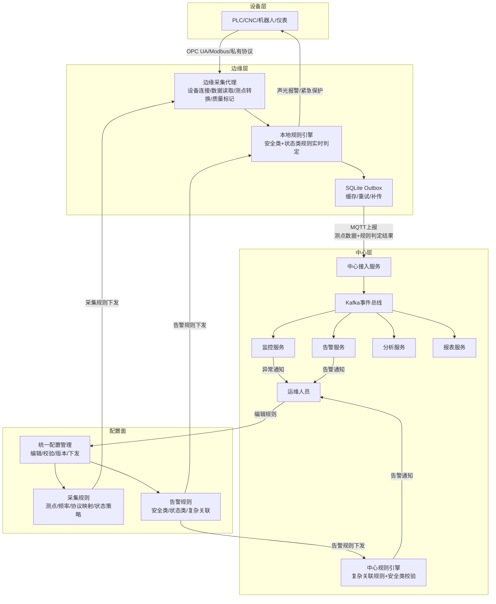

# 项目图示

## 智能设备运维平台 — 端边云架构总览

```mermaid
flowchart TD
    subgraph 设备层
        A["PLC/CNC/机器人/仪表"]
    end

    subgraph 边缘层
        B["边缘采集代理<br/>设备连接/数据读取/测点转换/质量标记"]
        R["本地规则引擎<br/>安全类+状态类规则实时判定"]
        S["SQLite Outbox<br/>缓存/重试/补传"]
        B --> R
        R --> S
    end

    subgraph 中心层
        C["中心接入服务"]
        D["Kafka事件总线"]
        G["监控服务"]
        H["告警服务"]
        I["分析服务"]
        J["报表服务"]
        D --> G
        D --> H
        D --> I
        D --> J
        K["中心规则引擎<br/>复杂关联规则+安全类校验"]
        E["运维人员"]
    end

    subgraph 配置面
        F["统一配置管理<br/>编辑/校验/版本/下发"]
        F1["采集规则<br/>测点/频率/协议映射/状态策略"]
        F2["告警规则<br/>安全类/状态类/复杂关联"]
        F --> F1
        F --> F2
    end

    A -->|OPC UA/Modbus/私有协议| B
    R -->|声光报警/紧急保护| A
    S -->|MQTT上报<br/>测点数据+规则判定结果| C
    C --> D
    G -->|异常通知| E
    H -->|告警通知| E
    K -->|告警通知| E
    E -->|编辑规则| F
    F1 -->|采集规则下发| B
    F2 -->|告警规则下发| R
    F2 -->|告警规则下发| K
```
