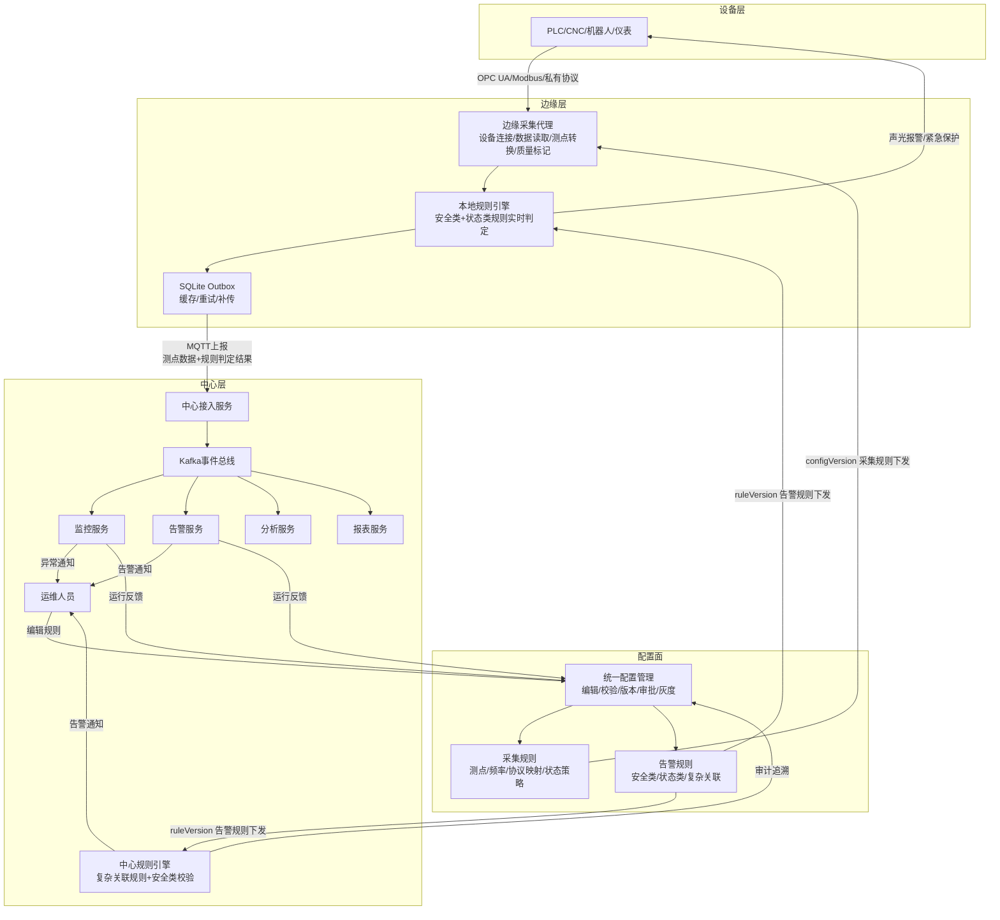
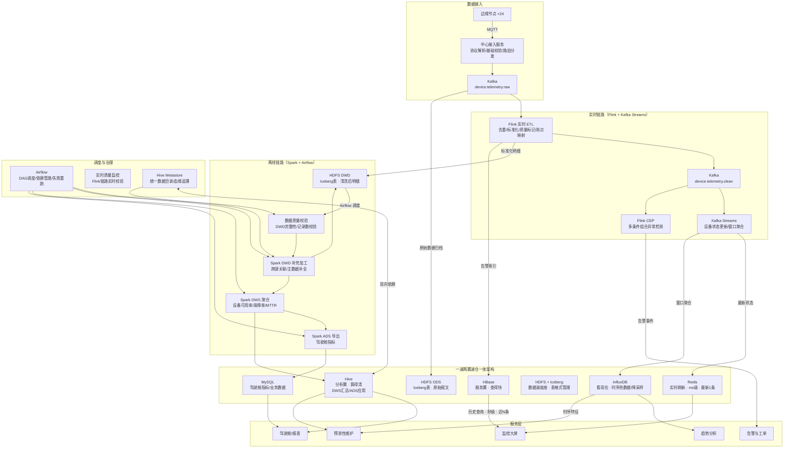
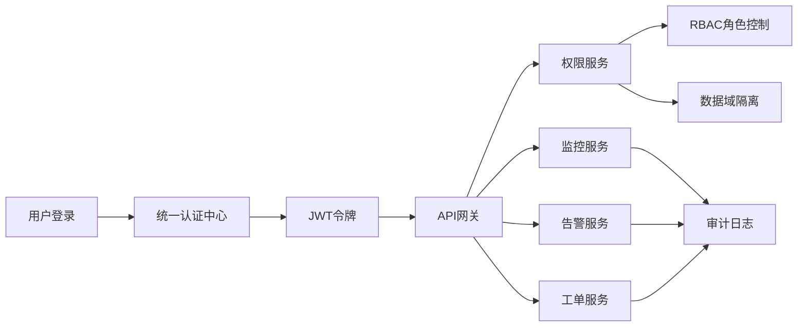
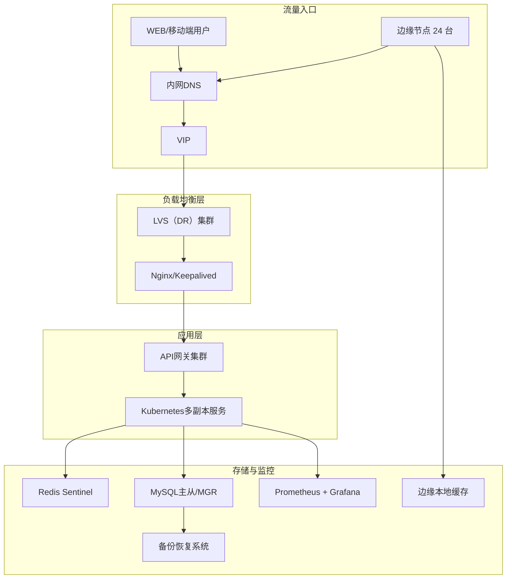
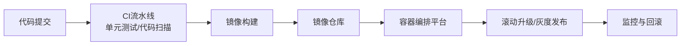
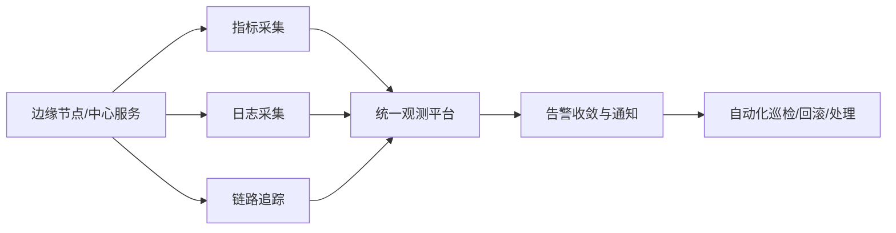

# 项目图示

## 一、架构总览

> 设备层 + 边缘层 + 中心层构成**数据面**，配置面即**控制面**。

## 二、中心层数据流与存储架构

> **数据流顺序**：边缘上报 → 中心接入（协议解析/基础校验）→ Kafka raw → Flink ETL（去重/标准化/质量标记）→ Kafka clean + HDFS DWD → 下游消费。ODS 层保存 Flink 处理前的原始报文，DWD 层保存 Flink 清洗后的标准化明细。
> **"一湖"**：HDFS + Iceberg 为湖仓一体底座，ODS 以 Iceberg 表格式保存原始报文（ACID 事务、Schema 演进、时间旅行），DWD 以 Iceberg 表格式保存清洗后明细（增量读取）。
> **"两翼"**：HBase（服务翼）提供毫秒级实时点查，Hive（分析翼）提供 SQL 批量分析。
> **Redis vs HBase**：Redis 缓存最新 1 条状态，大屏实时刷新用；HBase 存近 N 条历史，大屏详情查询用。
> **数据质量**：实时链路有 Flink 实时质量监控，离线链路在 ODS 写入后做第一道校验，Airflow 末端做最终校验。
> **数据分层**：ODS → DWD → DWS → ADS，详见 [06_数据架构与大数据处理.md](技术到场景/06_数据架构与大数据处理.md) 2.1 节。

## 三、权限与访问控制

## 四、基础设施与高可用

## 五、持续交付

## 六、可观测性

> 可观测性详细设计详见 [02_可观测性设计.md](技术到场景/02_可观测性设计.md)，持续交付与自动化运维详见 [03_持续交付与自动化运维.md](技术到场景/03_持续交付与自动化运维.md)。
