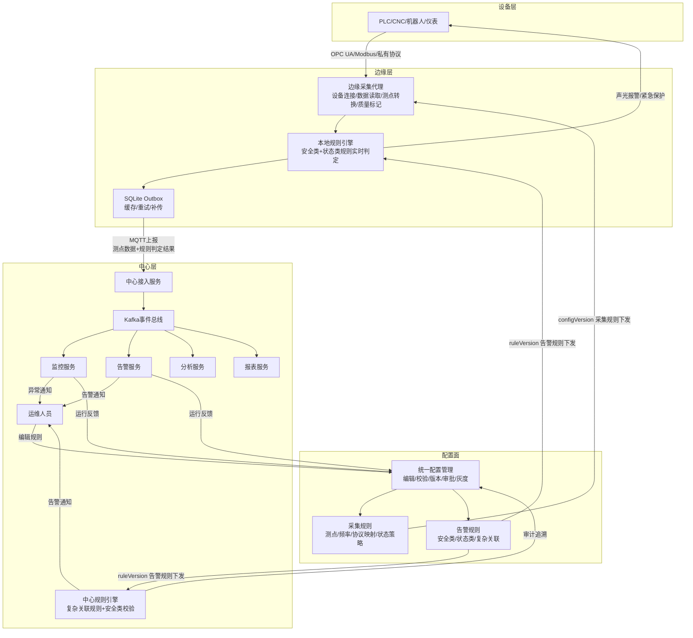
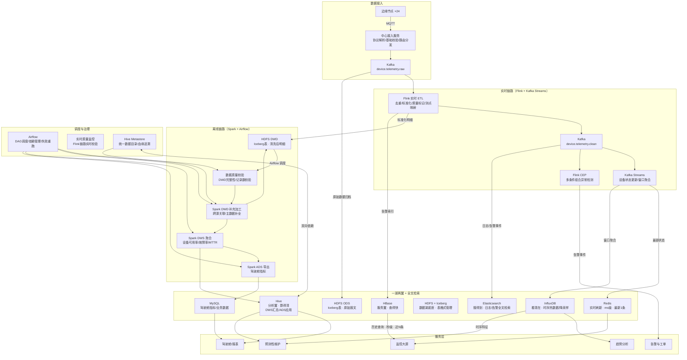
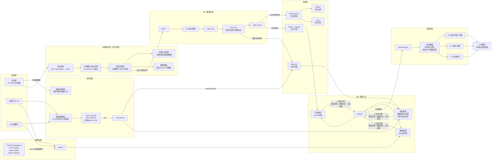
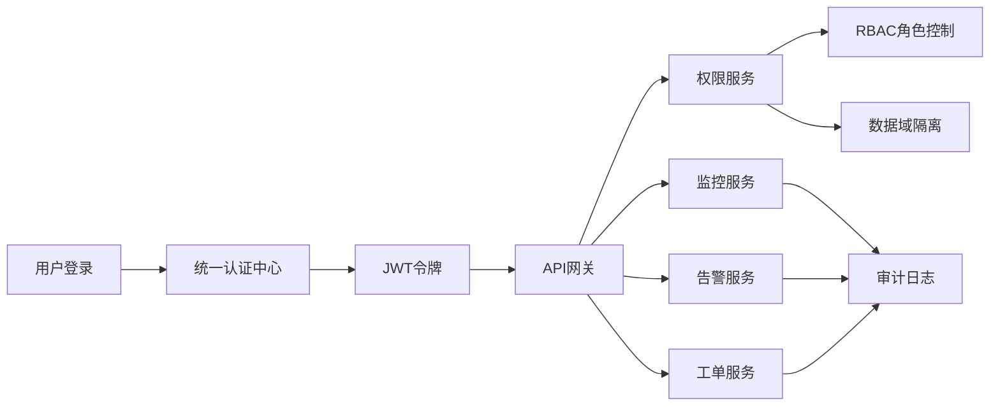
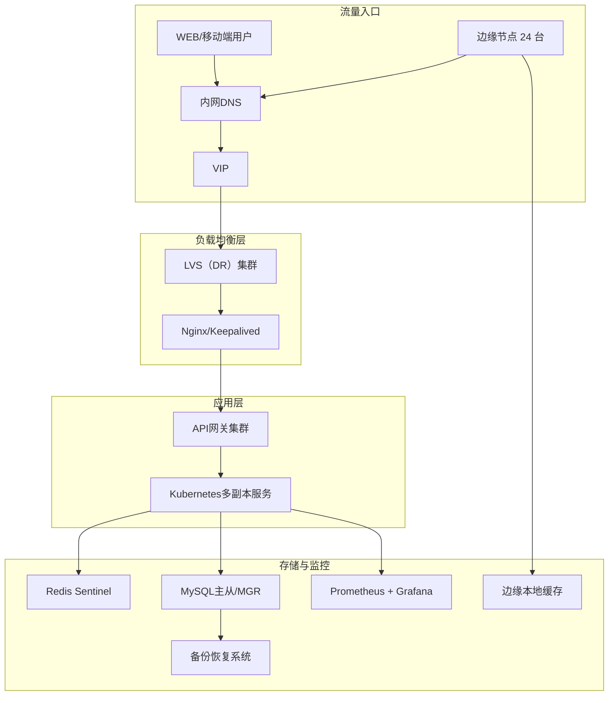
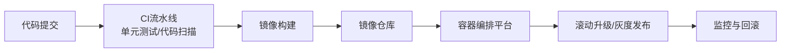

# 项目图示

## 一、架构总览

> 设备层 + 边缘层 + 中心层构成**数据面**，配置面即**控制面**。

## 二、中心层数据流与存储架构

> **数据流顺序**：边缘上报 → 中心接入（协议解析/基础校验）→ Kafka raw → Flink ETL（去重/标准化/质量标记）→ Kafka clean + HDFS DWD → 下游消费。ODS 层保存 Flink 处理前的原始报文，DWD 层保存 Flink 清洗后的标准化明细。
> **"一湖"**：HDFS + Iceberg 为湖仓一体底座，ODS 以 Iceberg 表格式保存原始报文（ACID 事务、Schema 演进、时间旅行），DWD 以 Iceberg 表格式保存清洗后明细（增量读取）。
> **"两翼"**：HBase（服务翼）提供毫秒级实时点查，Hive（分析翼）提供 SQL 批量分析。
> **Elasticsearch**：从 Kafka clean topic 消费日志和告警事件，仅承担全文检索职责（按关键词搜索错误信息、按 traceId 还原请求链路），日志的归档/点查/分析复用 HDFS/HBase/Hive，不重复建设。
> **Redis vs HBase**：Redis 缓存最新 1 条状态，大屏实时刷新用；HBase 存近 N 条历史，大屏详情查询用。
> **数据质量**：实时链路有 Flink 实时质量监控，离线链路在 ODS 写入后做第一道校验，Airflow 末端做最终校验。
> **数据分层**：ODS → DWD → DWS → ADS，详见 [06_数据架构与大数据处理.md](技术到场景/06_数据架构与大数据处理.md) 2.1 节。

## 三、可观测性

> **指标采集双链路**：系统运维指标走 Prometheus Pull（node_exporter / JMX / 应用 SDK），设备业务指标走统一数据管道（Flink），两者最终汇聚到 InfluxDB，由 Grafana 统一展示。
> **日志不走独立链路**：日志/告警事件和设备遥测数据统一走 边缘预处理 → MQTT → 中心接入服务 → Kafka → Flink ETL 管道，Elasticsearch 仅承担全文检索职责，归档/点查/分析复用 HDFS + HBase + Hive。
> **边缘网关五大职责**：协议适配、本地缓存+断点续传（RocksDB + ACK）、预过滤降噪、本地实时告警、数据脱敏。
> **三支柱关联**：指标与日志通过 Grafana + Loki 集成，日志与链路通过 traceId 字段关联，告警通知附带 Grafana 面板链接，实现"指标发现 → 链路定位 → 日志定因"的穿透式排障。
> 可观测性详细设计详见 [02_可观测性设计.md](技术到场景/02_可观测性设计.md)，数据架构详见 [06_数据架构与大数据处理.md](技术到场景/06_数据架构与大数据处理.md)，持续交付与自动化运维详见 [03_持续交付与自动化运维.md](技术到场景/03_持续交付与自动化运维.md)。

## 四、权限与访问控制

## 五、基础设施与高可用

## 六、持续交付

