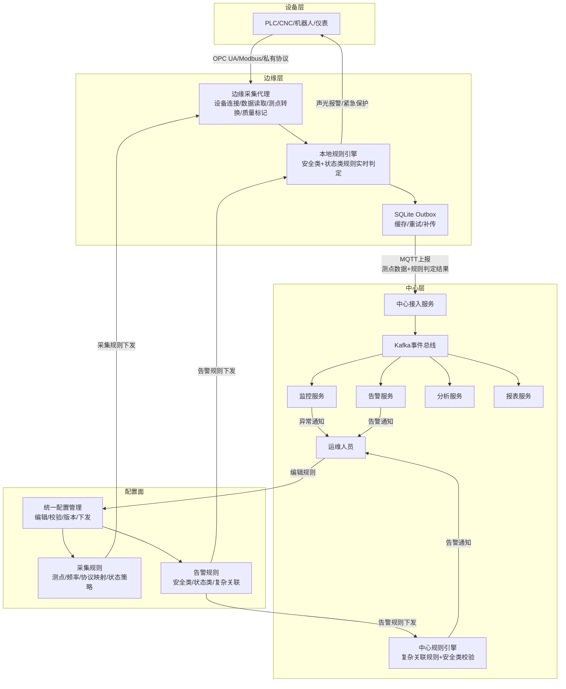
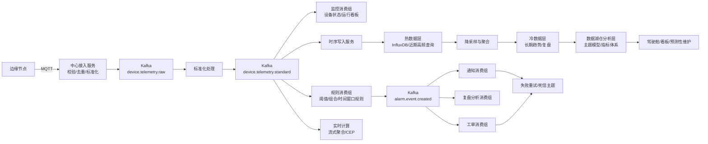
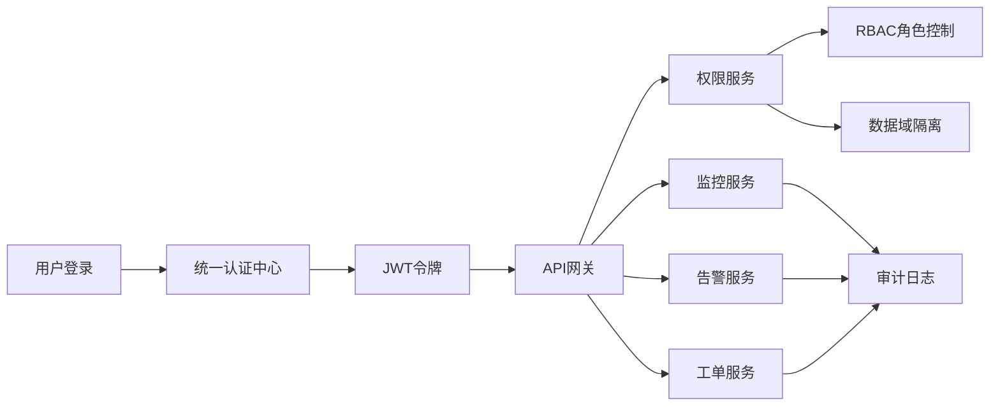
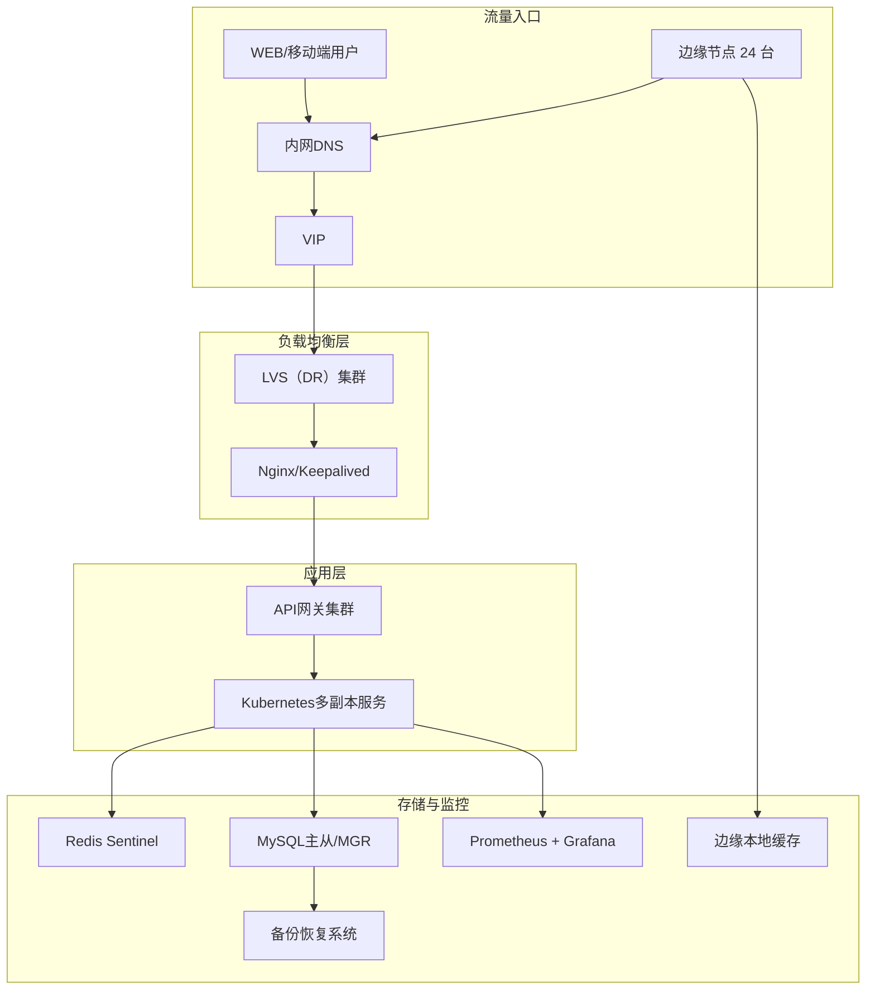
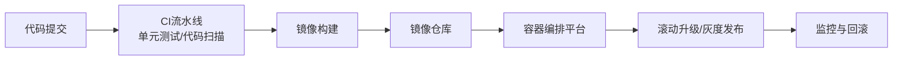
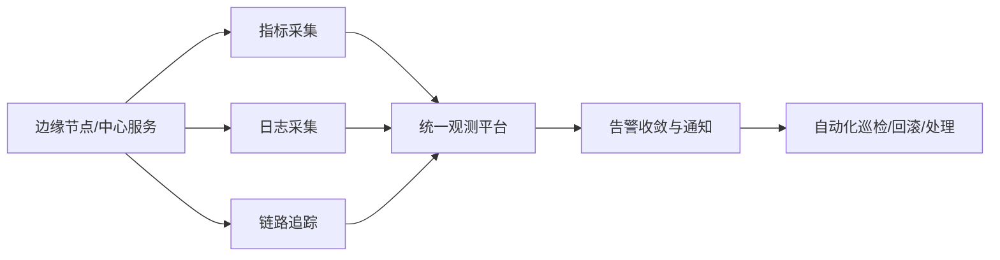
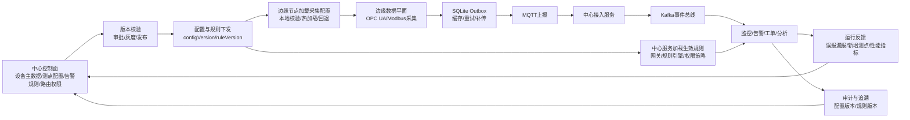

# 项目图示

## 一、架构总览

```mermaid
flowchart TD
    subgraph 设备层
        A["PLC/CNC/机器人/仪表"]
    end

    subgraph 边缘层
        B["边缘采集代理<br/>设备连接/数据读取/测点转换/质量标记"]
        R["本地规则引擎<br/>安全类+状态类规则实时判定"]
        S["SQLite Outbox<br/>缓存/重试/补传"]
        B --> R
        R --> S
    end

    subgraph 中心层
        C["中心接入服务"]
        D["Kafka事件总线"]
        G["监控服务"]
        H["告警服务"]
        I["分析服务"]
        J["报表服务"]
        D --> G
        D --> H
        D --> I
        D --> J
        K["中心规则引擎<br/>复杂关联规则+安全类校验"]
        E["运维人员"]
    end

    subgraph 配置面
        F["统一配置管理<br/>编辑/校验/版本/下发"]
        F1["采集规则<br/>测点/频率/协议映射/状态策略"]
        F2["告警规则<br/>安全类/状态类/复杂关联"]
        F --> F1
        F --> F2
    end

    A -->|OPC UA/Modbus/私有协议| B
    R -->|声光报警/紧急保护| A
    S -->|MQTT上报<br/>测点数据+规则判定结果| C
    C --> D
    G -->|异常通知| E
    H -->|告警通知| E
    K -->|告警通知| E
    E -->|编辑规则| F
    F1 -->|采集规则下发| B
    F2 -->|告警规则下发| R
    F2 -->|告警规则下发| K
```

## 二、中心层数据流

```mermaid
flowchart LR
    A["边缘节点"] -->|MQTT| B["中心接入服务<br/>校验/去重/标准化"]
    B --> C["Kafka<br/>device.telemetry.raw"]
    C --> D["标准化处理"]
    D --> E["Kafka<br/>device.telemetry.standard"]

    E --> F["监控消费组<br/>设备状态/运行看板"]
    E --> G["规则消费组<br/>阈值/组合/时间窗口规则"]
    E --> H["时序写入服务"]
    E --> I["实时计算<br/>流式聚合/CEP"]

    G --> J["Kafka<br/>alarm.event.created"]
    J --> K["通知消费组"]
    J --> L["工单消费组"]
    J --> M["复盘分析消费组"]

    H --> N["热数据层<br/>InfluxDB/近期高频查询"]
    N --> O["降采样与聚合"]
    O --> P["冷数据层<br/>长期趋势/复盘"]
    P --> Q["数据湖仓分析层<br/>主题模型/指标体系"]
    Q --> R["驾驶舱/看板/预测性维护"]

    K --> S["失败重试/死信主题"]
    L --> S
```

## 三、权限与访问控制

```mermaid
flowchart LR
    A["用户登录"] --> B["统一认证中心"]
    B --> C["JWT令牌"]
    C --> D["API网关"]
    D --> E["权限服务"]
    D --> F["监控服务"]
    D --> G["告警服务"]
    D --> H["工单服务"]
    E --> I["RBAC角色控制"]
    E --> J["数据域隔离"]
    F --> K["审计日志"]
    G --> K
    H --> K
```

## 四、基础设施与高可用

```mermaid
flowchart TD
    subgraph 流量入口
        A["边缘节点 24 台"]
        U["WEB/移动端用户"]
        B["内网DNS"]
        V["VIP"]
        A --> B
        U --> B
        B --> V
    end

    subgraph 负载均衡层
        LV["LVS（DR）集群"]
        NX["Nginx/Keepalived"]
        V --> LV
        LV --> NX
    end

    subgraph 应用层
        GW["API网关集群"]
        SVC["Kubernetes多副本服务"]
        NX --> GW
        GW --> SVC
    end

    subgraph 存储与监控
        REDIS["Redis Sentinel"]
        MYSQL["MySQL主从/MGR"]
        MON["Prometheus + Grafana"]
        BACKUP["备份恢复系统"]
        CACHE["边缘本地缓存"]
        SVC --> REDIS
        SVC --> MYSQL
        SVC --> MON
        MYSQL --> BACKUP
        A --> CACHE
    end
```

## 五、持续交付

```mermaid
flowchart LR
    A["代码提交"] --> B["CI流水线<br/>单元测试/代码扫描"]
    B --> C["镜像构建"]
    C --> D["镜像仓库"]
    D --> E["容器编排平台"]
    E --> F["滚动升级/灰度发布"]
    F --> G["监控与回滚"]
```

## 六、可观测性

```mermaid
flowchart LR
    A["边缘节点/中心服务"] --> B["指标采集"]
    A --> C["日志采集"]
    A --> D["链路追踪"]
    B --> E["统一观测平台"]
    C --> E
    D --> E
    E --> F["告警收敛与通知"]
    F --> G["自动化巡检/回滚/处理"]
```

## 七、控制面与数据平面

```mermaid
flowchart LR
    A["中心控制面<br/>设备主数据/测点配置/告警规则/路由权限"] --> B["版本校验<br/>审批/灰度/发布"]
    B --> C["配置与规则下发<br/>configVersion/ruleVersion"]
    C --> D["边缘节点加载采集配置<br/>本地校验/热加载/回退"]
    C --> E["中心服务加载生效规则<br/>网关/规则引擎/权限策略"]
    D --> F["边缘数据平面<br/>OPC UA/Modbus采集"]
    F --> G["SQLite Outbox<br/>缓存/重试/补传"]
    G --> H["MQTT上报"]
    H --> I["中心接入服务"]
    I --> J["Kafka事件总线"]
    J --> K["监控/告警/工单/分析"]
    E --> K
    K --> L["运行反馈<br/>误报漏报/新增测点/性能指标"]
    L --> A
    K --> M["审计与追溯<br/>配置版本/规则版本"]
    M --> A
```
