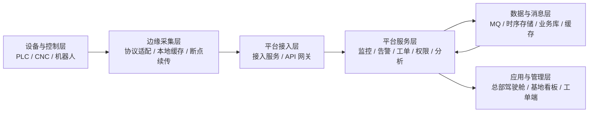

# 项目总架构说明与摘要模板

项目固定背景统一参考 [项目固定背景.md](/Users/duanpeitong/Desktop/work/study/26_jgs_lw/项目固定背景.md)。

## 1. 文档用途

这份文档用于把当前项目统一成一套可以直接复用的“总架构口径”。

你可以把它理解为两部分：

- 前半部分是 `总架构说明`，解决“这个项目到底是什么、怎么搭起来、为什么这么搭”
- 后半部分是 `可复用摘要模板`，解决“考场上如何在 5 到 10 分钟内写出稳定摘要”

建议使用方式：

1. 先读本文件中的“总架构说明”，固定项目叙事主线
2. 再按题目类型，从“摘要模板”中选一版做替换
3. 最后回到 [论文模版.md](/Users/duanpeitong/Desktop/work/study/26_jgs_lw/论文模版.md) 拼装正文

---

## 2. 项目总架构说明

### 2.1 项目概述

本项目为某汽车零部件集团建设“智能设备运维平台”，服务范围覆盖 3 个生产基地、900 余台关键生产设备和 24 台边缘节点。项目于 2024 年 7 月启动，建设周期 18 个月，采用 3 期交付方式，于 2026 年 1 月完成全面上线，当前仍在持续优化维护中。

平台建设目标并不只是实现设备联网，而是围绕集团设备运维数字化转型，逐步建立一套从设备接入、实时监控、异常告警、工单闭环到分析优化的统一平台能力，支撑运维模式由“事后抢修”向“预防性维护”演进。

我在项目中担任系统架构师，主要负责：

- 整体架构设计
- 技术路线制定
- 分期实施边界划分
- 关键基础设施选型
- 上线风险控制与演进治理

### 2.2 建设背景与核心问题

项目启动前，集团设备运维存在以下共性问题：

1. 不同基地各自管理，集团层面缺少统一设备运行视图
2. 设备来源厂商多、协议复杂，异构接入难度高
3. 监控、告警、工单和分析链路割裂，故障处置不成闭环
4. 工业现场网络环境复杂，中心平台无法直接稳定管理海量底层连接
5. 平台要分期建设并长期演进，必须兼顾当前落地和后续扩展

因此，本项目的架构设计重点不是单点功能建设，而是围绕“统一接入、统一治理、统一闭环、持续演进”建立平台化架构。

### 2.3 总体架构思路

本项目总体上采用“端边云协同、分层解耦、事件驱动、平台治理”的架构思路。

核心设计原则如下：

- `分层解耦`：把现场设备差异、中心业务处理和管理分析能力分层隔离
- `边缘前置`：在基地侧完成协议适配、近源采集、缓存补传和部分预处理
- `中心统一`：中心平台统一承载接入、监控、告警、工单、权限和分析服务
- `异步协同`：高频设备数据链路通过消息队列解耦，降低服务间直接耦合
- `平台治理`：通过网关、配置中心、灰度发布、可观测性等机制支撑长期运行
- `分期演进`：先打通主链路，再补闭环流程，最后增强预测分析和管理驾驶舱

### 2.4 总体分层结构

从架构层次看，平台可抽象为五层：

1. `设备与控制层`
   由 PLC、CNC、机器人及其他现场设备组成，负责产线执行与状态产生。

2. `边缘采集层`
   由部署在各基地的边缘节点和采集代理组成，负责协议适配、本地缓存、断点续传和边缘预处理。

3. `平台接入与服务层`
   由接入服务、监控服务、告警服务、工单服务、权限服务、分析服务等微服务组成，是平台业务能力核心承载层。

4. `数据与消息支撑层`
   由消息队列、时序存储、业务数据库、缓存、日志与指标采集等基础设施组成，支撑高频写入、事件分发和分析查询。

5. `应用与管理层`
   由总部驾驶舱、基地看板、监控大屏、工单处理端和管理报表组成，面向不同角色提供业务视图。

### 2.5 总体架构图

### 2.6 核心业务链路

平台的主链路可以统一概括为：

`设备接入 -> 数据上报 -> 实时监控 -> 规则判定 -> 告警生成 -> 工单联动 -> 处置闭环 -> 统计分析 -> 持续优化`

如果展开为更具体的技术链路，可写成：

`PLC/CNC/机器人 -> OPC UA/Modbus/私有协议 -> 边缘采集代理 -> 本地缓存 -> MQTT -> 中心接入服务 -> 消息队列 -> 监控服务/告警服务/分析服务 -> 工单服务 -> 驾驶舱与看板`

这条主链路是全项目最稳定的叙事骨架，几乎可以覆盖大部分论文题。

### 2.7 核心服务划分

中心平台按业务域拆分为以下核心服务：

- `设备接入服务`
  负责边缘节点接入、数据接收、基础校验和协议解耦后的统一入口。

- `设备主数据服务`
  负责设备档案、设备分类、测点定义和组织映射。

- `监控服务`
  负责设备状态聚合、运行态展示和实时监控面板。

- `告警服务`
  负责阈值规则、组合规则、窗口规则、告警收敛和通知分发。

- `工单服务`
  负责告警转工单、派单、处理、验收和关闭等闭环流程。

- `权限服务`
  负责统一认证、角色权限、数据域隔离和审计日志。

- `分析服务`
  负责统计指标、趋势分析、驾驶舱展示和预测性维护数据支撑。

### 2.8 关键技术与基础设施

项目中的关键技术可以统一归并为以下几类：

- `接入与边缘类`
  OPC UA、Modbus TCP/RTU、厂商私有协议、边缘采集代理、本地缓存、断点续传

- `服务治理类`
  微服务拆分、注册与配置管理、API 网关、限流熔断、统一日志与追踪

- `数据与消息类`
  消息队列、时序数据存储、冷热分层、聚合统计、缓存机制

- `闭环处置类`
  规则引擎、告警分级、工单工作流、通知联动、知识沉淀

- `运维与交付类`
  容器化、持续集成、持续交付、滚动升级、灰度发布、快速回滚、自动化巡检

### 2.9 非功能设计重点

这个项目在论文里最适合反复复用的非功能设计点有六个：

1. `高可用`
   入口层、核心服务、缓存和数据库采用冗余与多副本设计，边缘侧具备容错能力。

2. `可扩展性`
   通过微服务拆分、消息解耦和边缘前置，使新增设备、基地和分析能力时扩展成本可控。

3. `实时性`
   通过实时上报链路、规则判定和事件驱动协同支撑监控和告警时效。

4. `可靠性`
   通过本地缓存、补传、灰度发布、回滚机制和统一可观测性降低运行风险。

5. `安全性`
   通过统一认证、RBAC、多租户数据隔离和审计日志保证集团级平台安全边界。

6. `可维护性`
   通过分期演进、配置中心、标准化交付和自动化运维降低长期维护复杂度。

### 2.10 分期建设口径

项目采用三期推进，这个口径在写“软件维护”“架构演进”“云原生”“自动化运维”类题目时非常重要。

- `第一期`
  重点完成设备接入、中心接入和实时监控，先打通端边云数据主链路。

- `第二期`
  重点完成告警识别、工单闭环和权限治理，形成统一运维流程。

- `第三期`
  重点完成预测性维护、驾驶舱和分析服务，提升集团管理与持续优化能力。

分期建设的核心不是简单切任务，而是保证每一期都建立在统一主数据模型、统一服务边界和统一运行治理能力之上。

### 2.11 统一效果口径

如果论文需要写“效果”，建议统一使用下面这组口径：

- 平台已覆盖 3 个生产基地、900 余台关键设备和 24 台边缘节点
- 平台于 2026 年 1 月完成三期交付并全面上线
- 关键设备非计划停机率下降约 18%
- 运维响应效率和集团统一管理能力明显提升
- 平台初步实现由“事后抢修”向“预防性维护”的转型

### 2.12 一段式总架构说明

如果你只需要一段 300 到 500 字的总架构说明，可直接复用下面这段：

本项目面向某汽车零部件集团 3 个生产基地、900 余台关键设备和 24 台边缘节点，建设“智能设备运维平台”，目标是形成从设备接入、实时监控、异常告警、工单闭环到分析优化的统一平台能力。针对设备协议异构、现场网络复杂、多基地协同困难和平台需分期演进等特点，我采用了“端边云协同、分层解耦、事件驱动、平台治理”的总体架构：在基地侧通过边缘节点完成协议适配、本地缓存和断点续传；在中心侧按业务域拆分接入、监控、告警、工单、权限和分析等微服务，并通过消息队列、时序存储、统一网关、配置中心和可观测体系支撑高频数据处理、流程闭环和持续优化；在交付层通过容器化、灰度发布和自动化运维保证三期建设的平稳落地。该架构较好平衡了实时性、可靠性、扩展性和可维护性，支撑集团设备运维模式向平台化、智能化和预防性维护方向演进。

---

## 3. 可复用摘要模板

### 3.1 摘要使用原则

考场摘要的目标不是炫技，而是稳定拿分。建议始终包含下面 5 个要素：

1. `项目背景`
2. `你的角色`
3. `题目主题`
4. `核心问题`
5. `项目效果`

最稳的摘要结构是：

`项目是什么 -> 为什么要做 -> 围绕什么主题展开 -> 解决了什么问题 -> 最终取得什么效果`

### 3.2 通用摘要模板

2024 年 7 月，我作为系统架构师参与某汽车零部件集团“智能设备运维平台”的总体架构设计与建设工作。该平台面向集团 3 个生产基地、900 余台关键设备和 24 台边缘节点，建设目标是通过统一的平台能力提升设备接入、运行监控、异常处置和持续优化水平，支撑集团运维模式由“事后抢修”向“预防性维护”转型。

在项目推进过程中，围绕 **[考题主题]**，平台重点需要解决 **[核心问题 1]**、**[核心问题 2]** 和 **[核心问题 3]** 等问题，并在 **[关键特性 A]** 与 **[关键特性 B]** 之间取得平衡。为此，我结合项目实际情况，从总体架构、关键技术、实施路径和运行治理等方面进行了系统设计。

经实践验证，平台较好支撑了多基地设备统一接入、集中监控、协同处置和分析优化，关键设备非计划停机率下降约 18%，为集团设备运维数字化建设奠定了基础。本文将结合该项目，论述我在 **[考题主题]** 视角下的架构设计思路、关键决策与实施经验。

### 3.3 高频题摘要模板

#### A. 微服务 / 分布式 / 服务治理类

2024 年 7 月，我作为系统架构师参与某汽车零部件集团“智能设备运维平台”的总体架构设计与建设工作。该平台覆盖集团 3 个生产基地、900 余台关键设备和 24 台边缘节点，需要统一承载设备接入、实时监控、异常告警、工单闭环、权限控制和统计分析等多类能力。随着平台持续建设，传统单体方式已难以支撑多模块并行开发、分期交付和长期演进。

围绕 **微服务架构设计**，平台需要重点解决业务边界不清、服务协同耦合度高、高频数据链路与管理链路互相干扰等问题，并在扩展性、稳定性和治理复杂度之间取得平衡。为此，我采用了按业务域拆分核心服务、通过 API 网关统一入口、以消息队列实现异步解耦，并辅以注册配置管理、限流熔断和统一可观测性等治理机制。

经实践验证，该架构较好支撑了多基地统一运维平台的分期建设和持续扩展。本文将结合项目，重点论述我在微服务与云原生架构方面的设计、关键技术与实施体会。

#### B. 云原生 / 自动化运维 / 持续交付类

2024 年 7 月，我作为系统架构师参与某汽车零部件集团“智能设备运维平台”的建设工作。该平台采用分 3 期交付方式，覆盖 3 个生产基地、900 余台设备和多个中心服务。随着平台功能不断增加，传统人工部署和分散运维方式逐渐暴露出环境不一致、发布风险高、回滚困难和持续优化效率低等问题。

围绕 **[云原生架构设计/自动化运维]**，平台需要重点解决多服务标准化交付、灰度发布与快速回滚、运行状态可观测和故障快速定位等问题，并在交付效率、系统稳定性和运维复杂度之间取得平衡。为此，我采用了容器化封装、持续交付流水线、滚动升级与灰度发布、统一监控日志追踪和自动化巡检等技术手段。

经实践验证，该方案较好支撑了平台多期建设的平稳落地和持续优化。本文将结合项目，重点论述我在云原生与自动化运维方面的架构设计和工程实践。

#### C. 高可用 / 可靠性 / 容灾类

2024 年 7 月，我作为系统架构师参与某汽车零部件集团“智能设备运维平台”的总体架构设计与建设工作。平台服务范围覆盖 3 个生产基地、900 余台关键设备和 24 台边缘节点，既要承载现场设备的持续数据上报，也要支持监控告警、工单闭环和集团级管理分析，因此对系统稳定性和连续运行能力要求很高。

围绕 **[高可用架构设计/可靠性设计/容灾设计]**，平台需要重点解决现场网络波动、中心服务异常、发布变更风险和多基地运行连续性等问题，并在稳定性、成本和系统复杂度之间取得平衡。为此，我采用了入口冗余、核心服务多副本、边缘缓存补传、统一可观测性、备份恢复和灰度回滚等设计手段。

经实践验证，平台在承载多基地统一运维业务的情况下运行平稳，关键设备非计划停机率下降约 18%。本文将结合项目，论述我在高可用与可靠性方面的架构设计与实施经验。

#### D. 数据架构 / 大数据 / 时序数据类

2024 年 7 月，我作为系统架构师参与某汽车零部件集团“智能设备运维平台”的设计与建设。平台持续接收 3 个生产基地、900 余台设备上报的状态、测点和事件数据，并以此支撑实时监控、异常告警、趋势分析、预测性维护和管理驾驶舱等多类业务场景。随着接入规模扩大，如何高效承载时间序列数据并支撑多种分析需求，成为平台建设中的关键问题。

围绕 **[数据架构设计/大数据处理架构/时序数据架构]**，平台需要重点解决高频写入与复杂查询互相干扰、长期历史数据存储成本高、分析口径不统一和数据质量治理困难等问题，并在实时性、扩展性和成本之间取得平衡。为此，我采用了消息解耦、时序数据模型、冷热分层、降采样聚合和统一分析服务等设计手段。

经实践验证，该架构较好支撑了监控、告警、分析和预测性维护等多种上层能力。本文将结合项目，重点论述我在数据架构设计方面的思路与实践。

#### E. 安全架构 / 权限体系类

2024 年 7 月，我作为系统架构师参与某汽车零部件集团“智能设备运维平台”的总体架构设计与建设工作。平台覆盖 3 个生产基地、900 余台关键设备和多类运维角色，需要同时满足集团统一管理和基地本地自治的要求，因此对统一认证、角色授权、数据隔离和审计追踪提出了较高要求。

围绕 **[安全架构设计/权限体系设计]**，平台需要重点解决多基地访问边界混乱、不同角色职责交叉、数据口径和数据域需要严格隔离等问题，并在安全性、灵活性和管理效率之间取得平衡。为此，我采用了统一身份认证、RBAC 角色模型、数据域隔离和审计日志等架构设计。

经实践验证，平台较好支撑了集团级权限治理和多基地安全访问控制。本文将结合项目，重点论述我在安全架构与权限治理方面的设计思路和实践经验。

### 3.4 摘要速填表

| 变量项 | 建议填写方式 |
| --- | --- |
| 考题主题 | 如：微服务架构、高可用设计、云原生架构、数据架构、安全架构 |
| 核心问题 1 | 当前题目最核心的首要问题 |
| 核心问题 2 | 当前题目关联的次级问题 |
| 核心问题 3 | 可选补充问题，没有可不写 |
| 关键特性 A | 当前题目强调的第一类系统特性，如扩展性、可靠性、实时性 |
| 关键特性 B | 与 A 形成平衡或取舍的第二类特性，如成本、复杂度、灵活性 |

### 3.5 摘要替换规则

为了避免现场写摘要时过度发散，建议只允许替换下面几类内容：

- `题目主题`
- `核心问题`
- `关键特性`
- 少量结尾描述

不要轻易改动以下固定信息：

- 项目名称
- 时间范围
- 基地数量
- 设备数量
- 边缘节点数量
- 你的角色
- 三期建设与持续优化口径

这些固定信息越稳定，全文越容易保持一致。

### 3.6 最短可背版摘要

如果临场时间很紧，可以直接背下面这版，再替换 3 个词组：

2024 年 7 月，我作为系统架构师参与某汽车零部件集团“智能设备运维平台”的总体架构设计与建设工作。该平台面向 3 个生产基地、900 余台关键设备和 24 台边缘节点，目标是提升设备统一接入、集中监控、协同处置和持续优化能力，支撑集团运维模式由“事后抢修”向“预防性维护”转型。围绕 **[考题主题]**，平台重点需要解决 **[核心问题 1]**、**[核心问题 2]** 等问题，并在 **[关键特性 A]** 与 **[关键特性 B]** 之间取得平衡。经实践验证，平台较好支撑了多基地统一运维能力建设，关键设备非计划停机率下降约 18%。本文将结合该项目，论述我在 **[考题主题]** 视角下的架构设计思路与实施经验。
